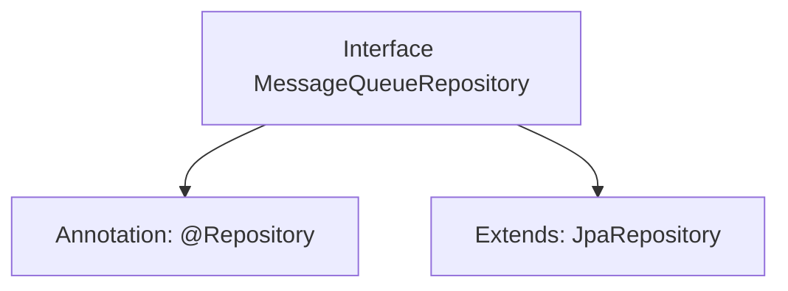

# Basic Information

|      |      |
|------|------|
| Name | MessageQueueRepository |
| Language | .java |
| Code Path | WeFe/gateway/src/main/java/com/welab/wefe/gateway/repository/MessageQueueRepository.java |
| Package Name | com.welab.wefe.gateway.repository |
| Dependencies | ['com.welab.wefe.gateway.entity.MessageQueueEntity', 'org.springframework.data.jpa.repository.JpaRepository', 'org.springframework.stereotype.Repository'] |
| Brief Description | Message queue repository interface, inherits JPA repository, operates on message queue entity class, with primary key type as string. |

# Description

The content defines a Spring Data JPA repository interface named MessageQueueRepository, marked with the @Repository annotation. This interface extends JpaRepository and is used to manipulate data of type MessageQueueEntity, with the primary key type being String. It provides basic CRUD operations and JPA functionality without requiring manual implementation.

# Class Summary

| Name   | Type  | Description |
|-------|------|-------------|
| MessageQueueRepository | interface | Message queue repository interface, inherits JPA repository, operates on message queue entities, with primary key type as string. |


## Class MessageQueueRepository

|      |      |
|------|------|
| Access Modifier | @Repository;public |
| Type | interface |
| Name | MessageQueueRepository |
| Description | Message queue repository interface, inherits JPA repository, operates on message queue entities, with primary key type as string. |


### UML Class Diagram

```mermaid
classDiagram
    class MessageQueueRepository {
        <<Interface>>
    }
    class JpaRepository~T, ID~ {
        <<Interface>>
    }
    MessageQueueRepository --|> JpaRepository : extends
    // MessageQueueRepository is a Spring Data JPA repository interface that extends the generic JpaRepository interface
    // Generic parameter T is MessageQueueEntity, ID is of type String
```

This class diagram illustrates the inheritance relationship of the `MessageQueueRepository` interface in Spring Data JPA. The interface is marked as `@Repository` and inherits basic CRUD operations from `JpaRepository<MessageQueueEntity, String>`, where the generic parameters specify the entity type as `MessageQueueEntity` and the primary key type as `String`. The diagram clearly shows the hierarchical relationship between interfaces, conforming to the design patterns of JPA specifications.


### Internal Method Call Graph



This flowchart illustrates the structure of a message queue repository interface in Spring Data JPA. The MessageQueueRepository is marked as a Spring-managed component via the @Repository annotation and inherits basic CRUD operations by extending the JpaRepository interface, with generic parameters specifying the entity type as MessageQueueEntity and the primary key type as String. This design simplifies database interaction code by automatically implementing persistence layer operations through interface definitions alone.

### Field List

| Name  | Type  | Description |
|-------|-------|------|

### Method List

| Name  | Type  | Description |
|-------|-------|------|


