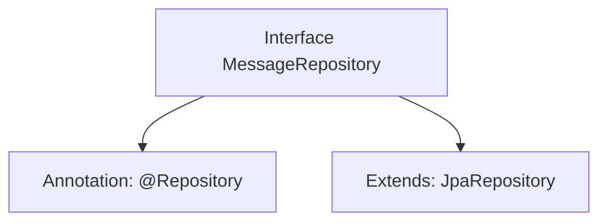

# Basic Information

|      |      |
|------|------|
| Name | MessageRepository |
| Language | .java |
| Code Path | WeFe/gateway/src/main/java/com/welab/wefe/gateway/repository/MessageRepository.java |
| Package Name | com.welab.wefe.gateway.repository |
| Dependencies | ['com.welab.wefe.gateway.entity.MessageEntity', 'org.springframework.data.jpa.repository.JpaRepository', 'org.springframework.stereotype.Repository'] |
| Brief Description | Message repository interface, inherits from JPA repository, operates on message entity class with string type primary key. |

# Description

The content defines a Spring Data repository interface named `MessageRepository`, marked with the `@Repository` annotation. This interface extends the generic `JpaRepository` interface, specifying the entity type as `MessageEntity` and the primary key type as `String`. This indicates that the repository is used for persistence operations on `MessageEntity`-type data, inheriting the standard CRUD operation methods provided by JPA.

# Class Summary

| Name   | Type  | Description |
|-------|------|-------------|
| MessageRepository | interface | The message repository interface extends the JPA repository and is used to manipulate message entities, with the primary key type being string. |


## Class MessageRepository

|      |      |
|------|------|
| Access Modifier | @Repository;public |
| Type | interface |
| Name | MessageRepository |
| Description | The message repository interface extends the JPA repository and is used to manipulate message entities, with the primary key type being string. |


### UML Class Diagram

```mermaid
classDiagram
    class MessageRepository {
        <<Interface>>
    }
    class JpaRepository~T, ID~ {
        <<Interface>>
    }
    MessageRepository --|> JpaRepository : extends
    // The MessageRepository interface extends the generic JpaRepository interface
    // Generic parameter T is MessageEntity, and ID is of type String
```

This class diagram illustrates the inheritance relationship of repository interfaces in Spring Data JPA. The MessageRepository, as a data access layer interface, inherits basic CRUD operation capabilities by extending JpaRepository<MessageEntity, String>. Here, JpaRepository is a generic interface provided by Spring Data, where T represents the entity type (MessageEntity) and ID denotes the primary key type (String). This design pattern enables standardized database operations for MessageEntity objects, complies with JPA specifications, and eliminates the need for manual implementation classes.


### Internal Method Call Graph



This code defines a Spring Data JPA Repository interface named MessageRepository, which is used to manipulate data of type MessageEntity with a primary key of type String. The interface is marked as a Spring-managed component via the @Repository annotation and inherits from the JpaRepository interface, thereby automatically acquiring basic CRUD operations and pagination query capabilities. This design adheres to Spring Data JPA specifications, allowing direct injection and usage without manual method implementation.

### Field List

| Name  | Type  | Description |
|-------|-------|------|

### Method List

| Name  | Type  | Description |
|-------|-------|------|


