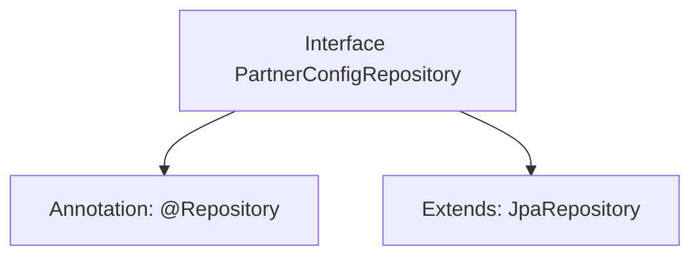

# Basic Information

|      |      |
|------|------|
| Name | PartnerConfigRepository |
| Language | .java |
| Code Path | WeFe/gateway/src/main/java/com/welab/wefe/gateway/repository/PartnerConfigRepository.java |
| Package Name | com.welab.wefe.gateway.repository |
| Dependencies | ['com.welab.wefe.gateway.entity.PartnerConfigEntity', 'org.springframework.data.jpa.repository.JpaRepository', 'org.springframework.stereotype.Repository'] |
| Brief Description | The interface PartnerConfigRepository extends JpaRepository and is used to manipulate PartnerConfigEntity data, with the primary key type being String. |

# Description

The content defines a Spring Data repository interface named PartnerConfigRepository, marked as a Spring-managed component with the @Repository annotation. This interface extends JpaRepository, specifying the entity type as PartnerConfigEntity and the primary key type as String. This indicates that the repository is used for persistence operations on the PartnerConfigEntity entity, providing standard JPA data access methods.

# Class Summary

| Name   | Type  | Description |
|-------|------|-------------|
| PartnerConfigRepository | interface | This is a Spring Data JPA repository interface for manipulating PartnerConfigEntity entities, with the primary key type being String. |


## Class PartnerConfigRepository

|      |      |
|------|------|
| Access Modifier | @Repository;public |
| Type | interface |
| Name | PartnerConfigRepository |
| Description | This is a Spring Data JPA repository interface for manipulating PartnerConfigEntity entities, with the primary key type being String. |


### UML Class Diagram

```mermaid
classDiagram
    class PartnerConfigRepository {
        <<Interface>>
    }
    class JpaRepository~T, ID~ {
        <<Interface>>
    }
    PartnerConfigRepository --|> JpaRepository : Extends
    // PartnerConfigRepository extends the generic interface JpaRepository
    // Generic parameter T is PartnerConfigEntity, ID is String type
```

This class diagram illustrates the repository interface definition in Spring Data JPA. PartnerConfigRepository is an interface marked with @Repository, extending the generic interface JpaRepository where the type parameter T is specified as PartnerConfigEntity and the ID type parameter as String. This design provides basic CRUD operation capabilities for PartnerConfigEntity entities, adhering to Spring Data JPA's standard implementation pattern. By inheriting the generic interface, it avoids repetitive code writing.


### Internal Method Call Graph



This flowchart illustrates the structure of the PartnerConfigRepository interface. The interface is annotated with @Repository, indicating it is a Spring Data Access Layer component. It also extends the generic JpaRepository interface, specifying the entity type as PartnerConfigEntity and the primary key type as String. This design pattern is a typical usage of Spring Data JPA, which automatically provides CRUD operation capabilities by inheriting the base repository interface, eliminating the need for manual implementation of basic data access methods.

### Field List

| Name  | Type  | Description |
|-------|-------|------|

### Method List

| Name  | Type  | Description |
|-------|-------|------|


