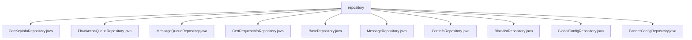

# Basic Information

|      |      |
|------|------|
| Name | repository |
| Language | .java |
| Code Path | WeFe/gateway/src/main/java/com/welab/wefe/gateway/repository |
| Package Name | docs.gateway.src.main.java.com.welab.wefe.gateway.repository |
| Brief Description | Multiple Spring Data repository interfaces are defined, all inheriting from a base class to provide CRUD functionality. These include repositories for entity operations such as CertKeyInfo, FlowActionQueue, MessageQueue, CertRequestInfo, Message, CertInfo, Blacklist, GlobalConfig, and PartnerConfig. The GlobalConfigRepository additionally provides a findByGroup query method. |

# Description

## Overview  
This module serves as the data access layer for the gateway system, with its core responsibility being to provide CRUD operations for various entity data through Spring Data JPA, functioning similarly to a database access middleware. The interface specifications uniformly inherit from `BaseRepository` or `JpaRepository`, encompassing basic CRUD capabilities and dynamic query functionalities. For instance, `GlobalConfigRepository` extends the `findByGroup` group query feature.  

Key data structures include entity classes such as `CertKeyInfoEntity` and `FlowActionQueueEntity`, all with `String`-type primary keys. The only external dependency is the Spring Data JPA framework. Implementation examples are abundant, such as `BlacklistRepository` automatically gaining pagination query capabilities, and `CertInfoRepository` reusing base class methods.  

## Core Business Scenarios  
The module supports the gateway's core business processes: certificate management (`CertKeyInfoRepository`), message queue processing (`MessageQueueRepository`), and blacklist/whitelist control (`BlacklistRepository`), among others. It adopts a unified JPA interaction pattern, such as `PartnerConfigRepository` directly invoking `save()` for configuration persistence.  

Typical applications include configuration queries (e.g., `GlobalConfigRepository` filtering by group) and asynchronous task management (`FlowActionQueueRepository` manipulating queue data). All APIs are Spring Data repository interfaces, with integration examples like `MessageRepository` automatically implementing CRUD operations for message entities.

### Package Internal Structure View

This flowchart displays all Java class files under the repository directory in the WeFe gateway project. The root node is "repository," which directly connects to 10 different Repository class files, including CertKeyInfoRepository, FlowActionQueueRepository, etc. These classes are all at the same level with no further subdirectory structure.

# File List

| Name   | Type  | Description |
|-------|------|-------------|
| [CertKeyInfoRepository.java](CertKeyInfoRepository.md) | file | This is a Spring repository interface that extends the base repository class, used for managing certificate key information entities. |
| [FlowActionQueueRepository.java](FlowActionQueueRepository.md) | file | This is a Spring Data JPA repository interface for operating the FlowActionQueueEntity entity, which inherits basic CRUD functionality from JpaRepository. |
| [MessageQueueRepository.java](MessageQueueRepository.md) | file | Message queue repository interface, inherits JPA repository, operates on message queue entity class, with primary key type as string. |
| [CertRequestInfoRepository.java](CertRequestInfoRepository.md) | file | The interface CertRequestInfoRepository extends BaseRepository and is used to operate the CertRequestInfoEntity entity class, with the primary key type being String. |
| [BaseRepository.java](BaseRepository.md) | file | This is a basic Spring Data JPA repository interface that extends both JpaRepository and JpaSpecificationExecutor, supporting generic entity type T and serializable ID type ID, annotated to prevent actual repository bean generation. |
| [MessageRepository.java](MessageRepository.md) | file | Message repository interface, extends JPA repository, operates on message entity class with primary key type as string. |
| [CertInfoRepository.java](CertInfoRepository.md) | file | This is a Spring Data JPA repository interface that extends the base repository class, used for operating on the CertInfoEntity entity class with a primary key type of String. |
| [BlacklistRepository.java](BlacklistRepository.md) | file | Blacklist repository interface, extends JPA repository, operates on the Blacklist entity with primary key type as String. |
| [GlobalConfigRepository.java](GlobalConfigRepository.md) | file | The Java interface GlobalConfigRepository extends JpaRepository and is used to manipulate GlobalConfigEntity data, providing query functionality by the group field. |
| [PartnerConfigRepository.java](PartnerConfigRepository.md) | file | The interface PartnerConfigRepository extends JpaRepository and is used to manipulate PartnerConfigEntity data, with the primary key type being String. |

