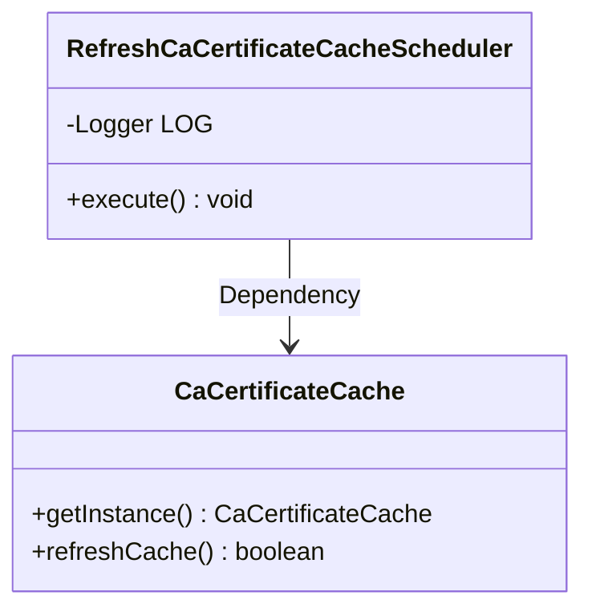
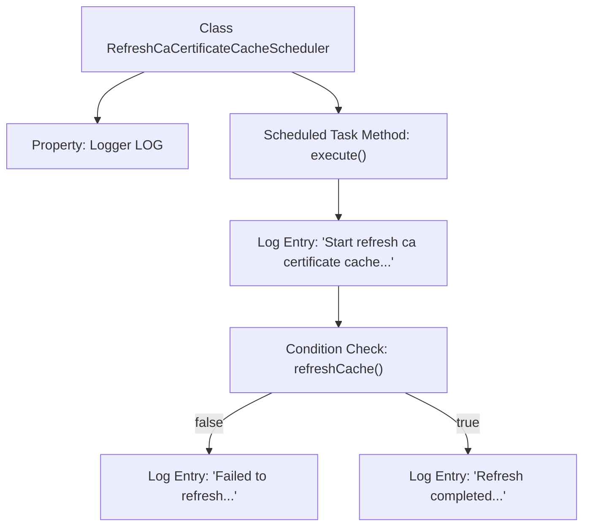

# Basic Information

|      |      |
|------|------|
| Name | RefreshCaCertificateCacheScheduler |
| Language | .java |
| Code Path | WeFe/gateway/src/main/java/com/welab/wefe/gateway/scheduler/RefreshCaCertificateCacheScheduler.java |
| Package Name | com.welab.wefe.gateway.scheduler |
| Dependencies | ['com.welab.wefe.gateway.cache.CaCertificateCache', 'org.slf4j.Logger', 'org.slf4j.LoggerFactory', 'org.springframework.scheduling.annotation.Scheduled', 'org.springframework.stereotype.Component'] |
| Brief Description | Scheduled task class, refreshes CA certificate cache every 30 seconds and logs success or failure. |

# Description

This is a Spring component class named `RefreshCaCertificateCacheScheduler`, designed to periodically refresh the CA certificate cache. The class contains an `execute` method annotated with `@Scheduled`, which automatically runs every 30 seconds. Upon execution, it first logs the start of the refresh process, then invokes the `refreshCache` method of the singleton `CaCertificateCache` instance to perform the cache refresh. If the refresh fails, an error log is recorded; if successful, a completion log is generated. The entire process is detailed through logging via a `Logger` object.

# Class Summary

| Name   | Type  | Description |
|-------|------|-------------|
| RefreshCaCertificateCacheScheduler | class | The scheduled task class refreshes the CA certificate cache every 30 seconds, logging both successes and failures. |

## Class RefreshCaCertificateCacheScheduler

|      |      |
|------|------|
| Access Modifier | @Component;public |
| Type | class |
| Name | RefreshCaCertificateCacheScheduler |
| Description | The scheduled task class refreshes the CA certificate cache every 30 seconds, logging both successes and failures. |

### UML Class Diagram

Class Diagram Description: This diagram illustrates a scheduled task component `RefreshCaCertificateCacheScheduler`, which periodically executes the `execute()` method via the `@Scheduled` annotation, invoking the `refreshCache()` method of the singleton `CaCertificateCache` to update the certificate cache. `CaCertificateCache`, as the dependent party, provides cache refresh functionality, forming a unidirectional dependency relationship between the two. The log object `LOG` is used to record task execution status, demonstrating a typical interaction pattern between scheduled tasks and utility classes.

### Internal Method Call Graph

This flowchart illustrates the execution process of a scheduled task for refreshing CA certificate cache. It first initializes the logger object, then triggers the execute method via Spring's scheduled task. After logging the start message, it invokes the cache refresh function and records either failure or success logs based on the refresh result. The entire process demonstrates the execution logic of scheduled tasks and exception handling mechanisms.

### Field List

| Name  | Type  | Description |
|-------|-------|------|
| LOG = LoggerFactory.getLogger(RefreshMemberCacheScheduler.class) | Logger | Define a private constant LOG, using LoggerFactory to obtain the logger instance for the RefreshMemberCacheScheduler class. |

### Method List

| Name  | Type  | Description |
|-------|-------|------|
| execute | void | The scheduled task refreshes the CA certificate cache every 30 seconds, logging both successes and failures. |

