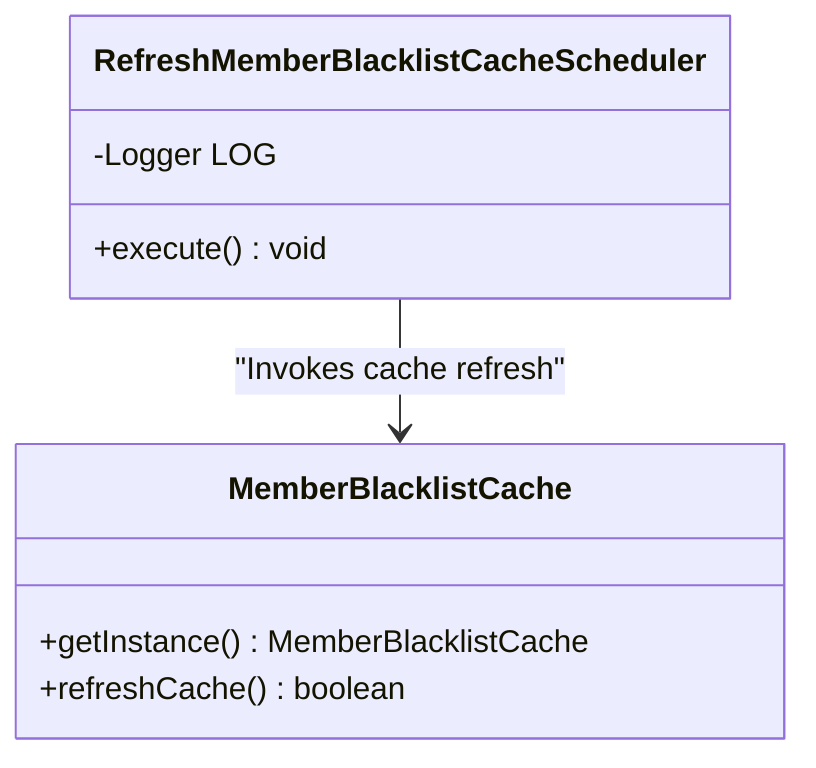
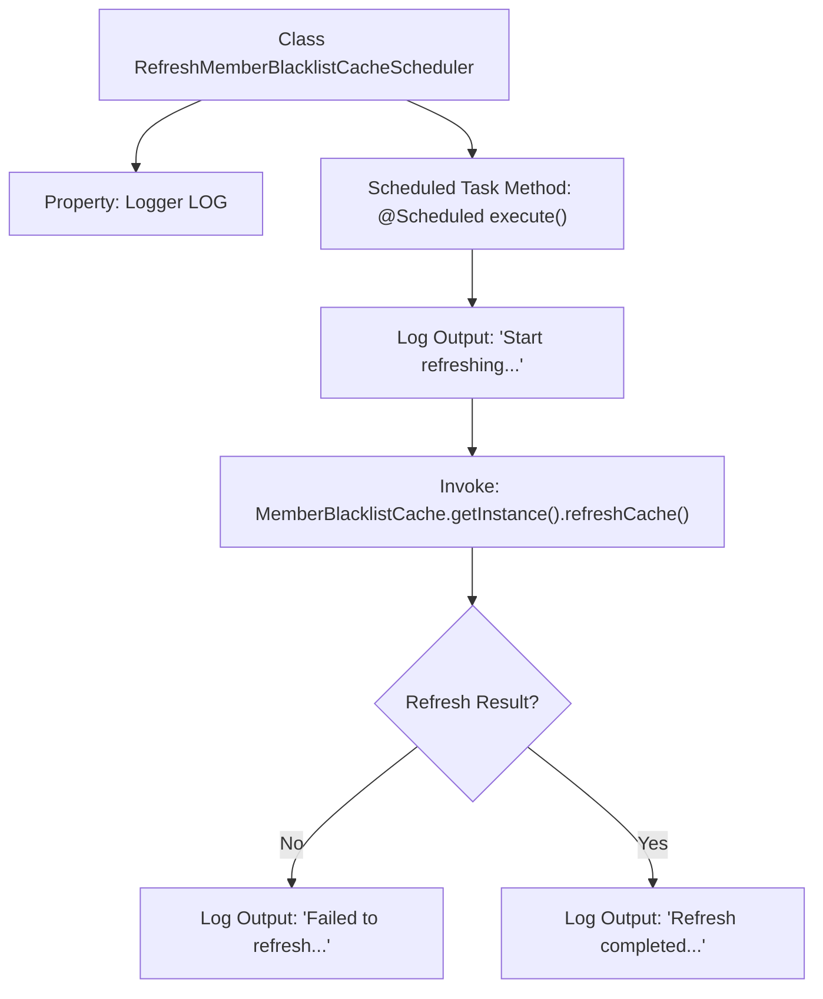

# Basic Information

|      |      |
|------|------|
| Name | RefreshMemberBlacklistCacheScheduler |
| Language | .java |
| Code Path | WeFe/gateway/src/main/java/com/welab/wefe/gateway/scheduler/RefreshMemberBlacklistCacheScheduler.java |
| Package Name | com.welab.wefe.gateway.scheduler |
| Dependencies | ['com.welab.wefe.gateway.cache.MemberBlacklistCache', 'org.slf4j.Logger', 'org.slf4j.LoggerFactory', 'org.springframework.scheduling.annotation.Scheduled', 'org.springframework.stereotype.Component'] |
| Brief Description | This is a scheduled task class for periodically refreshing the member blacklist cache, executing every 10 seconds, with both success and failure logs recorded. |

# Description

This is a Spring component class named RefreshMemberBlacklistCacheScheduler, designed for periodically refreshing the member blacklist cache. The class contains an execute method annotated with @Scheduled, which runs every 10 seconds. Upon execution, it first logs the start of the refresh process, then invokes the refreshCache method of the MemberBlacklistCache singleton to update the cache. If the refresh fails, an error log is recorded; if successful, a completion log is generated. The entire process outputs log messages at different levels via a Logger object for monitoring purposes.

# Class Summary

| Name   | Type  | Description |
|-------|------|-------------|
| RefreshMemberBlacklistCacheScheduler | class | Scheduled task class, refreshes the member blacklist cache every 10 seconds, and logs success or failure records. |

## Class RefreshMemberBlacklistCacheScheduler

|      |      |
|------|------|
| Access Modifier | @Component;public |
| Type | class |
| Name | RefreshMemberBlacklistCacheScheduler |
| Description | Scheduled task class, refreshes the member blacklist cache every 10 seconds, and logs success or failure records. |

### UML Class Diagram

This class diagram illustrates the relationship between the scheduled task component `RefreshMemberBlacklistCacheScheduler` and the cache class `MemberBlacklistCache`. The scheduler executes the `execute()` method every 10 seconds via the `@Scheduled` annotation, invoking the singleton instance of `MemberBlacklistCache` to refresh the cache and logging results at different levels. The diagram clearly demonstrates the unidirectional dependency of the Spring component scheduler on the cache class, as well as the singleton access and refresh functionality provided by the cache class.

### Internal Method Call Graph

This flowchart illustrates the execution logic of a Spring scheduled task component. The component triggers a cache refresh task every 10 seconds, first logging the start, then invoking the singleton method of MemberBlacklistCache to refresh the cache. Based on the refresh result, it outputs either failure or success logs, forming a complete closed-loop processing flow. The diagram clearly presents conditional branches and control flow points for logging.

### Field List

| Name  | Type  | Description |
|-------|-------|------|
| LOG = LoggerFactory.getLogger(RefreshMemberBlacklistCacheScheduler.class) | Logger | Declare a private static log object for recording log information of the RefreshMemberBlacklistCacheScheduler class. |

### Method List

| Name  | Type  | Description |
|-------|-------|------|
| execute | void | The scheduled task refreshes the member blacklist cache every 10 seconds, logging both successes and failures. |

