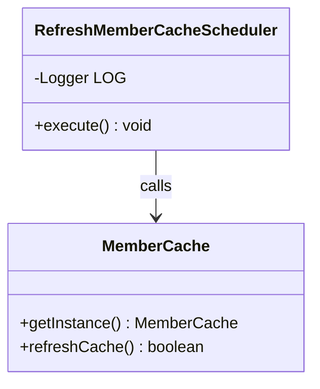
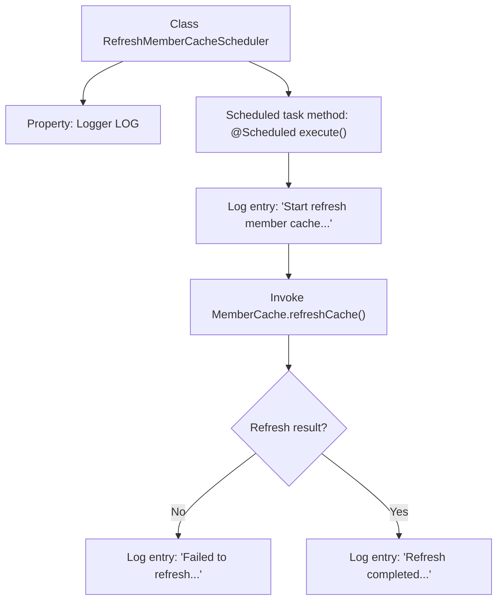

# Basic Information

|      |      |
|------|------|
| Name | RefreshMemberCacheScheduler |
| Language | .java |
| Code Path | WeFe/gateway/src/main/java/com/welab/wefe/gateway/scheduler/RefreshMemberCacheScheduler.java |
| Package Name | com.welab.wefe.gateway.scheduler |
| Dependencies | ['com.welab.wefe.gateway.cache.MemberCache', 'org.slf4j.Logger', 'org.slf4j.LoggerFactory', 'org.springframework.scheduling.annotation.Scheduled', 'org.springframework.stereotype.Component'] |
| Brief Description | Java scheduled task class, refreshes member cache every 30 seconds, logs success or failure status. |

# Description

This is a Spring component class named RefreshMemberCacheScheduler, designed to periodically refresh member cache. The class contains an execute method marked with the @Scheduled annotation, which runs every 30 seconds. During execution, it logs the start of cache refresh, then invokes the refreshCache method of MemberCache to perform the refresh. If the refresh fails, an error log is recorded; if successful, a completion log is written. The entire process outputs logs via Logger.

# Class Summary

| Name   | Type  | Description |
|-------|------|-------------|
| RefreshMemberCacheScheduler | class | This is a scheduled class for refreshing member cache periodically, executed every 30 seconds, with both success and failure logged. |

## Class RefreshMemberCacheScheduler

|      |      |
|------|------|
| Access Modifier | @Component;public |
| Type | class |
| Name | RefreshMemberCacheScheduler |
| Description | This is a scheduled class for refreshing member cache periodically, executed every 30 seconds, with both success and failure logged. |

### UML Class Diagram

Class Diagram Description:
The diagram illustrates the relationship between the RefreshMemberCacheScheduler class and the MemberCache class. RefreshMemberCacheScheduler is a scheduled task component that executes its execute() method every 30 seconds via the @Scheduled annotation. This method calls the singleton instance of MemberCache to refresh the cache. The MemberCache class provides the getInstance() method to obtain the singleton and the refreshCache() method to refresh the cache. The arrow denotes the calling dependency of RefreshMemberCacheScheduler on MemberCache.

### Internal Method Call Graph

This code demonstrates a Spring scheduled task component that executes member cache refresh every 30 seconds. The flowchart clearly illustrates the execution path: starting from log initialization, proceeding to cache refresh method invocation, and finally logging success or failure based on the result. Key nodes include the scheduled trigger, cache refresh call, and dual-branch result handling, reflecting the core execution logic and error handling mechanism of scheduled tasks.

### Field List

| Name  | Type  | Description |
|-------|-------|------|
| LOG = LoggerFactory.getLogger(RefreshMemberCacheScheduler.class) | Logger | Defined a private static log object LOG for recording log information of the RefreshMemberCacheScheduler class. |

### Method List

| Name  | Type  | Description |
|-------|-------|------|
| execute | void | The scheduled task refreshes the member cache every 30 seconds, logging both successes and failures. |

