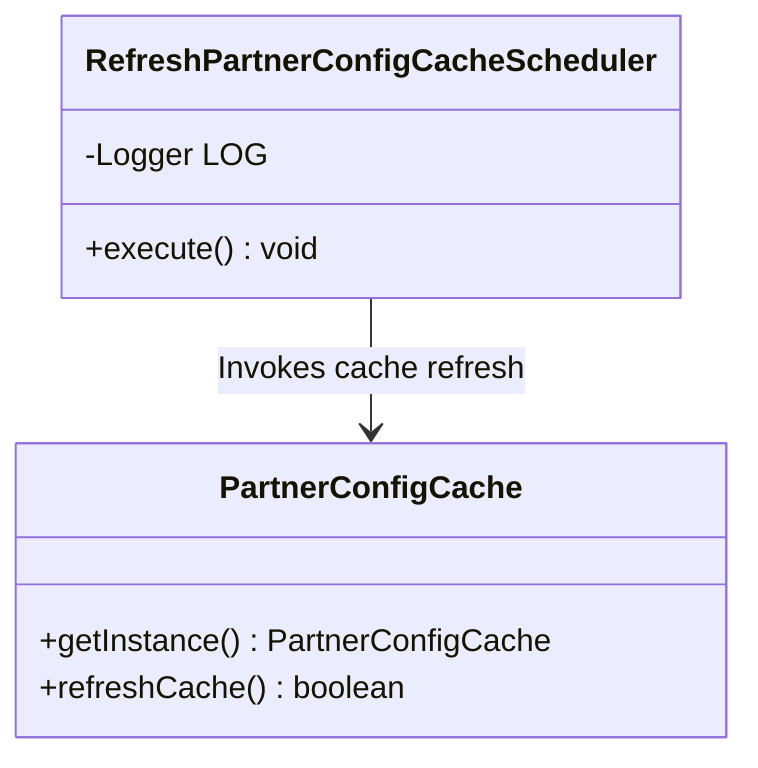
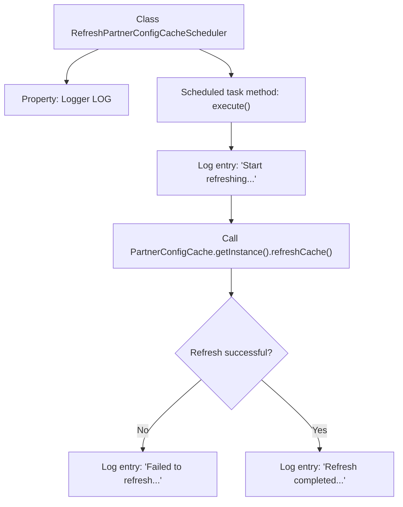

# Basic Information

|      |      |
|------|------|
| Name | RefreshPartnerConfigCacheScheduler |
| Language | .java |
| Code Path | WeFe/gateway/src/main/java/com/welab/wefe/gateway/scheduler/RefreshPartnerConfigCacheScheduler.java |
| Package Name | com.welab.wefe.gateway.scheduler |
| Dependencies | ['com.welab.wefe.gateway.cache.PartnerConfigCache', 'org.slf4j.Logger', 'org.slf4j.LoggerFactory', 'org.springframework.scheduling.annotation.Scheduled'] |
| Brief Description | Scheduled task class, refreshes partner configuration cache every 10 seconds, logs success or failure records. |

# Description

This is a Java class named RefreshPartnerConfigCacheScheduler, designed to periodically refresh the partner configuration cache. It utilizes Spring's Scheduled annotation to set up a scheduled task that executes every 10 seconds. Upon execution, it first logs the start of the refresh process, then calls the refreshCache method of the PartnerConfigCache singleton instance to update the cache. If the refresh fails, an error log is recorded; if successful, a completion log is written. The entire process logs key milestones through the Logger object within the class.

# Class Summary

| Name   | Type  | Description |
|-------|------|-------------|
| RefreshPartnerConfigCacheScheduler | class | Scheduled task class, refreshes partner configuration cache every 10 seconds, logs success or failure records. |

## Class RefreshPartnerConfigCacheScheduler

|      |      |
|------|------|
| Access Modifier | public |
| Type | class |
| Name | RefreshPartnerConfigCacheScheduler |
| Description | Scheduled task class, refreshes partner configuration cache every 10 seconds, logs success or failure records. |

### UML Class Diagram

Class diagram description: This diagram illustrates how the RefreshPartnerConfigCacheScheduler class invokes the cache refresh functionality of the PartnerConfigCache singleton through scheduled tasks. The scheduler class contains a logger and an execution method, while PartnerConfigCache provides methods for obtaining instances and refreshing the cache. The two classes implement a scheduled cache update mechanism through a dependency relationship, demonstrating a typical interaction scenario between scheduled tasks and the singleton pattern.

### Internal Method Call Graph

This code demonstrates a scheduler class for periodically refreshing partner configuration cache. The flowchart illustrates the complete workflow from triggering the scheduled task, logging startup information, invoking the cache refresh method, to recording status logs based on refresh results. Key paths include initializing logs, executing cache refresh operations, and branch processing based on outcomes, reflecting the core logic of scheduled tasks and error handling mechanisms.

### Field List

| Name  | Type  | Description |
|-------|-------|------|
| LOG = LoggerFactory.getLogger(RefreshPartnerConfigCacheScheduler.class) | Logger | Define a private static log object LOG for logging in the RefreshPartnerConfigCacheScheduler class. |

### Method List

| Name  | Type  | Description |
|-------|-------|------|
| execute | void | The scheduled task runs every 10 seconds to refresh the partner configuration cache, logging both successes and failures. |

