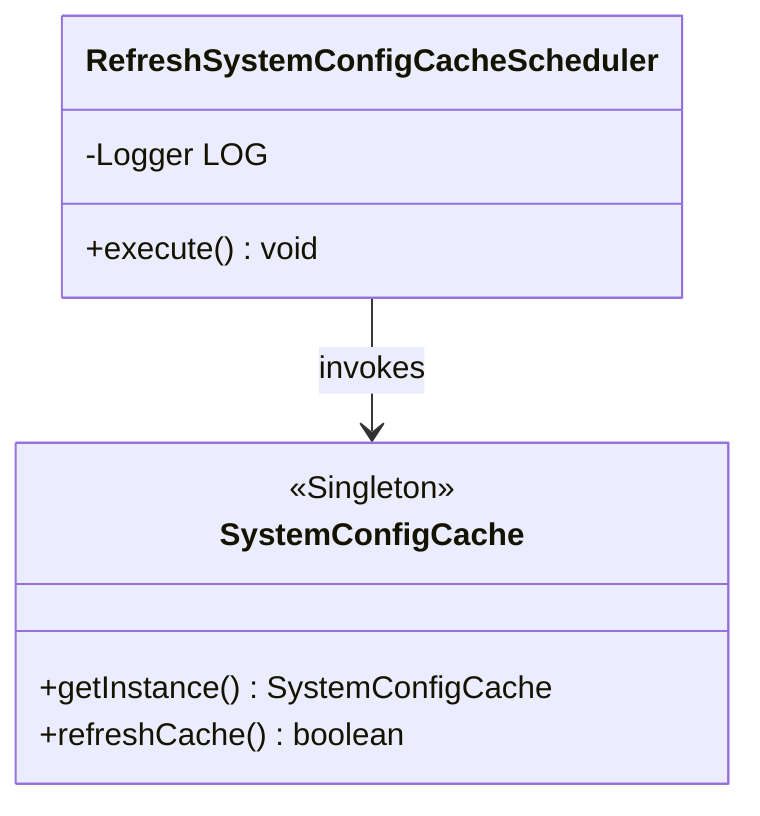
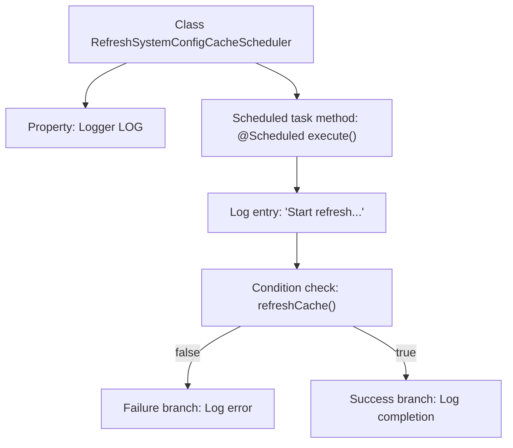

# Basic Information

|      |      |
|------|------|
| Name | RefreshSystemConfigCacheScheduler |
| Language | .java |
| Code Path | WeFe/gateway/src/main/java/com/welab/wefe/gateway/scheduler/RefreshSystemConfigCacheScheduler.java |
| Package Name | com.welab.wefe.gateway.scheduler |
| Dependencies | ['com.welab.wefe.gateway.cache.SystemConfigCache', 'org.slf4j.Logger', 'org.slf4j.LoggerFactory', 'org.springframework.scheduling.annotation.Scheduled', 'org.springframework.stereotype.Component'] |
| Brief Description | Scheduled task class, refreshes system configuration cache every 30 seconds, logs success or failure status. |

# Description

This is a Spring component class named RefreshSystemConfigCacheScheduler, designed to periodically refresh the system configuration cache. The class contains an execute method marked with the @Scheduled annotation, which runs every 30 seconds. Upon execution, it first logs a message indicating the start of the cache refresh, then calls the SystemConfigCache.getInstance().refreshCache() method to refresh the cache. If the refresh fails, an error log is recorded; if successful, a completion log is generated. The entire process is logged using the Logger object defined within the class.

# Class Summary

| Name   | Type  | Description |
|-------|------|-------------|
| RefreshSystemConfigCacheScheduler | class | Scheduled task class, refreshes system configuration cache every 30 seconds, logs success or failure status. |

## Class RefreshSystemConfigCacheScheduler

|      |      |
|------|------|
| Access Modifier | @Component;public |
| Type | class |
| Name | RefreshSystemConfigCacheScheduler |
| Description | Scheduled task class, refreshes system configuration cache every 30 seconds, logs success or failure status. |

### UML Class Diagram

This code illustrates a scheduler class for periodically refreshing system configuration cache. The RefreshSystemConfigCacheScheduler executes its `execute` method every 30 seconds via @Scheduled annotation, which invokes the singleton SystemConfigCache's `refreshCache` method to update the cache and logs the result accordingly. SystemConfigCache is a singleton class providing cache refresh functionality. The class diagram clearly depicts the scheduler's dependency on the cache singleton.

### Internal Method Call Graph

This flowchart illustrates the execution logic of a scheduled cache refresh component. The class contains a Logger property and an execute() method annotated with @Scheduled. Upon initiation, the method first logs an entry, then invokes the refreshCache() method of SystemConfigCache to update the cache. Based on the return result, it either logs an error or a completion message. The entire process demonstrates the complete control flow from task triggering to result handling.

### Field List

| Name  | Type  | Description |
|-------|-------|------|
| LOG = LoggerFactory.getLogger(RefreshSystemConfigCacheScheduler.class) | Logger | Declare a private static logger object for logging in the RefreshSystemConfigCacheScheduler class. |

### Method List

| Name  | Type  | Description |
|-------|-------|------|
| execute | void | The scheduled task refreshes the system configuration cache every 30 seconds, logging both successes and failures. |

