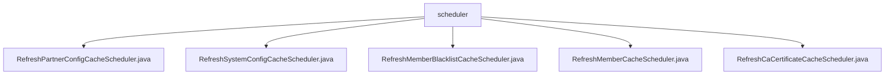

# Basic Information

|      |      |
|------|------|
| Name | scheduler |
| Language | .java |
| Code Path | WeFe/gateway/src/main/java/com/welab/wefe/gateway/scheduler |
| Package Name | docs.gateway.src.main.java.com.welab.wefe.gateway.scheduler |
| Brief Description | Five Spring scheduled task classes, refreshing partner configurations, system configurations, member blacklists, members, and CA certificate caches every 10/30 seconds respectively, each with start/success/failure log records. |

# Description

## Overview  
This module is a set of Spring-based scheduled cache refresh components, with the core responsibility of periodically updating various system configurations and business data caches. All schedulers adopt an event-bus-like pattern, triggered cyclically via the @Scheduled annotation. For example, partner configurations are refreshed every 10 seconds, while system configurations and CA certificates are refreshed every 30 seconds. The unified interface specification requires each class to include an `execute` method, which invokes the `refreshCache` method of the corresponding singleton Cache and logs execution status via Logger. Key data structures include singleton cache instances such as `PartnerConfigCache` and `SystemConfigCache`. The only external dependency is the scheduled task module of the Spring framework.  

## Primary Business Scenarios  
The module serves the real-time data synchronization needs of the gateway system, forming a comprehensive cache update framework. A typical workflow involves: scheduled triggering → logging → cache refresh invocation → status logging, resembling a heartbeat detection mechanism. For instance, the member blacklist is updated every 10 seconds, and member data is synchronized every 30 seconds. All components adhere to the same interaction pattern: parameterless invocation, exception handling, and status logging. Typical applications include automatic certificate renewal and real-time blacklist synchronization, ensuring system data consistency through high-frequency refreshes. The API types are exclusively scheduled task triggers, with integration cases covering multiple business dimensions such as configurations, certificates, and members.

### Package Internal Structure View

This flowchart illustrates the Java class file structure of the scheduler module in the WeFe gateway project. The root node "scheduler" contains five scheduled task classes, responsible for refreshing partner configuration cache, system configuration cache, member blacklist cache, member cache, and CA certificate cache respectively. All classes reside at the same directory level without deeper nesting relationships.

# File List

| Name   | Type  | Description |
|-------|------|-------------|
| [RefreshPartnerConfigCacheScheduler.java](RefreshPartnerConfigCacheScheduler.md) | file | Scheduled task class, refreshes partner configuration cache every 10 seconds, logs success or failure status. |
| [RefreshSystemConfigCacheScheduler.java](RefreshSystemConfigCacheScheduler.md) | file | Scheduled task class, refreshes system configuration cache every 30 seconds, logs success or failure status. |
| [RefreshMemberBlacklistCacheScheduler.java](RefreshMemberBlacklistCacheScheduler.md) | file | This is a scheduled class for periodically refreshing the member blacklist cache, executed every 10 seconds, with both success and failure logs recorded. |
| [RefreshMemberCacheScheduler.java](RefreshMemberCacheScheduler.md) | file | Java scheduled task class, refreshes member cache every 30 seconds, logs success or failure status. |
| [RefreshCaCertificateCacheScheduler.java](RefreshCaCertificateCacheScheduler.md) | file | Scheduled task class, refreshes CA certificate cache every 30 seconds and logs success or failure status. |

