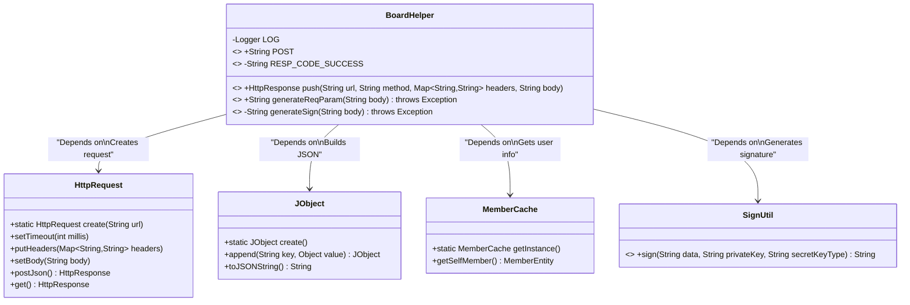
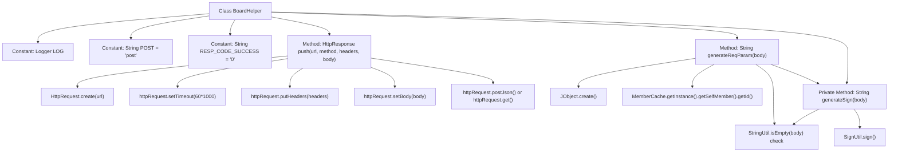

# Basic Information

|      |      |
|------|------|
| Name | BoardHelper |
| Language | .java |
| Code Path | WeFe/gateway/src/main/java/com/welab/wefe/gateway/sdk/BoardHelper.java |
| Package Name | com.welab.wefe.gateway.sdk |
| Dependencies | ['com.welab.wefe.common.http.HttpRequest', 'com.welab.wefe.common.http.HttpResponse', 'com.welab.wefe.common.util.JObject', 'com.welab.wefe.common.util.RSAUtil', 'com.welab.wefe.common.util.SignUtil', 'com.welab.wefe.common.util.StringUtil', 'com.welab.wefe.gateway.cache.MemberCache', 'com.welab.wefe.gateway.entity.MemberEntity', 'org.slf4j.Logger', 'org.slf4j.LoggerFactory', 'java.util.Map'] |
| Brief Description | The BoardHelper class provides HTTP request and signature functionalities, including the push method for sending requests, generateReqParam for generating request bodies, generateSign for generating signatures, using member ID and private key. |

# Description

BoardHelper is a utility class primarily designed for handling HTTP requests and generating request parameters. The class includes static constants POST and RESP_CODE_SUCCESS, representing the HTTP method and successful response code respectively. The push method is used to send HTTP requests, supporting both POST and GET methods, with configurable timeout, request headers, and request body. The generateReqParam method generates request parameters, including member ID, request data, and signature. The generateSign method generates a signature based on the member's private key and key type to sign the request body. All methods involve retrieving member information and string processing.

# Class Summary

| Name   | Type  | Description |
|-------|------|-------------|
| BoardHelper | class | The BoardHelper class provides HTTP request push and request parameter generation functionalities, including POST constants, success response codes, the push method for sending requests, as well as utility methods for generating request bodies and signatures. |

## Class BoardHelper

|      |      |
|------|------|
| Access Modifier | public |
| Type | class |
| Name | BoardHelper |
| Description | The BoardHelper class provides HTTP request push and request parameter generation functionalities, including POST constants, success response codes, the push method for sending requests, as well as utility methods for generating request bodies and signatures. |

### UML Class Diagram

Class diagram description: BoardHelper is a utility class primarily providing HTTP request pushing and parameter generation functionalities. It depends on HttpRequest for network requests, uses JObject to construct JSON parameters, obtains current user information through MemberCache, and invokes SignUtil to generate signatures. The class contains static constants POST and RESP_CODE_SUCCESS, with core methods push() handling request sending and generateReqParam() generating signed request parameters.

### Internal Method Call Graph

This code represents the BoardHelper utility class, primarily providing HTTP request push and parameter generation functionalities. The flowchart illustrates the class structure, including constant definitions, public methods push() and generateReqParam(), and private method generateSign(). The push method creates an HTTP request with timeout, headers, and body settings, executing POST or GET based on the method type. generateReqParam generates a JSON request body containing member ID, data, and signature. generateSign performs body signing using the member's private key. Clear invocation relationships between methods demonstrate the complete parameter processing and signature verification workflow.

### Field List

| Name  | Type  | Description |
|-------|-------|------|
| LOG = LoggerFactory.getLogger(BoardHelper.class) | Logger | Define a private static log constant LOG for the BoardHelper class. |
| RESP_CODE_SUCCESS = "0" | String | Define a static constant RESP_CODE_SUCCESS with the value "0", representing the successful response code. |
| POST = "post" | String | Defined a public static constant string POST with the value "post". |

### Method List

| Name  | Type  | Description |
|-------|-------|------|
| generateReqParam | String | Static method to generate request parameters, including member ID, data body, and signature. When the data body is empty, it is replaced with an empty string, and the final result is converted into a JSON string. |
| push | HttpResponse | The static method `push` accepts a URL, method, request headers, and request body, sets a timeout, then sends a POST or GET request and returns the response. |
| generateSign | String | This method is used to generate a signature, accepting a string parameter `body`, which is converted to an empty string if null. It retrieves the current member's private key and key type via `MemberCache`, then calls `SignUtil.sign` to perform the signing and returns the result. |

