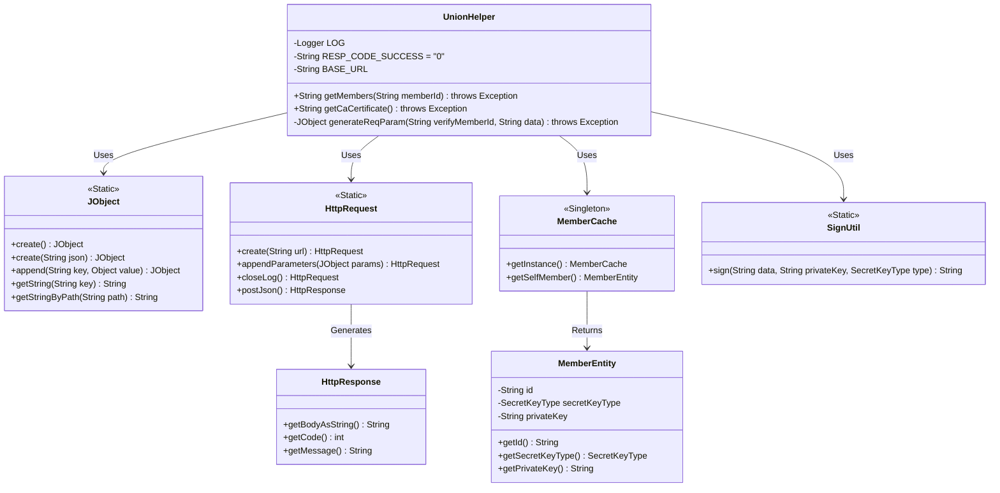
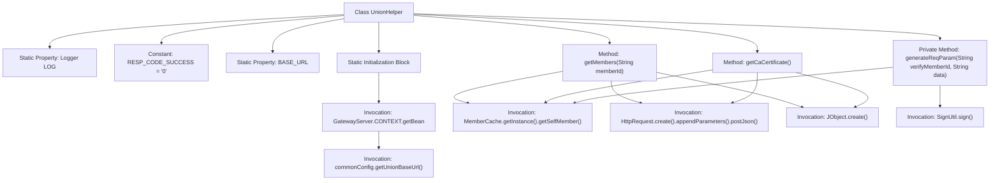
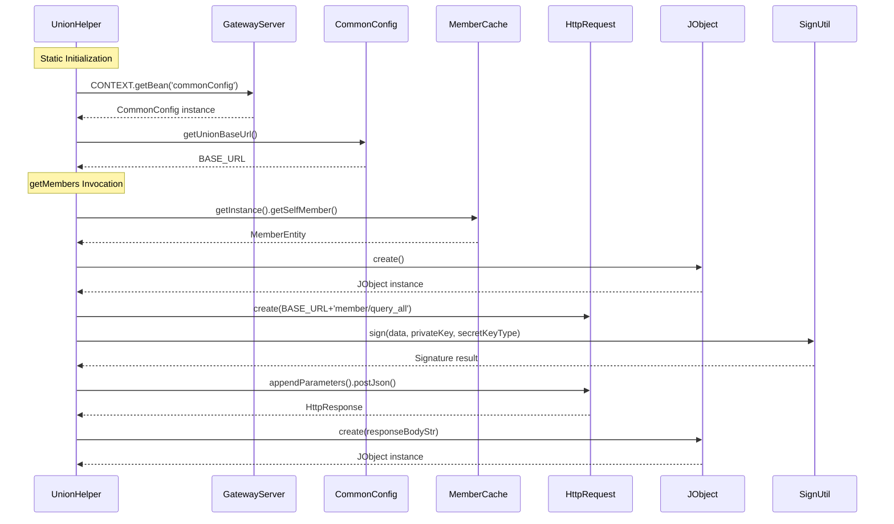

# Basic Information

|      |      |
|------|------|
| Name | UnionHelper |
| Language | .java |
| Code Path | WeFe/gateway/src/main/java/com/welab/wefe/gateway/sdk/UnionHelper.java |
| Package Name | com.welab.wefe.gateway.sdk |
| Dependencies | ['com.welab.wefe.common.constant.SecretKeyType', 'com.welab.wefe.common.http.HttpRequest', 'com.welab.wefe.common.http.HttpResponse', 'com.welab.wefe.common.util.JObject', 'com.welab.wefe.common.util.SignUtil', 'com.welab.wefe.common.util.StringUtil', 'com.welab.wefe.gateway.GatewayServer', 'com.welab.wefe.gateway.cache.CaCertificateCache', 'com.welab.wefe.gateway.cache.MemberCache', 'com.welab.wefe.gateway.config.CommonConfig', 'com.welab.wefe.gateway.config.ConfigProperties', 'com.welab.wefe.gateway.entity.MemberEntity', 'org.slf4j.Logger', 'org.slf4j.LoggerFactory', 'java.util.ArrayList', 'java.util.List'] |
| Brief Description | The UnionHelper class provides static methods: initializing BASE_URL; querying member information (with support for ID-based filtering); querying CA certificates; generating request parameters with signatures. It uses JObject to process JSON, sends requests via HttpRequest, and validates response codes and data. Exceptions are logged and thrown when they occur. |

# Description

The `UnionHelper` class is a utility class designed to handle federation network requests. It includes a static initialization block that retrieves the base URL from the configuration and ensures it ends with a slash. The class defines two primary methods: `getMembers` for querying member information with support for filtering by member ID, and `getCaCertificate` for retrieving all CA certificates. Both methods interact with the cloud via HTTP requests, using the `generateReqParam` method to generate signed request parameters and validating the response data. Error handling encompasses logging and exception throwing, with a successful response code of "0". The class also defines a logger and a constant for the success response code.

# Class Summary

| Name   | Type  | Description |
|-------|------|-------------|
| UnionHelper | class | The UnionHelper class provides static methods to query member and CA certificate information. During initialization, it retrieves the base URL from the configuration. The methods fetch data via HTTP requests, validate response codes and business data, and throw exceptions upon failure. Request parameters are generated with signatures to ensure security. |

## Class UnionHelper

|      |      |
|------|------|
| Access Modifier | public |
| Type | class |
| Name | UnionHelper |
| Description | The UnionHelper class provides static methods to query member and CA certificate information. During initialization, it retrieves the base URL from the configuration. The methods fetch data via HTTP requests, validate response codes and business data, and throw exceptions upon failure. Request parameters are generated with signatures to ensure security. |

### UML Class Diagram

Class Diagram Description:
UnionHelper is a utility class primarily used for interacting with the consortium network, including functionalities for retrieving member information and CA certificates. It relies on JObject for JSON data processing, uses HttpRequest to send HTTP requests, obtains current member information through MemberCache, and invokes SignUtil for data signing. The diagram clearly illustrates the dependencies between these components, demonstrating the collaborative approach between utility and helper classes.

### Internal Method Call Graph

This code represents the UnionHelper utility class, whose main functionalities include static initialization of base URL, querying member information, and CA certificates. The flowchart illustrates the class structure and method invocation relationships, while the sequence diagram details the execution flow of static initialization and the getMembers method. The code retrieves configurations via Spring context, interacts with cloud services through HTTP requests, ensures data security via signature verification, and performs multi-layer validation on response data to guarantee business data validity.

### Field List

| Name  | Type  | Description |
|-------|-------|------|
| RESP_CODE_SUCCESS = "0" | String | Define a private static constant RESP_CODE_SUCCESS with the value "0", representing the successful response code. |
| BASE_URL | String | Define a static string variable BASE_URL to store the base URL address. |
| LOG = LoggerFactory.getLogger(UnionHelper.class) | Logger | A private static immutable logger instance defined in the UnionHelper class. |

### Method List

| Name  | Type  | Description |
|-------|-------|------|
| getMembers | String | This method queries member information via an HTTP request, validates parameters before sending the request, processes the response data, and returns the result. It throws exceptions and logs errors when they occur. |
| getCaCertificate | String | The static method `getCaCertificate` retrieves CA certificate information via an HTTP request, processes the response data after validating the member ID, returns a list of certificates upon success, and throws an exception while logging the error upon failure. |
| generateReqParam | JObject | Static method for generating request parameters, which uses member ID and data, signs with private key and key type, and returns a JSON object containing the signature, member ID, and data. |

