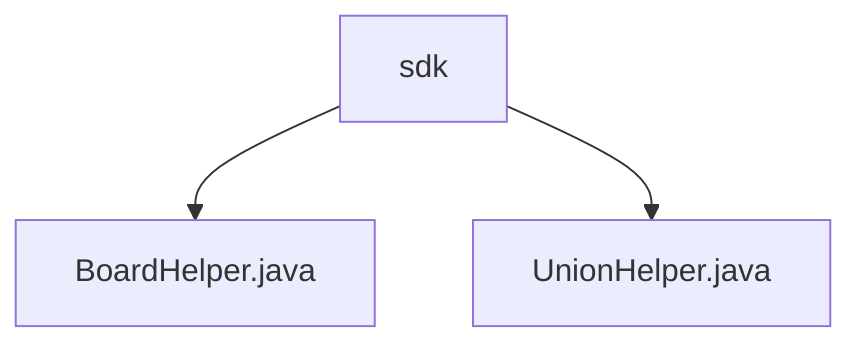

# Basic Information

|      |      |
|------|------|
| Name | sdk |
| Language | .java |
| Code Path | WeFe/gateway/src/main/java/com/welab/wefe/gateway/sdk |
| Package Name | docs.gateway.src.main.java.com.welab.wefe.gateway.sdk |
| Brief Description | BoardHelper is a utility class for handling HTTP requests, containing POST and RESP_CODE_SUCCESS constants, and providing functionalities such as push for sending requests, generateReqParam for generating parameters, and generateSign for signing. UnionHelper manages consortium network requests, including methods like getMembers for querying members and getCaCertificate for retrieving CA certificates, both interacting via HTTP and validating responses. |

# Description

## Overview  
The core responsibility of this module is to provide utility classes for HTTP request processing and consortium network interactions, including functionalities such as request parameter generation, signature verification, and member information queries. The interface specifications mandate the uniform use of POST/RESP_CODE_SUCCESS constants, support for generating signed request parameters (e.g., `generateReqParam`), and response validation. Key data structures involve member IDs, request data, signatures, and CA certificates. External dependencies include an HTTP client, logging system, and key management service. For example, `BoardHelper` handles basic HTTP requests, while `UnionHelper` is specialized for consortium member and certificate queries.  

## Key Business Scenarios  
The module primarily serves consortium network communication, with a typical workflow as follows: generate signed parameters → send HTTP request → validate response. The interaction pattern resembles an API gateway, such as `UnionHelper` querying members or certificates via `getMembers`/`getCaCertificate`. Functional completeness is reflected in error handling (logging + exceptions) and success code validation. Typical applications include member management (e.g., filtering by ID) and CA certificate synchronization. API types encompass query-based (GET) and submission-based (POST) operations, with integration examples like `BoardHelper`'s `push` method supporting timeout settings.

### Package Internal Structure View

This flowchart illustrates the code structure of the WeFe gateway SDK module. The sdk directory contains two Java class files: BoardHelper.java and UnionHelper.java. Both files are directly under the sdk directory with no deeper nesting, forming a simple two-level directory hierarchy.

# File List

| Name   | Type  | Description |
|-------|------|-------------|
| [BoardHelper.java](BoardHelper.md) | file | The BoardHelper class provides HTTP request and signature functionalities, including the push method for sending requests, generateReqParam for generating request bodies, generateSign for generating signatures, and utilizes member ID and private key. |
| [UnionHelper.java](UnionHelper.md) | file | The UnionHelper class provides static methods: initializing BASE_URL; querying member information (supports filtering by ID); querying CA certificates; generating request parameters with signatures. It uses JObject to process JSON, sends requests via HttpRequest, and validates response codes and data. Exceptions are logged and thrown when they occur. |

