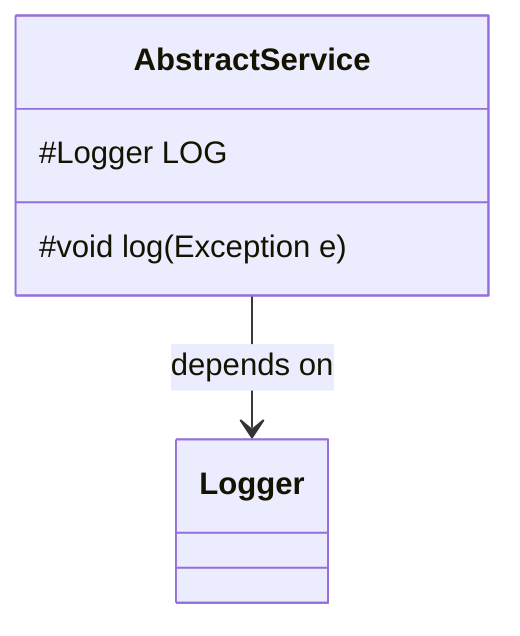
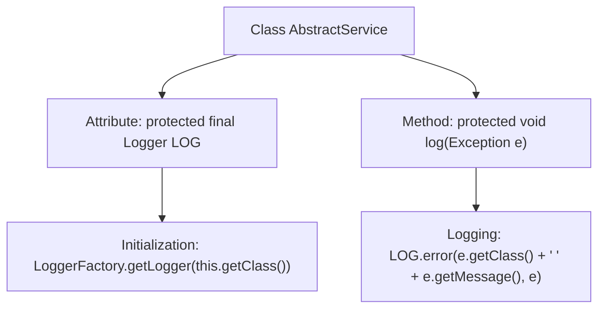

# Basic Information

|      |      |
|------|------|
| Name | AbstractService |
| Language | .java |
| Code Path | WeFe/gateway/src/main/java/com/welab/wefe/gateway/service/AbstractService.java |
| Package Name | com.welab.wefe.gateway.service |
| Dependencies | ['org.slf4j.Logger', 'org.slf4j.LoggerFactory'] |
| Brief Description | Abstract service classes provide logging functionality, including a protected log object and an exception logging method. |

# Description

This is an abstract class named AbstractService, primarily designed to provide logging functionality. The class contains a protected Logger instance, which obtains the logger for the current class through LoggerFactory. It also defines a protected log method for recording exception information, which outputs the exception class name, exception message, and the complete exception stack trace. This class can serve as a base class for other service classes, offering unified exception logging capabilities.

# Class Summary

| Name   | Type  | Description |
|-------|------|-------------|
| AbstractService | class | Abstract service classes provide logging functionality, including log objects and exception logging methods. |

## Class AbstractService

|      |      |
|------|------|
| Access Modifier | public |
| Type | class |
| Name | AbstractService |
| Description | Abstract service classes provide logging functionality, including log objects and exception logging methods. |

### UML Class Diagram

This code demonstrates an abstract service class `AbstractService`, which contains a protected logger `LOG` and a protected logging method `log`. The class obtains a logger instance for the current class through `LoggerFactory` and provides unified exception logging functionality, recording the exception type, message, and complete stack trace into the logging system. This design pattern is commonly used in service layer base classes to provide consistent logging capabilities for subclasses.

### Internal Method Call Graph

This code demonstrates an abstract service class AbstractService, which includes a protected logger LOG and a logging method log. The flowchart clearly depicts the class structure: first initializing the Logger object, then capturing exceptions and logging error messages through the log method, including the exception type and message. This design provides subclasses with unified exception logging capabilities, adhering to object-oriented encapsulation principles.

### Field List

| Name  | Type  | Description |
|-------|-------|------|
| LOG = LoggerFactory.getLogger(this.getClass()) | Logger | The class defines a protected and immutable logger instance for logging output within the current class. |

### Method List

| Name  | Type  | Description |
|-------|-------|------|
| log | void | This method is used to log exceptions, including the exception class name and message, and outputs the complete exception stack trace. |

