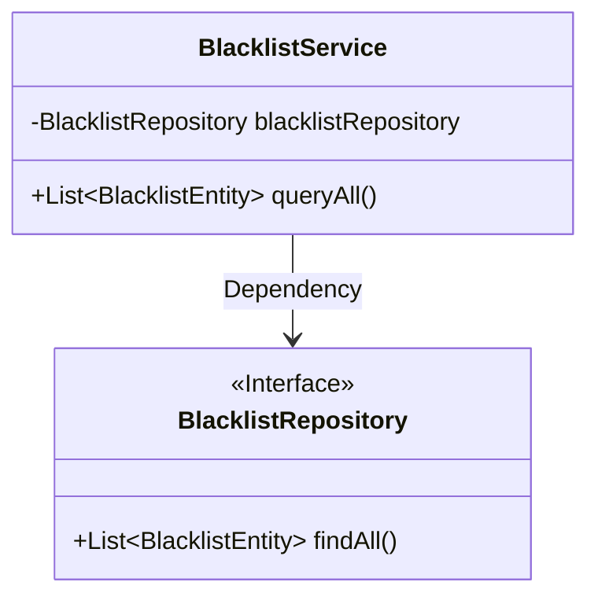
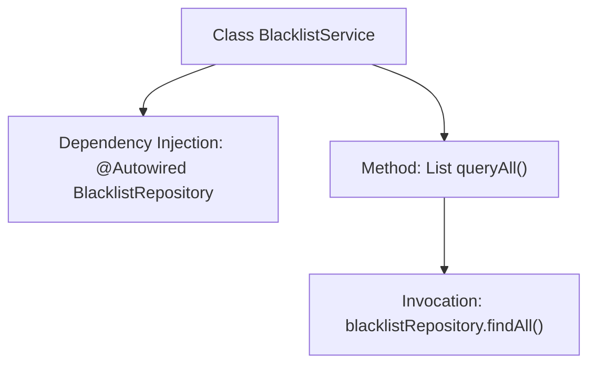

# Basic Information

|      |      |
|------|------|
| Name | BlacklistService |
| Language | .java |
| Code Path | WeFe/gateway/src/main/java/com/welab/wefe/gateway/service/BlacklistService.java |
| Package Name | com.welab.wefe.gateway.service |
| Dependencies | ['com.welab.wefe.gateway.entity.BlacklistEntity', 'com.welab.wefe.gateway.repository.BlacklistRepository', 'org.springframework.beans.factory.annotation.Autowired', 'org.springframework.stereotype.Service', 'java.util.List'] |
| Brief Description | Blacklist service class, automatically injects the repository, provides methods to query all blacklists. |

# Description

This is a service class named BlacklistService, marked as a Spring service component using the @Service annotation. It automatically injects a BlacklistRepository instance via @Autowired for data access. The class provides a queryAll method, which calls the findAll method of blacklistRepository to query and return a list of all blacklist entities. The entire class focuses on the query functionality of blacklist data, with a concise and clear structure.

# Class Summary

| Name   | Type  | Description |
|-------|------|-------------|
| BlacklistService | class | Blacklist service class, automatically injects the repository interface, and provides a method to query all blacklist data. |

## Class BlacklistService

|      |      |
|------|------|
| Access Modifier | @Service;public |
| Type | class |
| Name | BlacklistService |
| Description | Blacklist service class, automatically injects the repository interface, and provides a method to query all blacklist data. |

### UML Class Diagram

This class diagram illustrates the Spring service layer component BlacklistService and its dependencies. The BlacklistService autowires an instance of the BlacklistRepository interface via @Autowired and exposes the queryAll() method to provide external services. The BlacklistRepository, marked as a JPA interface (annotated with <<Interface>>), defines the abstract findAll() method. The diagram clearly presents the unidirectional dependency relationship between the service layer invoking the persistence layer, conforming to the typical layered architecture design pattern.

### Internal Method Call Graph

This flowchart illustrates the structure and invocation relationships of the Spring service class BlacklistService. The class automatically injects the BlacklistRepository dependency via @Autowired and provides the queryAll() method as an external service. Internally, this method directly calls the JPA repository's findAll() interface to retrieve full data, demonstrating a typical Spring Data JPA layered architecture pattern. The entire process is concise and clear, adhering to the Single Responsibility Principle, making it suitable for handling blacklist data query requirements.

### Field List

| Name  | Type  | Description |
|-------|-------|------|
| blacklistRepository | BlacklistRepository | Automatically inject blacklist repository instances. |

### Method List

| Name  | Type  | Description |
|-------|-------|------|
| queryAll | List<BlacklistEntity> | Query all blacklist entities, call the findAll method of blacklistRepository to return a list. |

