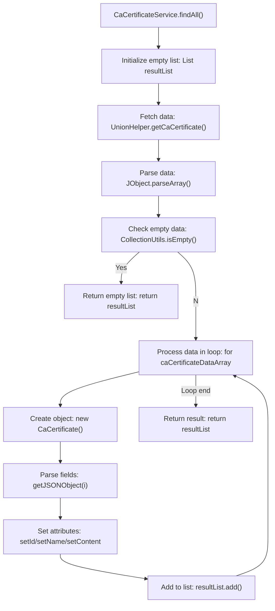

# Basic Information

|      |      |
|------|------|
| Name | CaCertificateService |
| Language | .java |
| Code Path | WeFe/gateway/src/main/java/com/welab/wefe/gateway/service/CaCertificateService.java |
| Package Name | com.welab.wefe.gateway.service |
| Dependencies | ['com.alibaba.fastjson.JSONArray', 'com.alibaba.fastjson.JSONObject', 'com.welab.wefe.common.util.JObject', 'com.welab.wefe.gateway.cache.CaCertificateCache', 'com.welab.wefe.gateway.sdk.UnionHelper', 'org.apache.commons.collections4.CollectionUtils', 'org.springframework.stereotype.Service', 'java.util.ArrayList', 'java.util.List'] |
| Brief Description | The CaCertificateService class provides the findAll method, which retrieves CA certificate data from the federated service, parses it into a list, and returns it containing the serial number, subject name, and certificate content. |

# Description

The `findAll` method in the `CaCertificateService` class is used to retrieve all CA certificate data from the federation service. This method first creates an empty list to store the results, then obtains the CA certificate JSON array data through `UnionHelper`. If the data is empty, it returns an empty list. While iterating through the array, it creates a `CaCertificate` object for each certificate, extracts the serial number, subject name, and certificate content from the JSON object, and sets them in the object. Finally, it adds all certificate objects to the result list and returns it.

# Class Summary

| Name   | Type  | Description |
|-------|------|-------------|
| CaCertificateService | class | The CaCertificateService class provides the findAll method, which retrieves CA certificate data from the federated service and parses it into a list for return. |


## Class CaCertificateService

|      |      |
|------|------|
| Access Modifier | @Service;public |
| Type | class |
| Name | CaCertificateService |
| Description | The CaCertificateService class provides the findAll method, which retrieves CA certificate data from the federated service and parses it into a list for return. |


### UML Class Diagram

```mermaid
classDiagram
    class CaCertificateService {
        +findAll() List~CaCertificateCache.CaCertificate~
    }
    
    class CaCertificateCache {
        class CaCertificate {
            -String id
            -String name
            -String content
            +setId(String id)
            +setName(String name)
            +setContent(String content)
        }
    }
    
    class UnionHelper {
        <<Interface>>
        +getCaCertificate() String
    }
    
    class JObject {
        <<Interface>>
        +parseArray(String json) JSONArray
    }
    
    class CollectionUtils {
        <<Interface>>
        +isEmpty(JSONArray array) boolean
    }
    
    CaCertificateService --> UnionHelper : Dependency
    CaCertificateService --> JObject : Dependency
    CaCertificateService --> CollectionUtils : Dependency
    CaCertificateService --> CaCertificateCache : Contains
```

This code describes a CA certificate service class `CaCertificateService`, which retrieves CA certificate data by invoking `UnionHelper`, parses JSON arrays using `JObject`, and checks for empty data via `CollectionUtils`. The service class internally utilizes `CaCertificateCache.CaCertificate` to store certificate information (serial number, subject name, and certificate content). The class diagram illustrates dependency relationships and internal structures among these classes, where `UnionHelper`, `JObject`, and `CollectionUtils` are marked as interfaces, while `CaCertificateCache` contains an inner class `CaCertificate` for encapsulating certificate data.


### Internal Method Call Graph



This flowchart illustrates the complete execution process of the findAll() method in the CaCertificateService class. The method first initializes an empty list, retrieves CA certificate data via UnionHelper, and parses it into a JSON array. If the data is empty, it directly returns the empty list; otherwise, it processes each certificate data item in a loop: creating a CaCertificate object, setting its attributes (serial number, subject name, certificate content), and finally returning the populated list. The entire process includes key steps such as data retrieval, null check, loop processing, and result return.

### Field List

| Name  | Type  | Description |
|-------|-------|------|

### Method List

| Name  | Type  | Description |
|-------|-------|------|
| findAll | List<CaCertificateCache.CaCertificate> | The method findAll retrieves a list of CA certificates, parses the JSON data, and populates it into CaCertificate objects, returning a list containing serial numbers, subject names, and certificate contents. If no data is available, an empty list is returned. |


