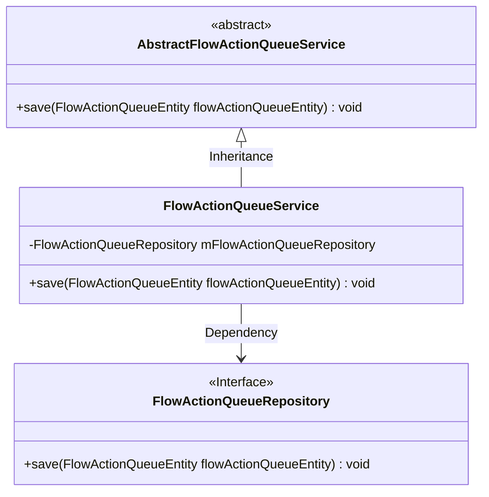
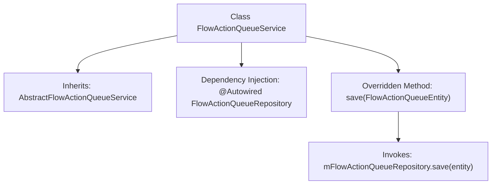

# Basic Information

|      |      |
|------|------|
| Name | FlowActionQueueService |
| Language | .java |
| Code Path | WeFe/gateway/src/main/java/com/welab/wefe/gateway/service/FlowActionQueueService.java |
| Package Name | com.welab.wefe.gateway.service |
| Dependencies | ['com.welab.wefe.gateway.entity.FlowActionQueueEntity', 'com.welab.wefe.gateway.repository.FlowActionQueueRepository', 'com.welab.wefe.gateway.service.base.AbstractFlowActionQueueService', 'org.springframework.beans.factory.annotation.Autowired', 'org.springframework.stereotype.Service'] |
| Brief Description | The FlowActionQueueService extends AbstractFlowActionQueueService and persists FlowActionQueueEntity instances via FlowActionQueueRepository. |

# Description

This is a service class named FlowActionQueueService, which extends AbstractFlowActionQueueService. It uses the @Autowired annotation to automatically inject an instance of FlowActionQueueRepository. The class overrides the save method, invoking the save method of mFlowActionQueueRepository to persist the incoming FlowActionQueueEntity object. The primary functionality of this class is to provide persistence operations for flow action queue entities.

# Class Summary

| Name   | Type  | Description |
|-------|------|-------------|
| FlowActionQueueService | class | The FlowActionQueueService inherits from AbstractFlowActionQueueService and persists FlowActionQueueEntity instances via FlowActionQueueRepository. |

## Class FlowActionQueueService

|      |      |
|------|------|
| Access Modifier | @Service;public |
| Type | class |
| Name | FlowActionQueueService |
| Description | The FlowActionQueueService inherits from AbstractFlowActionQueueService and persists FlowActionQueueEntity instances via FlowActionQueueRepository. |

### UML Class Diagram

This code demonstrates a service layer implementation based on the Spring framework, where FlowActionQueueService inherits from the abstract class AbstractFlowActionQueueService and utilizes the FlowActionQueueRepository interface through dependency injection to persist FlowActionQueueEntity objects. The design adheres to the Dependency Inversion Principle, decoupling specific storage implementations via interfaces for easier substitution and testing. The class diagram clearly reflects inheritance and dependency relationships, embodying the concept of layered architecture.

### Internal Method Call Graph

This flowchart illustrates the structure of the FlowActionQueueService class, which inherits from AbstractFlowActionQueueService and injects FlowActionQueueRepository dependency via @Autowired. The core logic involves overriding the save method, where it directly invokes the repository's save operation for persistence. The entire design exemplifies a typical Spring service layer pattern, delegating business logic implementation to the infrastructure layer.

### Field List

| Name  | Type  | Description |
|-------|-------|------|
| mFlowActionQueueRepository | FlowActionQueueRepository | Automatically inject the FlowActionQueueRepository instance. |

### Method List

| Name  | Type  | Description |
|-------|-------|------|
| save | void | Rewrite the save method to invoke the repository for saving the process action queue entity. |

