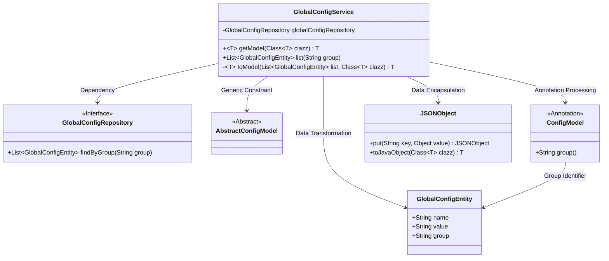
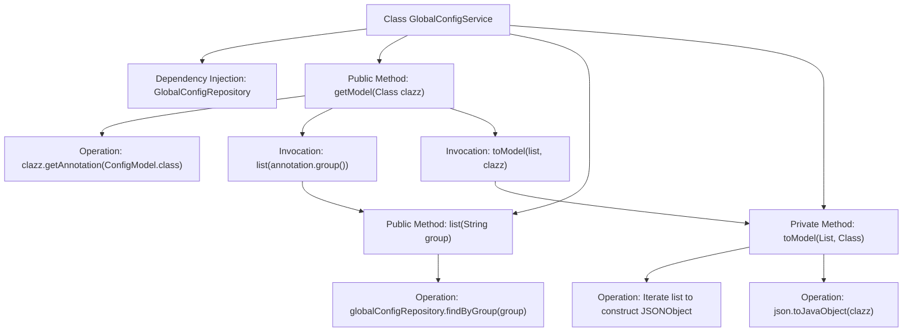

# Basic Information

|      |      |
|------|------|
| Name | GlobalConfigService |
| Language | .java |
| Code Path | WeFe/gateway/src/main/java/com/welab/wefe/gateway/service/GlobalConfigService.java |
| Package Name | com.welab.wefe.gateway.service |
| Dependencies | ['com.alibaba.fastjson.JSONObject', 'com.welab.wefe.common.wefe.dto.global_config.base.AbstractConfigModel', 'com.welab.wefe.common.wefe.dto.global_config.base.ConfigModel', 'com.welab.wefe.gateway.entity.GlobalConfigEntity', 'com.welab.wefe.gateway.repository.GlobalConfigRepository', 'org.springframework.beans.factory.annotation.Autowired', 'org.springframework.stereotype.Service', 'java.util.List'] |
| Brief Description | The GlobalConfigService provides configuration management functionality, allowing querying of configuration item lists by group and converting configuration items into model objects of specified types. Core methods include getModel for retrieving configuration models, list for querying configuration items by group, and toModel for converting configuration items into entity objects. |

# Description

The GlobalConfigService is a service class designed for managing global configurations. It accesses the database through the GlobalConfigRepository and provides two main methods: `getModel` retrieves the corresponding configuration entity for a specified class by internally invoking the `list` method to query configuration items by group, then converting the list into the target entity via `toModel`. The `toModel` method transforms the configuration item list into a JSON object before converting it into an instance of the specified class. This class supports annotating configuration models to enable flexible retrieval and conversion of configuration data.

# Class Summary

| Name   | Type  | Description |
|-------|------|-------------|
| GlobalConfigService | class | The GlobalConfigService provides configuration management functionality, allowing querying of configuration item lists by group and converting them into model objects of specified types. It utilizes Repository for data operations and supports JSON conversion. |

## Class GlobalConfigService

|      |      |
|------|------|
| Access Modifier | @Service;public |
| Type | class |
| Name | GlobalConfigService |
| Description | The GlobalConfigService provides configuration management functionality, allowing querying of configuration item lists by group and converting them into model objects of specified types. It utilizes Repository for data operations and supports JSON conversion. |

### UML Class Diagram

This code implements a global configuration service that dynamically queries and transforms configuration data through an annotation-based grouping mechanism. The GlobalConfigService acts as the core service class, relying on the GlobalConfigRepository interface to fetch raw data, utilizing JSONObject for data encapsulation, and converting configuration items into model objects of specified types via generic methods. The class diagram illustrates the complete workflow from the data access layer to business model transformation, encompassing multi-level interactions among interfaces, abstract classes, annotations, and entity classes.

### Internal Method Call Graph

This flowchart illustrates the core structure and workflow of the GlobalConfigService class. The class utilizes GlobalConfigRepository through dependency injection, providing public methods to retrieve configuration models and query configuration lists. The main process is: the getModel method first retrieves class annotations, then invokes the list method to query the database, and finally converts query results into target model objects via the toModel method. The private toModel method handles data conversion logic, including null checks, JSON object construction, and type conversion. The entire process demonstrates a complete transformation chain from database queries to object models.

### Field List

| Name  | Type  | Description |
|-------|-------|------|
| globalConfigRepository | GlobalConfigRepository | The code snippet uses the @Autowired annotation to automatically inject an instance of GlobalConfigRepository. |

### Method List

| Name  | Type  | Description |
|-------|-------|------|
| list | List<GlobalConfigEntity> | Query the global configuration list for a specified group. |
| toModel | T | Convert the configuration entity list into a model object of the specified type, returning null if the list is empty. Traverse the list to construct a JSON object and then convert it into an instance of the target class. |
| getModel | T | This is a Java method designed to retrieve a model instance of a specified configuration class. It obtains configuration group information through annotations, queries the relevant configuration list, and converts it into the target model object. The method supports generics, with the return type being a class that inherits from AbstractConfigModel. |

