# Basic Information

|      |      |
|------|------|
| Name | MemberService |
| Language | .java |
| Code Path | WeFe/gateway/src/main/java/com/welab/wefe/gateway/service/MemberService.java |
| Package Name | com.welab.wefe.gateway.service |
| Dependencies | ['java.util.ArrayList', 'java.util.List', 'com.welab.wefe.common.wefe.dto.global_config.GatewayConfigModel', 'com.welab.wefe.common.wefe.dto.global_config.storage.ClickHouseStorageConfigModel', 'org.apache.commons.collections4.CollectionUtils', 'org.apache.commons.lang3.math.NumberUtils', 'org.springframework.beans.factory.annotation.Autowired', 'org.springframework.stereotype.Service', 'com.alibaba.fastjson.JSONArray', 'com.alibaba.fastjson.JSONObject', 'com.welab.wefe.common.constant.SecretKeyType', 'com.welab.wefe.common.util.JObject', 'com.welab.wefe.common.util.StringUtil', 'com.welab.wefe.common.wefe.dto.global_config.MemberInfoModel', 'com.welab.wefe.gateway.GatewayServer', 'com.welab.wefe.gateway.entity.MemberEntity', 'com.welab.wefe.gateway.sdk.UnionHelper', 'com.welab.wefe.gateway.service.base.AbstractMemberService'] |
| Brief Description | The MemberService class inherits from AbstractMemberService, providing functionality to retrieve member lists and self-information. It handles member entity data including ID, name, secret key, and gateway configuration, with support for TLS settings verification. |

# Description

The MemberService class inherits from AbstractMemberService and provides member information query functionality. The find method retrieves the member list via UnionHelper, parses JSON data to construct a list of MemberEntity objects containing attributes such as gateway URI, name, ID, and public key, while supporting the extension of key types and TLS enablement status in JSON. The findSelf method queries the current member's information, populating the MemberEntity object with data from GlobalConfigService's MemberInfoModel, including attributes like internal/external network URIs and public/private keys. The getMemberGatewayTlsEnable method checks whether TLS is enabled for the current member's gateway.

# Class Summary

| Name   | Type  | Description |
|-------|------|-------------|
| MemberService | class | The MemberService class provides member information query functionality, including searching member lists by ID and querying self-information. It handles member entity attributes such as keys, gateway URIs, and supports TLS configuration checks. |

## Class MemberService

|      |      |
|------|------|
| Access Modifier | @Service;public |
| Type | class |
| Name | MemberService |
| Description | The MemberService class provides member information query functionality, including searching member lists by ID and querying self-information. It handles member entity attributes such as keys, gateway URIs, and supports TLS configuration checks. |

### UML Class Diagram

```mermaid
classDiagram
    class AbstractMemberService {
        <<abstract>>
    }

    class MemberService {
        -GlobalConfigService globalConfigService
        +List~MemberEntity~ find(String memberId) throws Exception
        +MemberEntity findSelf()
        +boolean getMemberGatewayTlsEnable()
    }

    class GlobalConfigService {
        <<Interface>>
        +~T~ getModel(Class~T~ clazz)
    }

    class MemberEntity {
        -String id
        -String name
        -String publicKey
        -String privateKey
        -String gatewayExternalUri
        -String gatewayInternalUri
        -SecretKeyType secretKeyType
        -Boolean gatewayTlsEnable
        +setters/getters...
    }

    class MemberInfoModel {
        -String memberId
        -String memberName
        -String rsaPrivateKey
        -String rsaPublicKey
        -String memberGatewayUri
        -SecretKeyType secretKeyType
        -Boolean memberGatewayTlsEnable
        +getters...
    }

    class GatewayConfigModel {
        -String intranetBaseUri
        +getters...
    }

    class SecretKeyType {
        <<Enumeration>>
        +rsa
        +otherValues...
        +static get(String type)
    }

    AbstractMemberService <|-- MemberService
    MemberService --> GlobalConfigService : Dependency
    MemberService --> MemberEntity : Create/Return
    MemberService --> MemberInfoModel : Query
    MemberService --> GatewayConfigModel : Query
    MemberInfoModel --> SecretKeyType : Uses
    MemberEntity --> SecretKeyType : Uses
```

Class Diagram Description: The diagram shows that MemberService inherits from AbstractMemberService and depends on the GlobalConfigService interface to obtain configuration information. MemberService primarily operates on MemberEntity objects, retrieves data through MemberInfoModel and GatewayConfigModel, and utilizes the SecretKeyType enumeration class. MemberEntity contains basic member information and gateway configurations, with each model class providing data access via getter methods.

### Internal Method Call Graph

This flowchart illustrates the core structure and key method invocation relationships of the MemberService class. The class inherits from AbstractMemberService and depends on GlobalConfigService, containing three main methods: find() for querying member lists and processing JSON data, findSelf() for retrieving self member information, and getMemberGatewayTlsEnable() for checking gateway TLS activation status. Critical processes include JSON parsing, entity construction, and configuration service calls, demonstrating a complete processing chain from data acquisition to business object conversion.

### Field List

| Name  | Type  | Description |
|-------|-------|------|
| globalConfigService | GlobalConfigService | Automatically inject global configuration service instances. |

### Method List

| Name  | Type  | Description |
|-------|-------|------|
| find | List<MemberEntity> | The method `find` retrieves the member list by `memberId`, parses the JSON data, and converts it into a list of `MemberEntity` objects, which includes basic information and extended attributes. |
| findSelf | MemberEntity | This method retrieves member information through global configuration, constructs and returns a member entity object containing attributes such as ID, name, secret key, and gateway URI. If the member information is empty, it returns null. |
| getMemberGatewayTlsEnable | boolean | This method checks whether member gateway TLS is enabled, returning false if it is not configured, otherwise returning the configured value. |

