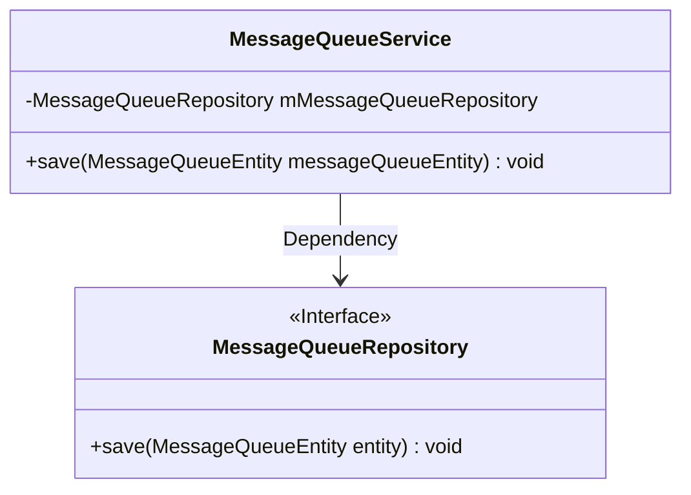
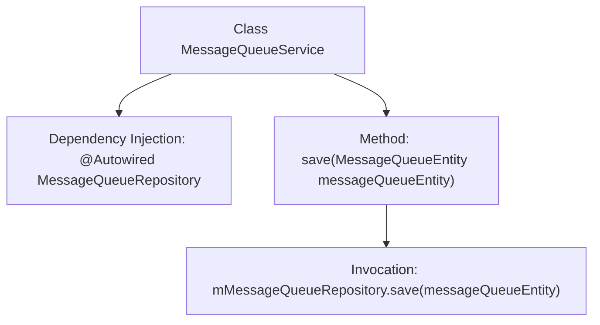

# Basic Information

|      |      |
|------|------|
| Name | MessageQueueService |
| Language | .java |
| Code Path | WeFe/gateway/src/main/java/com/welab/wefe/gateway/service/MessageQueueService.java |
| Package Name | com.welab.wefe.gateway.service |
| Dependencies | ['com.welab.wefe.gateway.entity.MessageQueueEntity', 'com.welab.wefe.gateway.repository.MessageQueueRepository', 'org.springframework.beans.factory.annotation.Autowired', 'org.springframework.stereotype.Service'] |
| Brief Description | The MessageQueueService class uses @Autowired to inject MessageQueueRepository and provides a save method to persist MessageQueueEntity entities. |

# Description

This is a service class named MessageQueueService, identified as a Spring service component using the @Service annotation. The class automatically injects a private member variable mMessageQueueRepository of type MessageQueueRepository via @Autowired. It provides a save method that accepts a parameter of type MessageQueueEntity and calls the save method of mMessageQueueRepository to persist the entity in the database. This service class is primarily used for handling the persistence operations of message queue entities.

# Class Summary

| Name   | Type  | Description |
|-------|------|-------------|
| MessageQueueService | class | The MessageQueueService is a Spring service class that persists MessageQueueEntity data via the MessageQueueRepository. |

## Class MessageQueueService

|      |      |
|------|------|
| Access Modifier | @Service;public |
| Type | class |
| Name | MessageQueueService |
| Description | The MessageQueueService is a Spring service class that persists MessageQueueEntity data via the MessageQueueRepository. |

### UML Class Diagram

This class diagram illustrates the Spring service layer component MessageQueueService and its dependency on the JPA repository interface MessageQueueRepository. The MessageQueueService injects a MessageQueueRepository instance via @Autowired and exposes a save method for persisting message queue entities. As a Spring Data JPA interface, MessageQueueRepository has its CRUD operations automatically implemented by the framework. This design adheres to the Dependency Inversion Principle, where high-level modules do not directly depend on low-level implementations but interact through abstract interfaces.

### Internal Method Call Graph

This flowchart illustrates the structure and workflow of the MessageQueueService class. The class automatically injects MessageQueueRepository dependency via @Autowired, with its core method save() delegating the received MessageQueueEntity object to the repository for persistent storage. The entire process demonstrates a typical collaboration pattern between Spring service layer components and data access layer, embodying dependency injection and the single responsibility principle.

### Field List

| Name  | Type  | Description |
|-------|-------|------|
| mMessageQueueRepository | MessageQueueRepository | The code snippet uses @Autowired to automatically inject a MessageQueueRepository instance into the private variable mMessageQueueRepository. |

### Method List

| Name  | Type  | Description |
|-------|-------|------|
| save | void | Save the message queue entity to the repository. |

