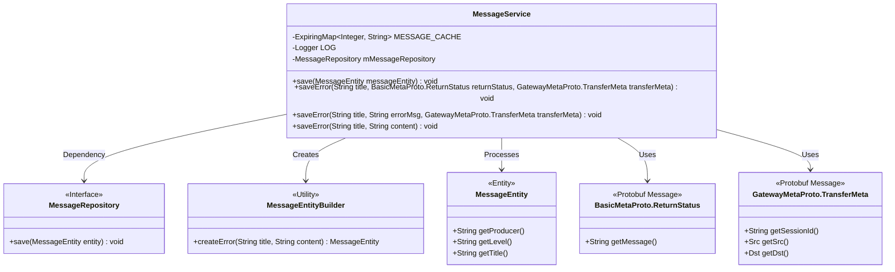
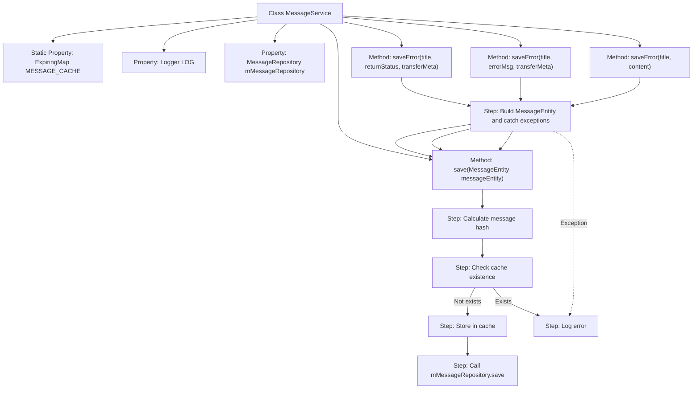

# Basic Information

|      |      |
|------|------|
| Name | MessageService |
| Language | .java |
| Code Path | WeFe/gateway/src/main/java/com/welab/wefe/gateway/service/MessageService.java |
| Package Name | com.welab.wefe.gateway.service |
| Dependencies | ['com.welab.wefe.gateway.api.meta.basic.BasicMetaProto', 'com.welab.wefe.gateway.api.meta.basic.GatewayMetaProto', 'com.welab.wefe.gateway.common.MessageEntityBuilder', 'com.welab.wefe.gateway.entity.MessageEntity', 'com.welab.wefe.gateway.repository.MessageRepository', 'net.jodah.expiringmap.ExpirationPolicy', 'net.jodah.expiringmap.ExpiringMap', 'org.slf4j.Logger', 'org.slf4j.LoggerFactory', 'org.springframework.beans.factory.annotation.Autowired', 'org.springframework.stereotype.Service', 'java.util.concurrent.TimeUnit'] |
| Brief Description | The MessageService class utilizes ExpiringMap to cache message hashes within 60 seconds to avoid duplicate storage. It provides multiple saveError methods to record gateway error information in the database and logs exceptions when they occur. |

# Description

The MessageService is a service class designed for handling message storage and deduplication. It utilizes ExpiringMap as a cache to prevent duplicate writes of identical messages within short time intervals. The caching strategy features a 60-second expiration period after creation, with a maximum capacity of 100 entries. The class injects MessageRepository for persistent storage. Key methods include save and multiple overloaded saveError methods. The save method checks the cache by calculating message hash values, persisting to the database if uncached. The saveError method encapsulates error message construction logic, recording gateway-related error details including sender, recipient, session ID, and error cause, while handling exceptional cases. All operations incorporate exception handling with error logging upon failures.

# Class Summary

| Name   | Type  | Description |
|-------|------|-------------|
| MessageService | class | Message service class, using cache to avoid duplicate messages, with a 60-second expiration time and a maximum of 100 entries. Provides methods for saving messages and error information, recording gateway error details. |

## Class MessageService

|      |      |
|------|------|
| Access Modifier | @Service;public |
| Type | class |
| Name | MessageService |
| Description | Message service class, using cache to avoid duplicate messages, with a 60-second expiration time and a maximum of 100 entries. Provides methods for saving messages and error information, recording gateway error details. |

### UML Class Diagram

This code implements a message service, whose primary function is to avoid repeatedly saving identical messages within a short time through a caching mechanism. The MessageService utilizes ExpiringMap as a cache, deduplicating messages based on hash values of their content, with a cache validity period of 60 seconds. The service provides multiple overloaded saveError methods to handle different types of error messages, ultimately invoking the save method to persist data to the database. The class diagram illustrates the relationships between the service, message entities, repository interface, and helper builder, demonstrating layered design and the dependency inversion principle.

### Internal Method Call Graph

This code demonstrates a message service class primarily handling gateway message caching and storage logic. Core functionalities include: implementing 60-second deduplication cache using ExpiringMap, determining duplicate messages through hash values, and providing three overloaded saveError methods to handle different error scenarios. All operations incorporate exception handling mechanisms and log errors via Logger. The flowchart clearly presents the message processing flow, cache validation logic, and method call relationships.

### Field List

| Name  | Type  | Description |
|-------|-------|------|
| MESSAGE_CACHE = ExpiringMap            .builder()            .expirationPolicy(ExpirationPolicy.CREATED)            .expiration(60, TimeUnit.SECONDS)            .maxSize(100)            .build() | ExpiringMap<Integer, String> | Create a static ExpiringMap cache named MESSAGE_CACHE with integer keys and string values. Set the expiration policy to expire 60 seconds after creation, with a maximum capacity of 100. |
| LOG = LoggerFactory.getLogger(SendTransferMetaService.class) | Logger | The class SendTransferMetaService defines a private immutable Logger instance LOG for logging purposes. |
| mMessageRepository | MessageRepository | Using @Autowired to automatically inject the MessageRepository instance. |

### Method List

| Name  | Type  | Description |
|-------|-------|------|
| saveError | void | The method `saveError` records gateway error information, including the title, sender and receiver, session ID, and error cause, and logs the details when an exception occurs. |
| save | void | The method `save` accepts a `MessageEntity` object, computes the hash values of its producer, level, and title. If the hash value exists in the cache `MESSAGE_CACHE`, it returns directly; otherwise, it stores the value in the cache and invokes `mMessageRepository` to save the message entity. |
| saveError | void | The method `saveError` records gateway error information, including the title, error message, and transmission metadata (sender, receiver, session ID). Logs are recorded in case of exceptions. |
| saveError | void | The method `saveError` records error information, including a title and content, prefixed with "Gateway:". If the save operation fails, it logs an exception. |

