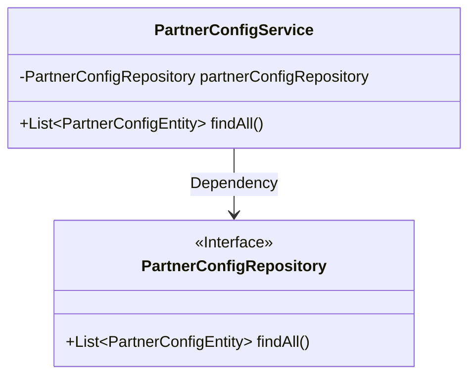
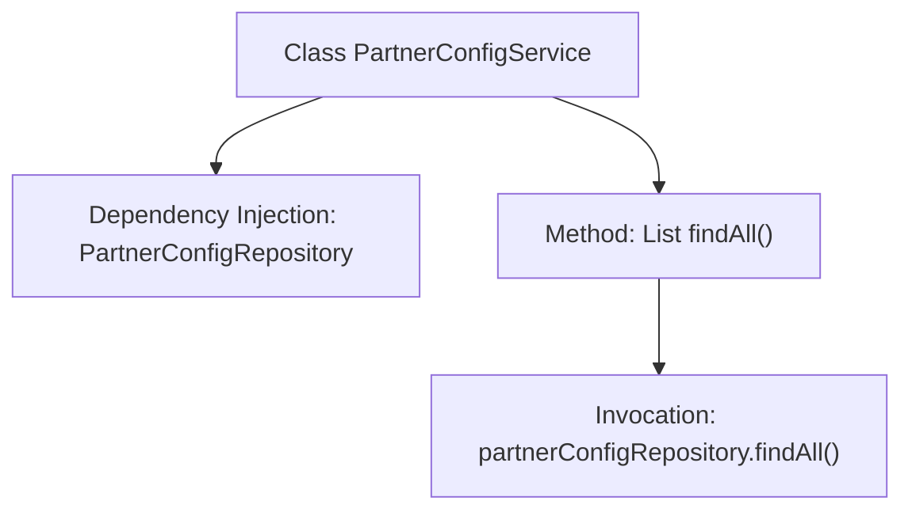

# Basic Information

|      |      |
|------|------|
| Name | PartnerConfigService |
| Language | .java |
| Code Path | WeFe/gateway/src/main/java/com/welab/wefe/gateway/service/PartnerConfigService.java |
| Package Name | com.welab.wefe.gateway.service |
| Dependencies | ['com.welab.wefe.gateway.entity.PartnerConfigEntity', 'com.welab.wefe.gateway.repository.PartnerConfigRepository', 'org.springframework.beans.factory.annotation.Autowired', 'org.springframework.stereotype.Service', 'java.util.List'] |
| Brief Description | The PartnerConfigService class retrieves all PartnerConfigEntity data through the PartnerConfigRepository. |

# Description

This is a Spring service class named PartnerConfigService, designed to manage partner configuration data. It interacts with the database through the auto-injected PartnerConfigRepository and provides a findAll method to retrieve a list of all partner configuration entities. The class is annotated with @Service, indicating it is a Spring-managed service component.

# Class Summary

| Name   | Type  | Description |
|-------|------|-------------|
| PartnerConfigService | class | The PartnerConfigService class retrieves all PartnerConfigEntity data through the PartnerConfigRepository. |

## Class PartnerConfigService

|      |      |
|------|------|
| Access Modifier | @Service;public |
| Type | class |
| Name | PartnerConfigService |
| Description | The PartnerConfigService class retrieves all PartnerConfigEntity data through the PartnerConfigRepository. |

### UML Class Diagram

This class diagram illustrates the dependency relationship between the PartnerConfigService class and the PartnerConfigRepository interface. The PartnerConfigService holds an instance of the PartnerConfigRepository interface through dependency injection and exposes a public method findAll() to retrieve a list of all partner configuration entities. The PartnerConfigRepository, marked with <<Interface>> to denote its interface nature, is a Spring Data JPA interface that automatically implements basic CRUD operations through inheritance mechanisms.

### Internal Method Call Graph

This flowchart illustrates the structure and workflow of the PartnerConfigService class. The class automatically injects the PartnerConfigRepository dependency via the @Autowired annotation, providing a findAll() method to retrieve all partner configuration data. Internally, this method directly invokes the findAll() method of partnerConfigRepository to perform database queries, demonstrating a typical collaboration pattern between the Spring service layer and Repository layer, which aligns with the JPA specification's data access design pattern.

### Field List

| Name  | Type  | Description |
|-------|-------|------|
| partnerConfigRepository | PartnerConfigRepository | Automatically inject the PartnerConfigRepository instance. |

### Method List

| Name  | Type  | Description |
|-------|-------|------|
| findAll | List<PartnerConfigEntity> | This is a Java method that retrieves all PartnerConfigEntity objects from partnerConfigRepository and returns them as a list. |

