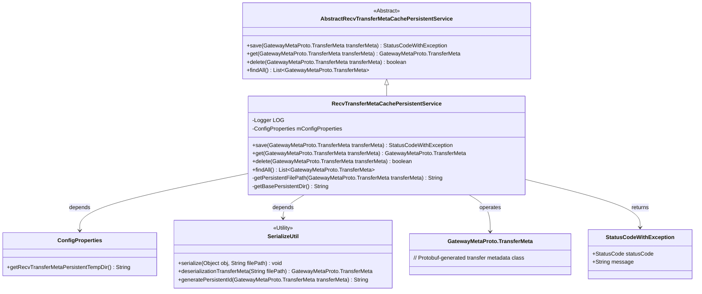
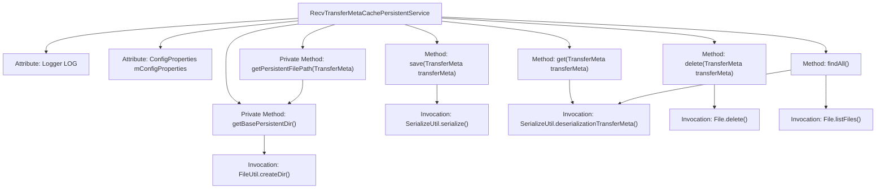

# Basic Information

|      |      |
|------|------|
| Name | RecvTransferMetaCachePersistentService |
| Language | .java |
| Code Path | WeFe/gateway/src/main/java/com/welab/wefe/gateway/service/RecvTransferMetaCachePersistentService.java |
| Package Name | com.welab.wefe.gateway.service |
| Dependencies | ['com.welab.wefe.common.StatusCode', 'com.welab.wefe.common.exception.StatusCodeWithException', 'com.welab.wefe.common.util.FileUtil', 'com.welab.wefe.gateway.api.meta.basic.GatewayMetaProto', 'com.welab.wefe.gateway.config.ConfigProperties', 'com.welab.wefe.gateway.service.base.AbstractRecvTransferMetaCachePersistentService', 'com.welab.wefe.gateway.util.SerializeUtil', 'org.slf4j.Logger', 'org.slf4j.LoggerFactory', 'org.springframework.beans.factory.annotation.Autowired', 'org.springframework.boot.autoconfigure.condition.ConditionalOnExpression', 'org.springframework.stereotype.Service', 'java.io.File', 'java.util.ArrayList', 'java.util.List'] |
| Brief Description | Metadata reception and transmission caching persistence service, based on local file system storage, provides functions for saving, querying, deleting, and retrieving all metadata, handles serialization and deserialization operations, and ensures correct directory permissions and paths. |

# Description

The code defines a local file system-based persistent service class for caching received transfer metadata, named `RecvTransferMetaCachePersistentService`. It inherits from the abstract class `AbstractRecvTransferMetaCachePersistentService` and is activated via the `@ConditionalOnExpression` conditional annotation only when the configuration property `recv.transfer.meta.persistent.type` matches the `LOCAL_FILE_SYS` type. Key functionalities include: serializing and saving transfer metadata to local files, deserializing metadata from files, deleting specified metadata files, and locating all persisted metadata. The service retrieves storage directory paths using the configuration property `mConfigProperties`, handles serialization operations via the `SerializeUtil` utility class, and incorporates robust error handling and logging mechanisms.

# Class Summary

| Name   | Type  | Description |
|-------|------|-------------|
| RecvTransferMetaCachePersistentService | class | Receive transmission metadata cache persistence service class, based on local file system storage, provides functions for saving, querying, deleting, and finding all metadata, handles serialization and deserialization operations, and ensures proper directory permissions. |

## Class RecvTransferMetaCachePersistentService

|      |      |
|------|------|
| Access Modifier | @ConditionalOnExpression("#{T(com.welab.wefe.gateway.common.TransferMetaCachePersistentTypeEnum).LOCAL_FILE_SYS.getType().equals(environment.getProperty('recv.transfer.meta.persistent.type', T(com.welab.wefe.gateway.common.TransferMetaCachePersistentTypeEnum).LOCAL_FILE_SYS.getType()))}");@Service;public |
| Type | class |
| Name | RecvTransferMetaCachePersistentService |
| Description | Receive transmission metadata cache persistence service class, based on local file system storage, provides functions for saving, querying, deleting, and finding all metadata, handles serialization and deserialization operations, and ensures proper directory permissions. |

### UML Class Diagram

This class diagram illustrates the inheritance and dependency structure of the receive transfer metadata cache persistence service. RecvTransferMetaCachePersistentService inherits from an abstract base class, utilizes the SerializeUtil utility for metadata serialization operations, depends on ConfigProperties to obtain configuration paths, and manipulates GatewayMetaProto.TransferMeta transfer objects. The service provides complete CRUD functionality with exception handling and logging capabilities, employing the file system as the persistence storage medium.

### Internal Method Call Graph

This flowchart illustrates the core structure and invocation relationships of the RecvTransferMetaCachePersistentService class. The service primarily handles local filesystem persistence operations for transfer metadata, featuring four main public methods: save() for serialized data storage, get() for deserialized data retrieval, delete() for file removal, and findAll() for batch data queries. Private methods getPersistentFilePath() and getBasePersistentDir() manage file path logic. The class utilizes ConfigProperties for configuration, SerializeUtil for serialization operations, relies on File and FileUtil for filesystem operations, and logs errors via Logger. The complete workflow demonstrates end-to-end lifecycle management from data storage to retrieval.

### Field List

| Name  | Type  | Description |
|-------|-------|------|
| LOG = LoggerFactory.getLogger(RecvTransferMetaCachePersistentService.class) | Logger | The class RecvTransferMetaCachePersistentService defines a private immutable logger LOG. |
| mConfigProperties | ConfigProperties | Using @Autowired to automatically inject the ConfigProperties configuration property object. |

### Method List

| Name  | Type  | Description |
|-------|-------|------|
| save | StatusCodeWithException | The method `save` attempts to serialize the `transferMeta` object to the specified path. If successful, it returns the `SUCCESS` status; if it fails, it logs the error and returns `SYSTEM_ERROR` along with a prompt message. |
| get | GatewayMetaProto.TransferMeta | The method `get` receives a `TransferMeta` object, attempts to deserialize data from a persistent file, and logs an error before returning the original object if the operation fails. |
| delete | boolean | This method deletes the persistent file corresponding to the specified transfer metadata and returns whether the deletion operation was successful. |
| findAll | List<GatewayMetaProto.TransferMeta> | This method reads and deserializes all transfer metadata files from the file system, ignores directories, logs error messages in case of exceptions, and finally returns the metadata list. |
| getPersistentFilePath | String | Method for obtaining persistent file path: Concatenate the complete path based on the base directory and the ID generated from transfer metadata. |
| getBasePersistentDir | String | Obtain the persistent directory path, ensure it ends with a separator and create the directory. |

