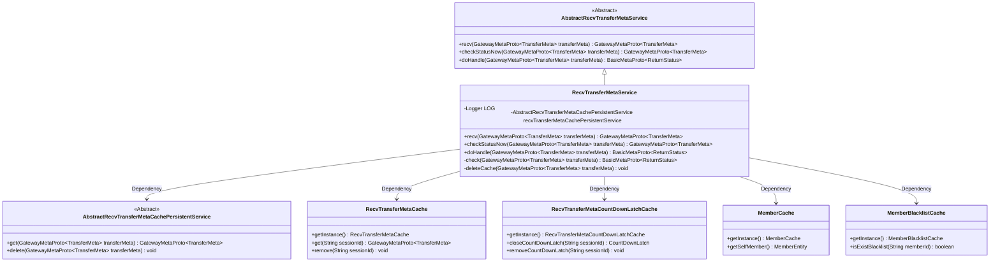
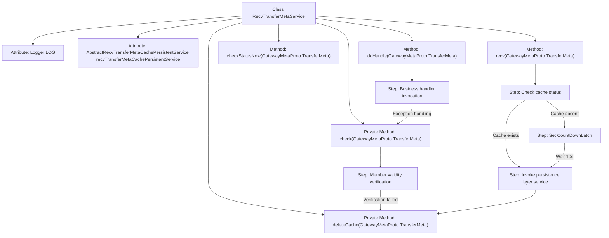

# Basic Information

|      |      |
|------|------|
| Name | RecvTransferMetaService |
| Language | .java |
| Code Path | WeFe/gateway/src/main/java/com/welab/wefe/gateway/service/RecvTransferMetaService.java |
| Package Name | com.welab.wefe.gateway.service |
| Dependencies | ['com.welab.wefe.gateway.api.meta.basic.BasicMetaProto', 'com.welab.wefe.gateway.api.meta.basic.GatewayMetaProto', 'com.welab.wefe.gateway.cache.MemberBlacklistCache', 'com.welab.wefe.gateway.cache.MemberCache', 'com.welab.wefe.gateway.cache.RecvTransferMetaCache', 'com.welab.wefe.gateway.cache.RecvTransferMetaCountDownLatchCache', 'com.welab.wefe.gateway.common.ReturnStatusBuilder', 'com.welab.wefe.gateway.entity.MemberEntity', 'com.welab.wefe.gateway.service.base.AbstractRecvTransferMetaCachePersistentService', 'com.welab.wefe.gateway.service.base.AbstractRecvTransferMetaService', 'com.welab.wefe.gateway.service.processors.ProcessorContext', 'com.welab.wefe.gateway.util.ReturnStatusUtil', 'org.slf4j.Logger', 'org.slf4j.LoggerFactory', 'org.springframework.beans.factory.annotation.Autowired', 'org.springframework.stereotype.Service', 'java.util.concurrent.CountDownLatch', 'java.util.concurrent.TimeUnit'] |
| Brief Description | The RecvTransferMetaService handles the receipt of transfer metadata, checks the status, and executes business logic. It includes functionalities such as cache management, status verification, and blacklist validation. |

# Description

The RecvTransferMetaService is a service class that handles transfer metadata, inheriting from AbstractRecvTransferMetaService. It manages transfer states through caching and persistence services, with primary functionalities including receiving transfer metadata, checking states, and executing business processing. During data reception, it checks the cache state—if completed or errored, it retrieves data from the persistence layer and clears the cache; otherwise, it sets a blocking lock to await processing. The state-checking method directly returns cached data or marks it as in progress. Business processing is executed via ProcessorContext, with message validity verified, including checks for recipient member IDs and blacklist status. Finally, it provides cache deletion functionality to clean up related cached and persisted data. The entire process logs critical operations and exceptions.

# Class Summary

| Name   | Type  | Description |
|-------|------|-------------|
| RecvTransferMetaService | class | The RecvTransferMetaService processes received transfer metadata, checks statuses, validates message integrity, and executes business logic. It manages data using caching and persistence layers, supporting blocking waits and blacklist verification. |

## Class RecvTransferMetaService

|      |      |
|------|------|
| Access Modifier | @Service;public |
| Type | class |
| Name | RecvTransferMetaService |
| Description | The RecvTransferMetaService processes received transfer metadata, checks statuses, validates message integrity, and executes business logic. It manages data using caching and persistence layers, supporting blocking waits and blacklist verification. |

### UML Class Diagram

This diagram illustrates the class structure of RecvTransferMetaService and its dependencies. RecvTransferMetaService inherits from AbstractRecvTransferMetaService, implementing functionalities for receiving, checking, and processing transfer metadata. It relies on multiple cache services (e.g., RecvTransferMetaCache, RecvTransferMetaCountDownLatchCache) and a persistence service (AbstractRecvTransferMetaCachePersistentService) to manage data. Additionally, it utilizes MemberCache and MemberBlacklistCache to verify member identity and blacklist status. The overall design reflects a layered and modular approach, with clearly defined responsibilities for each component.

### Internal Method Call Graph

This flowchart illustrates the core processing logic of RecvTransferMetaService, including cache checking during metadata reception, blocking wait mechanism, persistence layer interaction, and business processing flow. The class implements synchronous control via CountDownLatch, adopts a three-tier cache architecture (memory cache, persistence layer, business handler), and incorporates strict member identity verification and blacklist mechanisms. Exception handling permeates the entire process, with critical operations logged, reflecting a highly reliable message reception service design.

### Field List

| Name  | Type  | Description |
|-------|-------|------|
| LOG = LoggerFactory.getLogger(RecvTransferMetaService.class) | Logger | The class RecvTransferMetaService defines a private immutable logger LOG for recording log information. |
| recvTransferMetaCachePersistentService | AbstractRecvTransferMetaCachePersistentService | Using @Autowired to automatically inject an instance of AbstractRecvTransferMetaCachePersistentService. |

### Method List

| Name  | Type  | Description |
|-------|-------|------|
| doHandle | BasicMetaProto.ReturnStatus | Processing transmission metadata: First, check its validity; if invalid, return the status; if valid, execute business processing, and log errors while returning a system exception status in case of exceptions. |
| recv | GatewayMetaProto.TransferMeta | The method receives transmission metadata and checks the cache status. If completed or in error, it retrieves data from the persistent layer and clears the cache. Otherwise, it sets a blocking lock, waits for 10 seconds, checks the status again, and returns the processing result. |
| checkStatusNow | GatewayMetaProto.TransferMeta | The method checks the transmission status, and if there is no data in the cache, it sets it to processing and returns. |
| check | BasicMetaProto.ReturnStatus | Method checks transmission metadata: Verify if the recipient ID matches itself, otherwise reject and prompt an address error; check if the sender is on the blacklist, and reject if so; return success if all checks pass. |
| deleteCache | void | This method deletes the cache: retrieves the session ID, clears the countdown lock and receive metadata cache, and finally deletes the persistent data. |

