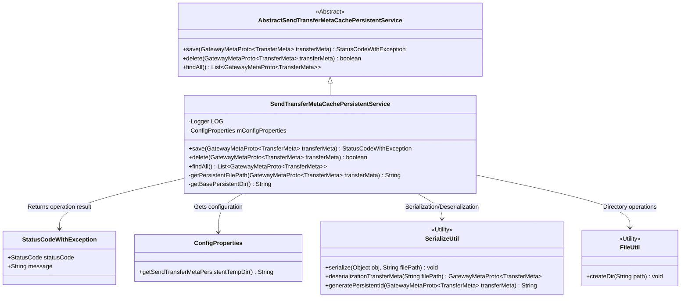
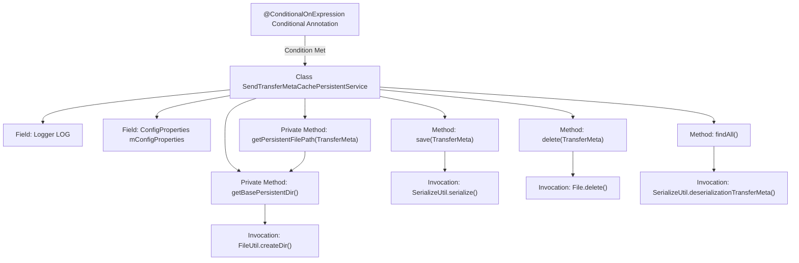

# Basic Information

|      |      |
|------|------|
| Name | SendTransferMetaCachePersistentService |
| Language | .java |
| Code Path | WeFe/gateway/src/main/java/com/welab/wefe/gateway/service/SendTransferMetaCachePersistentService.java |
| Package Name | com.welab.wefe.gateway.service |
| Dependencies | ['com.welab.wefe.common.StatusCode', 'com.welab.wefe.common.exception.StatusCodeWithException', 'com.welab.wefe.common.util.FileUtil', 'com.welab.wefe.gateway.api.meta.basic.GatewayMetaProto', 'com.welab.wefe.gateway.config.ConfigProperties', 'com.welab.wefe.gateway.service.base.AbstractSendTransferMetaCachePersistentService', 'com.welab.wefe.gateway.util.SerializeUtil', 'org.slf4j.Logger', 'org.slf4j.LoggerFactory', 'org.springframework.beans.factory.annotation.Autowired', 'org.springframework.boot.autoconfigure.condition.ConditionalOnExpression', 'org.springframework.stereotype.Service', 'java.io.File', 'java.util.ArrayList', 'java.util.List'] |
| Brief Description | The SendTransferMetaCachePersistentService class implements local filesystem persistence based on conditional annotations, providing functionalities for saving, deleting, and querying transfer metadata, while handling exceptions and logging. |

# Description

The content describes a Spring service class named SendTransferMetaCachePersistentService based on conditional annotations, which handles local file system persistence operations for transfer metadata. This class inherits from an abstract service class and includes method implementations for saving, deleting, and querying transfer metadata. During saving, a serialization tool is used to write data to a specified file path. Deletion involves directly removing the corresponding file, while querying traverses the directory to deserialize all file data. The configuration path is obtained via ConfigProperties, with automatic handling of directory separators and directory creation. The operations log events and return status codes, with system error messages returned in case of exceptions.

# Class Summary

| Name   | Type  | Description |
|-------|------|-------------|
| SendTransferMetaCachePersistentService | class | The `SendTransferMetaCachePersistentService` class implements conditional loading to store TransferMeta data in the local file system, providing save, delete, and query functionalities while handling serialization and exceptions. |

## Class SendTransferMetaCachePersistentService

|      |      |
|------|------|
| Access Modifier | @ConditionalOnExpression("#{T(com.welab.wefe.gateway.common.TransferMetaCachePersistentTypeEnum).LOCAL_FILE_SYS.getType().equals(environment.getProperty('send.transfer.meta.persistent.type', T(com.welab.wefe.gateway.common.TransferMetaCachePersistentTypeEnum).LOCAL_FILE_SYS.getType()))}");@Service;public |
| Type | class |
| Name | SendTransferMetaCachePersistentService |
| Description | The `SendTransferMetaCachePersistentService` class implements conditional loading to store TransferMeta data in the local file system, providing save, delete, and query functionalities while handling serialization and exceptions. |

### UML Class Diagram

This code implements a local filesystem-based persistent service for transfer metadata, which inherits from an abstract parent class and implements three core methods: saving metadata to files, deleting metadata from files, and loading all metadata from the filesystem. The service obtains storage paths through configuration, uses serialization utilities for object storage, and relies on file utility classes to ensure directory existence. The entire process includes exception handling and logging, returning result objects containing status codes.

### Internal Method Call Graph

This flowchart illustrates the core structure and invocation relationships of the SendTransferMetaCachePersistentService class. This service class is loaded only when specific conditional expressions are met, primarily implementing local filesystem persistence operations for transfer metadata. It contains three key methods: save, delete, and findAll. The save method invokes serialization utilities to store data, the delete method performs direct file deletion, and the findAll method traverses directories to deserialize file contents. Two private methods handle file path generation and base directory creation respectively, demonstrating clear responsibility division and utility class reuse.

### Field List

| Name  | Type  | Description |
|-------|-------|------|
| mConfigProperties | ConfigProperties | Using @Autowired to automatically inject an instance of the ConfigProperties configuration property class. |
| LOG = LoggerFactory.getLogger(SendTransferMetaCachePersistentService.class) | Logger | The private static log object LOG defined in the class SendTransferMetaCachePersistentService. |

### Method List

| Name  | Type  | Description |
|-------|-------|------|
| save | StatusCodeWithException | The method `save` is used to serialize and store transmission metadata to the file system. Upon success, it returns the `SUCCESS` status; upon failure, it logs the error and returns the `SYSTEM_ERROR` status along with a prompt message. |
| findAll | List<GatewayMetaProto.TransferMeta> | This method traverses files in the specified directory, deserializes them into a list of TransferMeta objects, logs exceptions, and returns an empty list when errors occur. |
| delete | boolean | This method deletes the persistent file corresponding to the specified transfer metadata and returns the deletion result. |
| getPersistentFilePath | String | This method generates a persistent file path based on transmission metadata, combining a base directory and a serialized ID. |
| getBasePersistentDir | String | Get the base persistent directory path, ensure it ends with a separator and create the directory. |

