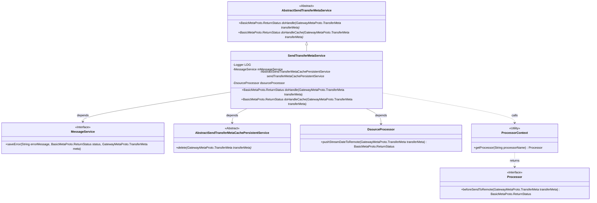
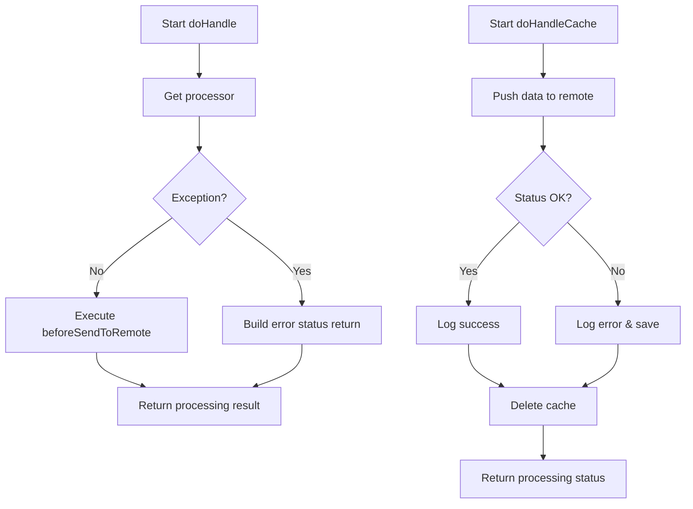
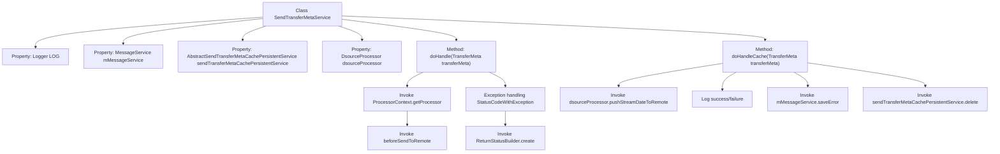

# Basic Information

|      |      |
|------|------|
| Name | SendTransferMetaService |
| Language | .java |
| Code Path | WeFe/gateway/src/main/java/com/welab/wefe/gateway/service/SendTransferMetaService.java |
| Package Name | com.welab.wefe.gateway.service |
| Dependencies | ['com.welab.wefe.common.exception.StatusCodeWithException', 'com.welab.wefe.gateway.api.meta.basic.BasicMetaProto', 'com.welab.wefe.gateway.api.meta.basic.GatewayMetaProto', 'com.welab.wefe.gateway.common.ReturnStatusBuilder', 'com.welab.wefe.gateway.service.base.AbstractSendTransferMetaCachePersistentService', 'com.welab.wefe.gateway.service.base.AbstractSendTransferMetaService', 'com.welab.wefe.gateway.service.processors.DsourceProcessor', 'com.welab.wefe.gateway.service.processors.ProcessorContext', 'com.welab.wefe.gateway.util.ReturnStatusUtil', 'com.welab.wefe.gateway.util.TransferMetaUtil', 'org.slf4j.Logger', 'org.slf4j.LoggerFactory', 'org.springframework.beans.factory.annotation.Autowired', 'org.springframework.stereotype.Service'] |
| Brief Description | The SendTransferMetaService handles message transmission, encompassing remote sending and cache processing logic, logs records, and invokes related services. |

# Description

SendTransferMetaService is a service class that inherits from AbstractSendTransferMetaService, designed to handle the sending and caching operations of transfer metadata. The class obtains instances of MessageService, AbstractSendTransferMetaCachePersistentService, and DsourceProcessor through dependency injection. It primarily includes two methods: the doHandle method invokes corresponding pre-processing logic based on the processor type in the transfer metadata and handles potential exceptions; the doHandleCache method pushes stream data to a remote destination via dsourceProcessor, logs success or failure messages, and deletes the transfer metadata from the cache upon operation completion. The entire process involves functionalities such as status return, exception handling, and logging.

# Class Summary

| Name   | Type  | Description |
|-------|------|-------------|
| SendTransferMetaService | class | SendTransferMetaService handles message transmission, including remote sending and cache processing logic, records logs, and invokes related services. |

## Class SendTransferMetaService

|      |      |
|------|------|
| Access Modifier | @Service;public |
| Type | class |
| Name | SendTransferMetaService |
| Description | SendTransferMetaService handles message transmission, including remote sending and cache processing logic, records logs, and invokes related services. |

### UML Class Diagram

This code implements a message transfer service containing core processing logic and cache handling logic. The class diagram shows SendTransferMetaService inheriting from an abstract parent class and depending on multiple service components (message service, cache persistence service, data source processor). The flowchart clearly presents the execution paths of two main methods: doHandle performs preprocessing through a processor chain, while doHandleCache handles data pushing and status tracking. The system achieves separation of processing logic from infrastructure through layered design.

### Internal Method Call Graph

This code flowchart illustrates the core processing logic of the SendTransferMetaService class. Inheriting from AbstractSendTransferMetaService, this class primarily contains two key methods: doHandle for the main transfer metadata processing flow (obtaining processors via ProcessorContext and executing pre-remote-send operations), and doHandleCache for cache handling logic (first invoking dsourceProcessor to push data, logging results based on return status, saving error messages upon failure, and finally deleting cache). The process clearly demonstrates both normal workflows and exception handling paths, along with the interaction relationships between dependent components.

### Field List

| Name  | Type  | Description |
|-------|-------|------|
| LOG = LoggerFactory.getLogger(SendTransferMetaService.class) | Logger | The class SendTransferMetaService defines a private static log object LOG for recording log information. |
| mMessageService | MessageService | Using @Autowired to automatically inject an instance of MessageService. |
| dsourceProcessor | DsourceProcessor | Using @Autowired to automatically inject a DsourceProcessor instance. |
| sendTransferMetaCachePersistentService | AbstractSendTransferMetaCachePersistentService | Using @Autowired to automatically inject an instance of AbstractSendTransferMetaCachePersistentService. |

### Method List

| Name  | Type  | Description |
|-------|-------|------|
| doHandle | BasicMetaProto.ReturnStatus | The method processes transmission metadata, invokes the corresponding pre-processor logic, and returns a status code and session ID in case of exceptions. |
| doHandleCache | BasicMetaProto.ReturnStatus | The method handles cache pushing, calls remote push data and logs the operation. It deletes the cache regardless of success or failure, and returns the push status. Error information is saved upon failure. |

