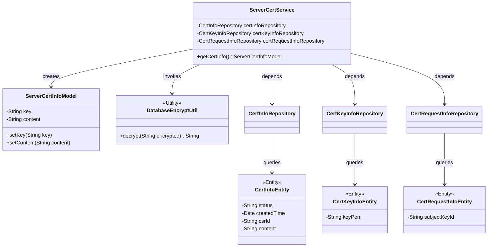
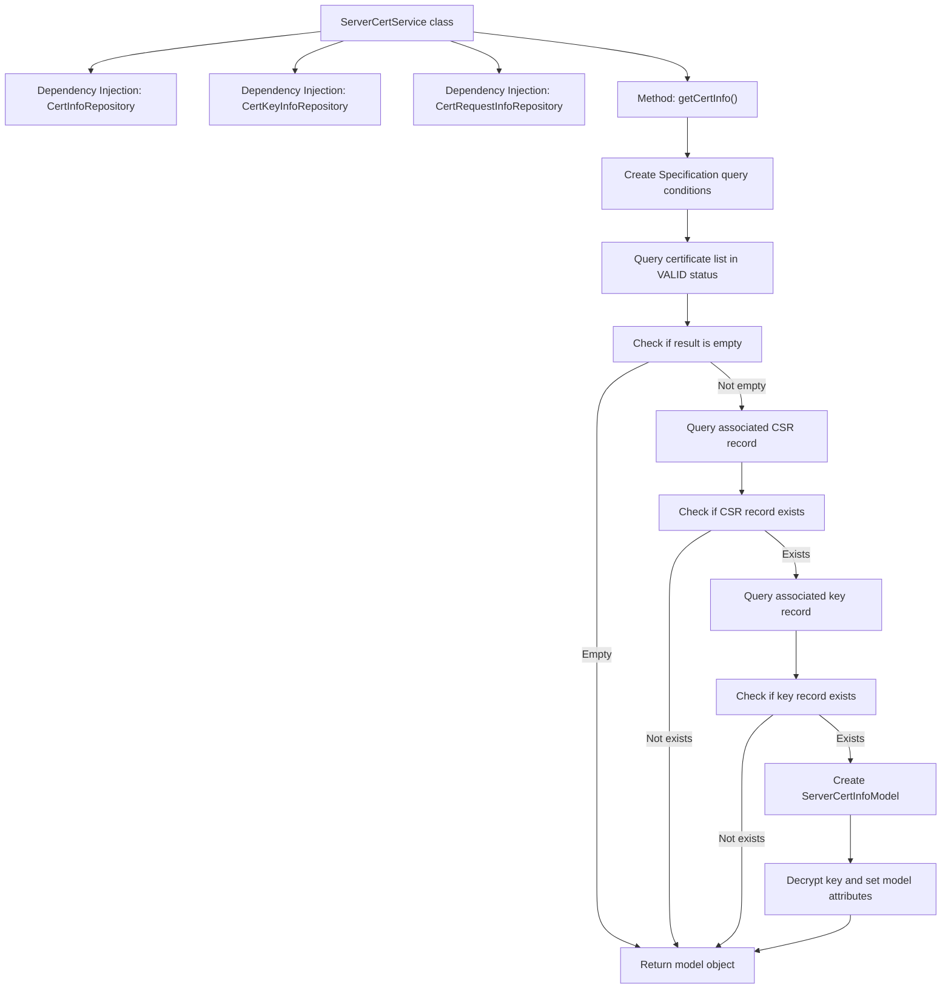

# Basic Information

|      |      |
|------|------|
| Name | ServerCertService |
| Language | .java |
| Code Path | WeFe/gateway/src/main/java/com/welab/wefe/gateway/service/ServerCertService.java |
| Package Name | com.welab.wefe.gateway.service |
| Dependencies | ['java.util.List', 'org.apache.commons.collections4.CollectionUtils', 'org.springframework.beans.factory.annotation.Autowired', 'org.springframework.data.jpa.domain.Specification', 'org.springframework.stereotype.Service', 'com.welab.wefe.common.data.mysql.Where', 'com.welab.wefe.common.data.mysql.enums.OrderBy', 'com.welab.wefe.common.exception.StatusCodeWithException', 'com.welab.wefe.common.wefe.dto.global_config.ServerCertInfoModel', 'com.welab.wefe.gateway.entity.CertInfoEntity', 'com.welab.wefe.gateway.entity.CertKeyInfoEntity', 'com.welab.wefe.gateway.entity.CertRequestInfoEntity', 'com.welab.wefe.gateway.repository.CertInfoRepository', 'com.welab.wefe.gateway.repository.CertKeyInfoRepository', 'com.welab.wefe.gateway.repository.CertRequestInfoRepository', 'com.welab.wefe.gateway.util.DatabaseEncryptUtil'] |
| Brief Description | The ServerCertService class retrieves certificate information in the VALID state, associates it with key and request data, decrypts the information, and returns a ServerCertInfoModel object. |

# Description

ServerCertService is a service class used to retrieve server certificate information. It relies on three repository classes: CertInfoRepository, CertKeyInfoRepository, and CertRequestInfoRepository. The getCertInfo method first queries a list of certificate entities with a status of VALID, sorted in descending order by creation time. If the list is empty, it returns null. Then, it queries the certificate request entity using the csrId from the certificate entity, followed by querying the key entity using the subjectKeyId from the request entity. If any entity does not exist, it returns null. Finally, it constructs a ServerCertInfoModel object, decrypts the key content, sets the certificate content, and returns it.

# Class Summary

| Name   | Type  | Description |
|-------|------|-------------|
| ServerCertService | class | The ServerCertService class retrieves certificate information in the VALID state, associates request and key data, and returns the decrypted key along with the certificate content. |

## Class ServerCertService

|      |      |
|------|------|
| Access Modifier | @Service;public |
| Type | class |
| Name | ServerCertService |
| Description | The ServerCertService class retrieves certificate information in the VALID state, associates request and key data, and returns the decrypted key along with the certificate content. |

### UML Class Diagram

This class diagram illustrates the relationships between ServerCertService and multiple entity classes as well as utility classes. ServerCertService operates on CertInfoEntity, CertKeyInfoEntity, and CertRequestInfoEntity through three repositories (CertInfoRepository, CertKeyInfoRepository, CertRequestInfoRepository) respectively, ultimately constructing a ServerCertInfoModel object. The DatabaseEncryptUtil utility class is used for key decryption, demonstrating the complete process from querying certificate information in the database to assembling and returning the model.

### Internal Method Call Graph

This code flowchart illustrates the complete process of obtaining certificate information in the ServerCertService class. The service operates on the database through three Repository components, first querying the list of certificates in VALID status, then sequentially querying associated CSR request records and key records, and finally constructing and returning a model object containing the decrypted key and certificate content. The flow includes three critical null-check nodes to ensure safe return of null when data is missing at any stage. The entire process demonstrates a complete handling chain from data acquisition to business model transformation.

### Field List

| Name  | Type  | Description |
|-------|-------|------|
| certKeyInfoRepository | CertKeyInfoRepository | Automatically inject the CertKeyInfoRepository instance. |
| certInfoRepository | CertInfoRepository | Automatically inject the CertInfoRepository instance. |
| certRequestInfoRepository | CertRequestInfoRepository | Using @Autowired to automatically inject an instance of CertRequestInfoRepository. |

### Method List

| Name  | Type  | Description |
|-------|-------|------|
| getCertInfo | ServerCertInfoModel | Obtain valid certificate information, including keys and content, or return empty if it does not exist. |

