# Basic Information

|      |      |
|------|------|
| Name | TransferMetaDataAsyncSaveService |
| Language | .java |
| Code Path | WeFe/gateway/src/main/java/com/welab/wefe/gateway/service/TransferMetaDataAsyncSaveService.java |
| Package Name | com.welab.wefe.gateway.service |
| Dependencies | ['com.welab.wefe.common.data.storage.model.DataItemModel', 'com.welab.wefe.common.data.storage.service.fc.FcStorage', 'com.welab.wefe.common.data.storage.service.persistent.PersistentStorage', 'com.welab.wefe.common.util.FileUtil', 'com.welab.wefe.common.util.StringUtil', 'com.welab.wefe.common.util.ThreadUtil', 'com.welab.wefe.common.wefe.dto.global_config.GatewayConfigModel', 'com.welab.wefe.common.wefe.enums.GatewayProcessorType', 'com.welab.wefe.gateway.api.meta.basic.BasicMetaProto', 'com.welab.wefe.gateway.api.meta.basic.GatewayMetaProto', 'com.welab.wefe.gateway.api.service.proto.TransferServiceGrpc', 'com.welab.wefe.gateway.cache.GrpcChannelCache', 'com.welab.wefe.gateway.cache.MemberCache', 'com.welab.wefe.gateway.init.InitStorageManager', 'com.welab.wefe.gateway.util.GrpcUtil', 'com.welab.wefe.gateway.util.SerializeUtil', 'com.welab.wefe.gateway.util.TransferMetaUtil', 'io.grpc.ManagedChannel', 'org.apache.commons.collections4.CollectionUtils', 'org.apache.commons.lang3.math.NumberUtils', 'org.slf4j.Logger', 'org.slf4j.LoggerFactory', 'org.springframework.beans.factory.annotation.Autowired', 'org.springframework.scheduling.annotation.Async', 'org.springframework.stereotype.Service', 'java.util', 'java.util.concurrent.TimeUnit'] |
| Brief Description | Asynchronous save transmission metadata service, supports deserializing data and checking storage configurations, stores data based on type (OTS/OSS/COS/ClickHouse), retries 3 times upon failure, and handles success or failure status. |

# Description

The `TransferMetaDataAsyncSaveService` is a service class designed for asynchronously saving transfer metadata, utilizing a dedicated thread pool for task execution via the `@Async` annotation. Its core functionalities include: deserializing transfer metadata, extracting source and target database table names, verifying storage configurations (e.g., FC and ClickHouse), and saving data to the corresponding storage systems based on storage types (e.g., ots, oss, clickhouse, cos). It supports a retry mechanism for failures (up to 3 attempts), logs error messages upon failure, and updates statuses. Additionally, it includes methods to validate storage configurations, notifying the sender if anomalies are detected. The entire process involves logging, error handling, and file cleanup.

# Class Summary

| Name   | Type  | Description |
|-------|------|-------------|
| TransferMetaDataAsyncSaveService | class | Asynchronous save transmission metadata service, supports deserializing data and checking storage configurations, saves data based on type (OTS/OSS/COS/ClickHouse), retries 3 times upon failure, and deletes the serialized file after successful or failed processing. |

## Class TransferMetaDataAsyncSaveService

|      |      |
|------|------|
| Access Modifier | @Service;public |
| Type | class |
| Name | TransferMetaDataAsyncSaveService |
| Description | Asynchronous save transmission metadata service, supports deserializing data and checking storage configurations, saves data based on type (OTS/OSS/COS/ClickHouse), retries 3 times upon failure, and deletes the serialized file after successful or failed processing. |

### UML Class Diagram

```mermaid
classDiagram
    class TransferMetaDataAsyncSaveService {
        -Logger LOG
        -MessageService messageService
        -GlobalConfigService globalConfigService
        +save(String sessionId, TransferMetaDataSink~ProcessingTransferMetaData~ processingTransferMetaData) void
        -checkStorageAndCallback(GatewayMetaProto~TransferMeta~ transferMeta) void
    }

    class MessageService {
        <<Interface>>
        +saveError(String title, String message) void
        +saveError(String title, String message, GatewayMetaProto~TransferMeta~ transferMeta) void
    }

    class GlobalConfigService {
        <<Interface>>
        +getModel(Class~T~ clazz) T
    }

    class TransferMetaDataSink {
        <<Interface>>
    }

    class GatewayMetaProto {
        <<Interface>>
    }

    class BasicMetaProto {
        <<Interface>>
    }

    class DataItemModel~K,V~ {
        +K k
        +V v
        +setK(K k) void
        +setV(V v) void
    }

    class FcStorage {
        +getInstance() FcStorage
        +putAll(List~DataItemModel~byte[],byte[]~~ dataList, Map~String,Object~ args) void
    }

    class PersistentStorage {
        +getInstance() PersistentStorage
        +putAllNew(String dbName, String tableName, List~DataItemModel~byte[],byte[]~~ dataList) void
    }

    class InitStorageManager {
        <<Interface>>
    }

    class MemberCache {
        +getInstance() MemberCache
        +get(String memberId) Object
    }

    class GrpcChannelCache {
        +getInstance() GrpcChannelCache
        +getNonNull(String uri, boolean secure, Object params) ManagedChannel
    }

    class TransferServiceGrpc {
        <<Interface>>
        +newBlockingStub(ManagedChannel channel) TransferServiceBlockingStub
    }

    TransferMetaDataAsyncSaveService --> MessageService : Dependency
    TransferMetaDataAsyncSaveService --> GlobalConfigService : Dependency
    TransferMetaDataAsyncSaveService --> TransferMetaDataSink : Processes data
    TransferMetaDataAsyncSaveService --> GatewayMetaProto : Parses metadata
    TransferMetaDataAsyncSaveService --> BasicMetaProto : Handles key-value data
    TransferMetaDataAsyncSaveService --> DataItemModel : Creates data items
    TransferMetaDataAsyncSaveService --> FcStorage : Stores data (FC)
    TransferMetaDataAsyncSaveService --> PersistentStorage : Stores data (CK)
    TransferMetaDataAsyncSaveService --> InitStorageManager : Checks storage status
    TransferMetaDataAsyncSaveService --> MemberCache : Retrieves member info
    TransferMetaDataAsyncSaveService --> GrpcChannelCache : Acquires gRPC channel
    TransferMetaDataAsyncSaveService --> TransferServiceGrpc : Sends callbacks
```

This class diagram illustrates the core structure and dependencies of TransferMetaDataAsyncSaveService. The service primarily handles asynchronous saving of transfer metadata, supporting multiple storage types (OTS/OSS/CK/COS). It includes functionalities such as data deserialization, storage status verification, error retry mechanisms, and callback notifications. Errors are logged via MessageService, configurations are obtained through GlobalConfigService, data storage is managed by FcStorage and PersistentStorage, and cross-node communication is achieved via gRPC channels. The design demonstrates high-reliability data transfer processing capabilities, ensuring data integrity through a three-layer retry mechanism and state management.

### Internal Method Call Graph

This code represents the core implementation of the TransferMetaDataAsyncSaveService class, primarily functioning to asynchronously save transfer metadata. The flowchart illustrates the complete processing logic, including deserialization, data validation, multi-type storage support (OTS/OSS/ClickHouse/COS), and retry mechanisms. The sequence diagram details the interaction process between the service and various components, particularly highlighting exception handling and storage configuration checks. The code achieves asynchronous execution through the @Async annotation, supports multiple storage backends, and incorporates comprehensive error handling and retry mechanisms.

### Field List

| Name  | Type  | Description |
|-------|-------|------|
| globalConfigService | GlobalConfigService | Automatically inject global configuration service instances. |
| LOG = LoggerFactory.getLogger(TransferMetaDataAsyncSaveService.class) | Logger | The class TransferMetaDataAsyncSaveService defines a private immutable logger LOG for recording log information. |
| messageService | MessageService | Automatically inject the MessageService instance. |

### Method List

| Name  | Type  | Description |
|-------|-------|------|
| save | void | The asynchronous method `save` handles the transmission of metadata, including deserialization, configuration validation, and uploading data based on the storage type (OTS, OSS, ClickHouse, COS). It retries up to 3 times upon failure, ultimately updates the status, and deletes temporary files. |
| checkStorageAndCallback | void | Check storage status and callback: Skip if the serial number is non-zero; check initialization status based on storage type, construct an error message and notify the sender if incomplete, then send the callback via gRPC. |

