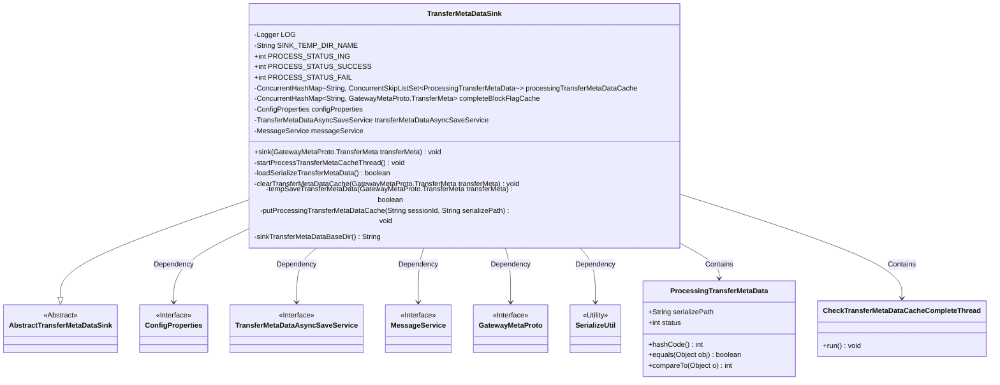
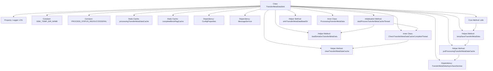

# Basic Information

|      |      |
|------|------|
| Name | TransferMetaDataSink |
| Language | .java |
| Code Path | WeFe/gateway/src/main/java/com/welab/wefe/gateway/service/TransferMetaDataSink.java |
| Package Name | com.welab.wefe.gateway.service |
| Dependencies | ['com.welab.wefe.common.util.FileUtil', 'com.welab.wefe.common.util.StringUtil', 'com.welab.wefe.common.util.ThreadUtil', 'com.welab.wefe.gateway.api.meta.basic.GatewayMetaProto', 'com.welab.wefe.gateway.config.ConfigProperties', 'com.welab.wefe.gateway.service.base.AbstractTransferMetaDataSink', 'com.welab.wefe.gateway.util.SerializeUtil', 'org.apache.commons.collections4.CollectionUtils', 'org.slf4j.Logger', 'org.slf4j.LoggerFactory', 'org.springframework.beans.factory.annotation.Autowired', 'org.springframework.stereotype.Service', 'java.io.File', 'java.util.ArrayList', 'java.util.List', 'java.util.Map', 'java.util.concurrent.ConcurrentHashMap', 'java.util.concurrent.ConcurrentSkipListSet'] |
| Brief Description | The `TransferMetaDataSink` class handles metadata transfer, incorporating cache management, status check threads, serialized data loading, and temporary storage capabilities. It supports three states: processing, success, and failure. |

# Description

TransferMetaDataSink is a service class designed for handling metadata transfer, inheriting from AbstractTransferMetaDataSink. It includes three processing state constants: in-progress, success, and failure. Two ConcurrentHashMaps are used to cache metadata under processing and completed block identifiers. Configuration properties, asynchronous save service, and message service are injected via Autowired. During startup, it loads serialized data and initiates a thread to check whether the cache has received completions. The sink method temporarily stores transfer metadata. The inner class CheckTransferMetaDataCacheCompleteThread periodically checks if cached data processing is completed, updates the status, and cleans the cache. It provides functionalities such as serialized metadata loading, temporary storage, cache management, and base directory retrieval. The inner class ProcessingTransferMetaData defines the structure and comparison logic for metadata under processing.

# Class Summary

| Name   | Type  | Description |
|-------|------|-------------|
| TransferMetaDataSink | class | The TransferMetaDataSink class is designed to handle metadata transfer, incorporating cache management, status checking, and asynchronous storage capabilities. It supports three states: in-progress, success, and failure, and verifies completion via thread checks while performing cache cleanup. |

## Class TransferMetaDataSink

|      |      |
|------|------|
| Access Modifier | @Service;public |
| Type | class |
| Name | TransferMetaDataSink |
| Description | The TransferMetaDataSink class is designed to handle metadata transfer, incorporating cache management, status checking, and asynchronous storage capabilities. It supports three states: in-progress, success, and failure, and verifies completion via thread checks while performing cache cleanup. |

### UML Class Diagram

This code describes a metadata transfer sink system, primarily consisting of the TransferMetaDataSink class and its inner classes ProcessingTransferMetaData and CheckTransferMetaDataCacheCompleteThread. The system implements reliable metadata transmission through cache management, asynchronous processing, and serialization techniques, incorporating status management, temporary storage, exception handling, and automatic recovery mechanisms. The class diagram illustrates inheritance, dependency, and containment relationships between core components, including interactions with configuration services, messaging services, and serialization utilities.

### Internal Method Call Graph

This flowchart illustrates the complete structure of the TransferMetaDataSink class, showcasing the core data flow path: After receiving metadata through the sink() method, it calls tempSaveTransferMetaData for temporary storage and triggers putProcessingTransferMetaDataCache to update the cache and perform asynchronous storage. During initialization, it loads serialized data and starts the CheckTransferMetaDataCacheCompleteThread monitoring thread, which continuously tracks cache completion status and cleans up processed data. The class maintains two core ConcurrentHashMap caches and uses the ProcessingTransferMetaData inner class to track processing states, collectively implementing a highly reliable metadata reception and processing pipeline.

### Field List

| Name  | Type  | Description |
|-------|-------|------|
| completeBlockFlagCache = new ConcurrentHashMap<>() | ConcurrentHashMap<String, GatewayMetaProto.TransferMeta> | Define a private static ConcurrentHashMap with String as the key and GatewayMetaProto.TransferMeta as the value, used for caching complete block markers. |
| PROCESS_STATUS_ING = 0 | int | Define the static constant PROCESS_STATUS_ING with a value of 0, representing the processing status. |
| configProperties | ConfigProperties | Automatically inject configuration property objects. |
| transferMetaDataAsyncSaveService | TransferMetaDataAsyncSaveService | Using @Autowired to automatically inject an instance of the TransferMetaDataAsyncSaveService. |
| PROCESS_STATUS_FAIL = 2 | int | The constant PROCESS_STATUS_FAIL has a value of 2, indicating the processing failure status. |
| SINK_TEMP_DIR_NAME = "sink" | String | Define the constant string SINK_TEMP_DIR_NAME with the value "sink". |
| PROCESS_STATUS_SUCCESS = 1 | int | A public static constant is defined, representing the successful processing state with a value of 1. |
| processingTransferMetaDataCache = new ConcurrentHashMap<>() | ConcurrentHashMap<String, ConcurrentSkipListSet<ProcessingTransferMetaData>> | A private static concurrent hash table with string keys and concurrent skip list set values, used for storing and processing transmission metadata. |
| messageService | MessageService | Using @Autowired to automatically inject an instance of MessageService. |
| LOG = LoggerFactory.getLogger(TransferMetaDataSink.class) | Logger | Define a private static log object LOG for the TransferMetaDataSink class. |

### Method List

| Name  | Type  | Description |
|-------|-------|------|
| startProcessTransferMetaCacheThread | void | Using @Autowired for method injection, the system will exit if loading serialized data fails, and a thread will be started to check the metadata cache reception status. |
| clearTransferMetaDataCache | void | Clearing transmission metadata cache: Delete the completion flag and in-process data cache for the specified session ID, and remove the corresponding persistent files. |
| loadSerializeTransferMetaData | boolean | Method for loading serialized transmission metadata: Check the directory file, deserialize the metadata and cache the files being processed, then mark the completion file. Returns true on success, false on failure. |
| sink | void | The method `sink` temporarily stores the transfer metadata `transferMeta` and may throw exceptions. |
| tempSaveTransferMetaData | boolean | The method `tempSaveTransferMetaData` saves transfer metadata to a specified directory, processing differently based on whether it is the final block. It returns `true` upon success and logs errors before returning `false` in case of failure. |
| putProcessingTransferMetaDataCache | void | Private synchronization method that stores in-progress transfer metadata in cache and asynchronously saves it to the database. Retrieves or creates an ordered collection based on sessionId, adds metadata, updates the cache, and finally invokes an asynchronous service to persist the data. |
| sinkTransferMetaDataBaseDir | String | This method retrieves the temporary storage directory path for received metadata, ensures the path ends with a separator, and concatenates the specified directory name. |

