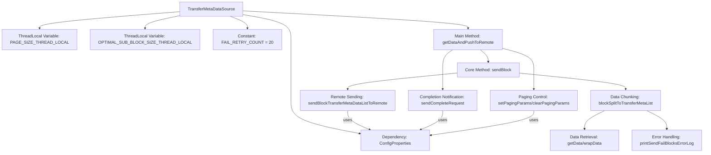
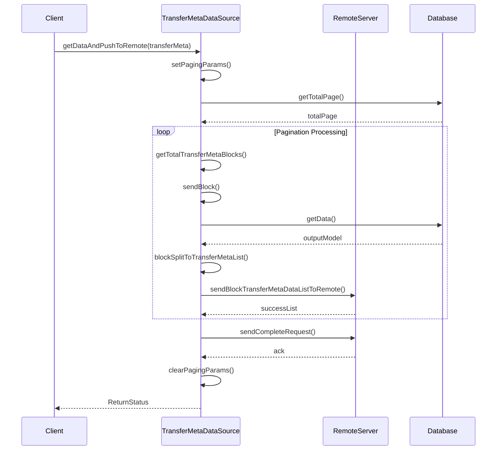

# Basic Information

|      |      |
|------|------|
| Name | TransferMetaDataSource |
| Language | .java |
| Code Path | WeFe/gateway/src/main/java/com/welab/wefe/gateway/service/TransferMetaDataSource.java |
| Package Name | com.welab.wefe.gateway.service |
| Dependencies | ['com.google.common.util.concurrent.SettableFuture', 'com.welab.wefe.common.data.storage.model.DataItemModel', 'com.welab.wefe.common.data.storage.model.PageInputModel', 'com.welab.wefe.common.data.storage.model.PageOutputModel', 'com.welab.wefe.common.data.storage.service.persistent.PersistentStorage', 'com.welab.wefe.common.util.ThreadUtil', 'com.welab.wefe.gateway.api.meta.basic.BasicMetaProto', 'com.welab.wefe.gateway.api.meta.basic.GatewayMetaProto', 'com.welab.wefe.gateway.api.service.proto.NetworkDataTransferProxyServiceGrpc', 'com.welab.wefe.gateway.api.streammessage.PushDataSourceResponseStreamObserver', 'com.welab.wefe.gateway.cache.GrpcChannelCache', 'com.welab.wefe.gateway.cache.MemberCache', 'com.welab.wefe.gateway.common.EndpointBuilder', 'com.welab.wefe.gateway.common.KeyValueDataBuilder', 'com.welab.wefe.gateway.common.ReturnStatusBuilder', 'com.welab.wefe.gateway.config.ConfigProperties', 'com.welab.wefe.gateway.entity.MemberEntity', 'com.welab.wefe.gateway.interceptor.ClientCallCredentials', 'com.welab.wefe.gateway.interceptor.SignVerifyMetadataBuilder', 'com.welab.wefe.gateway.interceptor.SystemTimestampMetadataBuilder', 'com.welab.wefe.gateway.service.base.AbstractTransferMetaDataSource', 'com.welab.wefe.gateway.util.GrpcUtil', 'com.welab.wefe.gateway.util.TlsUtil', 'com.welab.wefe.gateway.util.TransferMetaUtil', 'io.grpc.ManagedChannel', 'io.grpc.StatusRuntimeException', 'io.grpc.stub.StreamObserver', 'org.apache.commons.collections4.CollectionUtils', 'org.slf4j.Logger', 'org.slf4j.LoggerFactory', 'org.springframework.beans.factory.annotation.Autowired', 'org.springframework.stereotype.Service', 'java.util.ArrayList', 'java.util.List'] |
| Brief Description | The `TransferMetaDataSource` class implements data pagination transfer functionality, manages pagination parameters through thread-local variables, supports a retry mechanism for failures, utilizes gRPC asynchronous communication to send data chunks to remote services, handles exceptions such as signature verification and SSL connections, and logs transfer records. |

# Description

TransferMetaDataSource is a service class responsible for paginating and transferring metadata to a remote server. Its primary functions include: setting pagination parameters, retrieving a list of data chunks to be sent, transmitting data chunks in batches, handling retry logic for failed transmissions, and marking completion. The class uses ThreadLocal to store page size and optimal sub-chunk size, with a default retry count of 20 for failures. Data is transmitted asynchronously via gRPC streaming, supporting SSL and signature verification. During transmission, logs are recorded to handle errors such as network exceptions or signature verification failures, ultimately returning the transfer status. Auxiliary methods include data chunking, packaging, error handling, and parameter cleanup.

# Class Summary

| Name   | Type  | Description |
|-------|------|-------------|
| TransferMetaDataSource | class | The TransferMetaDataSource class implements data pagination transfer functionality, including pagination parameter settings, data block segmentation, remote transmission, and failure retry mechanisms. It supports SSL and signature verification, allows up to 20 retries upon failure, logs events, and cleans up thread-local variables. |

## Class TransferMetaDataSource

|      |      |
|------|------|
| Access Modifier | @Service;public |
| Type | class |
| Name | TransferMetaDataSource |
| Description | The TransferMetaDataSource class implements data pagination transfer functionality, including pagination parameter settings, data block segmentation, remote transmission, and failure retry mechanisms. It supports SSL and signature verification, allows up to 20 retries upon failure, logs events, and cleans up thread-local variables. |

### UML Class Diagram

```mermaid
classDiagram
    class TransferMetaDataSource {
        -Logger LOG
        -ThreadLocal~Integer~ PAGE_SIZE_THREAD_LOCAL
        -ThreadLocal~Integer~ OPTIMAL_SUB_BLOCK_SIZE_THREAD_LOCAL
        -int FAIL_RETRY_COUNT = 20
        -ConfigProperties configProperties
        +BasicMetaProto.ReturnStatus getDataAndPushToRemote(GatewayMetaProto.TransferMeta transferMeta)
        -List~GatewayMetaProto.TransferMeta~ sendBlock(GatewayMetaProto.TransferMeta block)
        -List~GatewayMetaProto.TransferMeta~ blockSplitToTransferMetaList(GatewayMetaProto.TransferMeta block)
        -List~GatewayMetaProto.TransferMeta~ sendBlockTransferMetaDataListToRemote(GatewayMetaProto.TransferMeta block, List~GatewayMetaProto.TransferMeta~ transferMetaDataList)
        -List~GatewayMetaProto.TransferMeta~ getSendFailedTransferMetaList(List~GatewayMetaProto.TransferMeta~ totalTransferMetaList, List~GatewayMetaProto.TransferMeta~ sendSuccessBlocks)
        -boolean sendCompleteRequest(GatewayMetaProto.TransferMeta transferMeta, boolean success)
        -List~GatewayMetaProto.TransferMeta~ getTotalTransferMetaBlocks(GatewayMetaProto.TransferMeta transferMeta)
        -int getTotalPage(GatewayMetaProto.TransferMeta transferMeta)
        -PageOutputModel~byte[], byte[]~ getData(GatewayMetaProto.TransferMeta transferMeta, PageInputModel inputModel)
        -List~BasicMetaProto.KeyValueData~ wrapData(PageOutputModel~byte[], byte[]~ outputModel)
        -void printSendFailBlocksErrorLog(List~GatewayMetaProto.TransferMeta~ sendFailBlocks)
        -List~List~BasicMetaProto.KeyValueData~~ splitConfigDataList(List~BasicMetaProto.KeyValueData~ configDataList)
        -int getBlockSequenceNo(int blockNo)
        -int getSplitBlockCount(int totalCount, int perSplitCount)
        -void setPagingParams(GatewayMetaProto.TransferMeta transferMeta)
        -void clearPagingParams()
    }

    class AbstractTransferMetaDataSource {
        <<Abstract>>
    }

    class ConfigProperties {
        +double persistentStorageBatchInsertSize
    }

    class GatewayMetaProto {
        <<Interface>>
    }

    class BasicMetaProto {
        <<Interface>>
    }

    class PersistentStorage {
        +int count(String dbName, String tableName)
        +PageOutputModel~byte[], byte[]~ getPageBytes(String dbName, String tableName, PageInputModel inputModel)
        +int getCountByByteSize(String dbName, String tableName, long byteSize)
    }

    class PageInputModel {
        +int pageNum
        +int pageSize
    }

    class PageOutputModel~K, V~ {
        +List~DataItemModel~K, V~~ data
    }

    class DataItemModel~K, V~ {
        +K k
        +V v
    }

    class GrpcChannelCache {
        +ManagedChannel getNonNull(String uri, boolean tlsEnable, List~X509Certificate~ certificates)
    }

    class NetworkDataTransferProxyServiceGrpc {
        <<Interface>>
    }

    class AsyncResponseCollector {
        +List~GatewayMetaProto.TransferMeta~ successList
    }

    class ClientCallCredentials {
        +ClientCallCredentials(Object credentials, SignVerifyMetadataBuilder signVerifyMetadataBuilder, SystemTimestampMetadataBuilder systemTimestampMetadataBuilder)
    }

    TransferMetaDataSource --|> AbstractTransferMetaDataSource : Inheritance
    TransferMetaDataSource --> ConfigProperties : Dependency
    TransferMetaDataSource --> PersistentStorage : Dependency
    TransferMetaDataSource --> GrpcChannelCache : Dependency
    TransferMetaDataSource --> NetworkDataTransferProxyServiceGrpc : Dependency
    TransferMetaDataSource --> AsyncResponseCollector : Dependency
    TransferMetaDataSource --> ClientCallCredentials : Dependency
    TransferMetaDataSource --> GatewayMetaProto : Dependency
    TransferMetaDataSource --> BasicMetaProto : Dependency
    PageOutputModel --> DataItemModel : Contains
```

Class diagram description: This diagram illustrates the TransferMetaDataSource class and its dependencies, inheriting from AbstractTransferMetaDataSource, primarily handling data transfer logic. It includes thread-local variables, configuration properties, persistent storage operations, and components interacting with gRPC services. Core functionalities like reliable data transfer are achieved through pagination, data block splitting, and retry mechanisms, involving collaboration with multiple auxiliary classes and interfaces.

### Internal Method Call Graph

This flowchart illustrates the core structure and data flow process of the TransferMetaDataSource class. The main method getDataAndPushToRemote completes data transmission through three core stages: paging control, data chunking, and remote sending. It uses ThreadLocal to maintain paging parameters, supports a failure retry mechanism, and handles various exceptions. The sequence diagram details the complete interaction process from client request to database query, data chunking, and remote pushing, including key processes such as a 20-time retry mechanism and SSL/TLS secure communication. The entire design achieves efficient and reliable large-volume data chunk transmission capabilities.

### Field List

| Name  | Type  | Description |
|-------|-------|------|
| configProperties | ConfigProperties | Automatically inject configuration property objects. |
| FAIL_RETRY_COUNT = 20 | int | Private static constant, the number of retry attempts on failure is set to 20. |
| LOG = LoggerFactory.getLogger(TransferMetaDataSource.class) | Logger | Declare a private immutable logger instance for logging output in the TransferMetaDataSource class. |
| OPTIMAL_SUB_BLOCK_SIZE_THREAD_LOCAL = new ThreadLocal<>() | ThreadLocal<Integer> | Define a thread-local variable OPTIMAL_SUB_BLOCK_SIZE_THREAD_LOCAL to store integer-type values, with each thread accessing its own independent copy. |
| PAGE_SIZE_THREAD_LOCAL = new ThreadLocal<>() | ThreadLocal<Integer> | Thread-local variable, storing integer page size, static private constant. |

### Method List

| Name  | Type  | Description |
|-------|-------|------|
| printSendFailBlocksErrorLog | void | Log failed block transmissions in the method record, including session ID, database name, table name, and sequence number list. Skip if no failed blocks exist. |
| blockSplitToTransferMetaList | List<GatewayMetaProto.TransferMeta> | The method splits block data into a list of transmission metadata: query the database to retrieve paginated data, validate non-null values before encapsulation and segmentation, generate a new list of transmission metadata, and set sequence numbers, statuses, and data content. |
| getSendFailedTransferMetaList | List<GatewayMetaProto.TransferMeta> | Retrieve the list of transmission metadata that failed to send, and return the unsuccessful metadata by comparing the sequence numbers of the total list and the successful list. |
| setPagingParams | void | This method calculates and sets the pagination parameters, determining the optimal sub-block size and page size based on the storage configuration and table data size. |
| getTotalPage | int | Method to obtain the total number of pages: Extract the database name and table name from transferMeta, retry up to 3 times to query the total record count, then calculate and return the number of pages upon success or after retries are completed. |
| sendBlockTransferMetaDataListToRemote | List<GatewayMetaProto.TransferMeta> | The method sends a list of metadata to a remote server using gRPC asynchronous streaming. After verifying the list is not empty, it establishes a channel and sets up the request stream, sending data one by one. If the server encounters an error during processing, it stops sending and ultimately returns the list of metadata that failed to send. In case of an exception, it closes the stream and throws an error. |
| sendBlock | List<GatewayMetaProto.TransferMeta> | The method sends data blocks, retries sending after splitting, refreshes the target address and sleeps before retrying upon failure, and throws an exception if the retry count is exceeded. |
| getData | PageOutputModel<byte[], byte[]> | The method getData retrieves paginated data from storage, with a maximum of 3 retries and an incremental wait time after each failure. It returns the data upon success, otherwise null. |
| wrapData | List<BasicMetaProto.KeyValueData> | Convert the key-value pair data in PageOutputModel into a KeyValueData list. If the input is not empty, iterate through each data item, construct the list, and then return it. |
| getBlockSequenceNo | int | The method `getBlockSequenceNo` calculates the sequence number based on the block number, using the number of chunks, the current page size, and the optimal sub-block size to determine the chunk count. The formula is block number multiplied by the chunk count plus 1. |
| splitConfigDataList | List<List<BasicMetaProto.KeyValueData>> | Split the configuration data list into multiple sublists according to the specified block size, and return the collection of split lists. |
| getTotalTransferMetaBlocks | List<GatewayMetaProto.TransferMeta> | The method `getTotalTransferMetaBlocks` generates multiple TransferMeta blocks based on the pagination total of `transferMeta`, setting the sequence number, unfinished flag, and processing status for each block, and finally returns the block list. |
| clearPagingParams | void | Clear pagination parameters: Remove the thread-local stored variables for optimal sub-block size and page size. |
| sendCompleteRequest | boolean | The method `sendCompleteRequest` sends a transfer completion request via gRPC, supports retry on failure, sets the transfer status, and processes the response. It returns `true` on success and throws an exception on failure. |
| getSplitBlockCount | int | Calculate the number of chunks: Divide the total quantity by the quantity per chunk, and if there is a remainder, increment the chunk count by 1. |
| getDataAndPushToRemote | BasicMetaProto.ReturnStatus | The method getDataAndPushToRemote handles data transmission: it retrieves data blocks in pagination, sends them to the remote, logs failed blocks, and retries. It returns OK upon success or error messages (network, SSL, signature issues, etc.) upon failure. Finally, it cleans up pagination parameters and logs the time consumed. |

