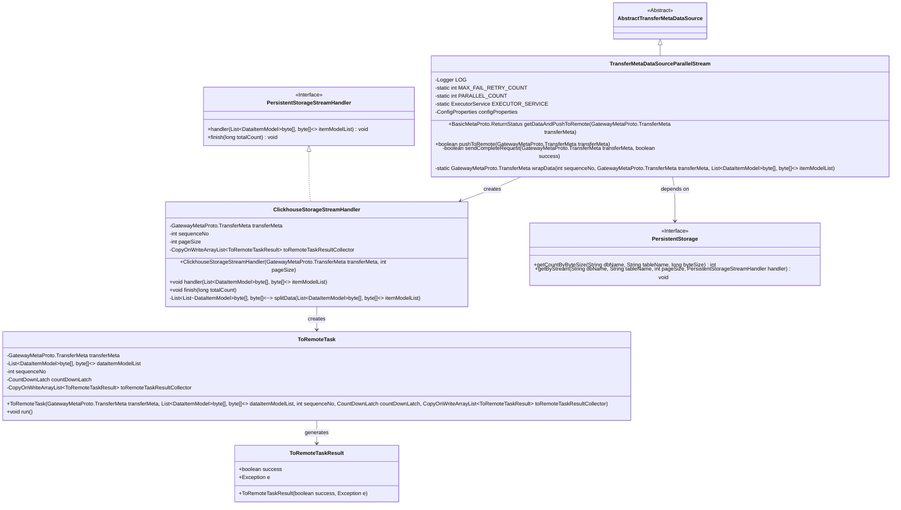
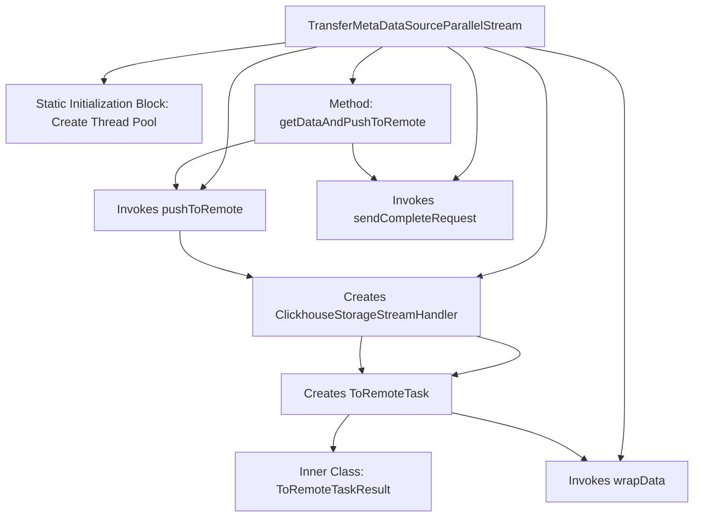
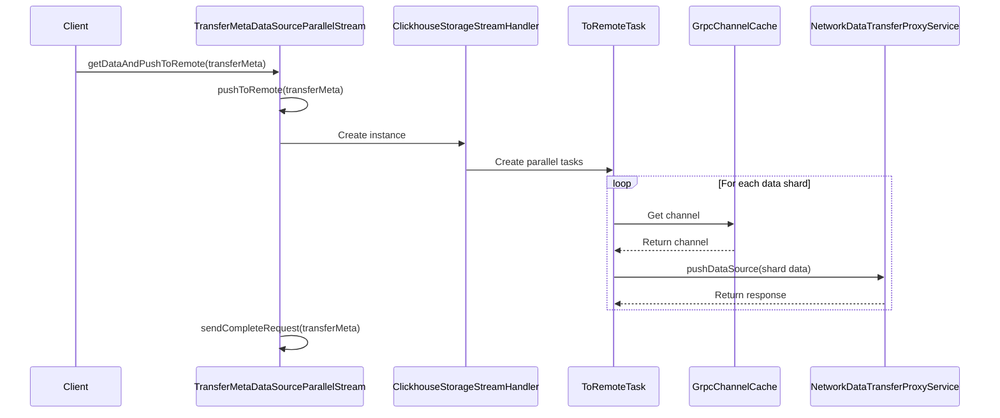

# Basic Information

|      |      |
|------|------|
| Name | TransferMetaDataSourceParallelStream |
| Language | .java |
| Code Path | WeFe/gateway/src/main/java/com/welab/wefe/gateway/service/TransferMetaDataSourceParallelStream.java |
| Package Name | com.welab.wefe.gateway.service |
| Dependencies | ['com.google.common.util.concurrent.SettableFuture', 'com.welab.wefe.common.data.storage.model.DataItemModel', 'com.welab.wefe.common.data.storage.service.persistent.PersistentStorage', 'com.welab.wefe.common.data.storage.service.persistent.PersistentStorageStreamHandler', 'com.welab.wefe.common.util.ThreadUtil', 'com.welab.wefe.gateway.api.meta.basic.BasicMetaProto', 'com.welab.wefe.gateway.api.meta.basic.GatewayMetaProto', 'com.welab.wefe.gateway.api.service.proto.NetworkDataTransferProxyServiceGrpc', 'com.welab.wefe.gateway.api.streammessage.PushDataSourceResponseStreamObserver', 'com.welab.wefe.gateway.cache.GrpcChannelCache', 'com.welab.wefe.gateway.common.EndpointBuilder', 'com.welab.wefe.gateway.common.KeyValueDataBuilder', 'com.welab.wefe.gateway.common.ReturnStatusBuilder', 'com.welab.wefe.gateway.config.ConfigProperties', 'com.welab.wefe.gateway.interceptor.ClientCallCredentials', 'com.welab.wefe.gateway.interceptor.SignVerifyMetadataBuilder', 'com.welab.wefe.gateway.interceptor.SystemTimestampMetadataBuilder', 'com.welab.wefe.gateway.service.base.AbstractTransferMetaDataSource', 'com.welab.wefe.gateway.util.GrpcUtil', 'com.welab.wefe.gateway.util.TlsUtil', 'com.welab.wefe.gateway.util.TransferMetaUtil', 'io.grpc.ManagedChannel', 'io.grpc.StatusRuntimeException', 'io.grpc.stub.StreamObserver', 'org.apache.commons.collections4.CollectionUtils', 'org.slf4j.Logger', 'org.slf4j.LoggerFactory', 'org.springframework.beans.factory.annotation.Autowired', 'org.springframework.stereotype.Service', 'java.util.ArrayList', 'java.util.List', 'java.util.concurrent.CopyOnWriteArrayList', 'java.util.concurrent.CountDownLatch', 'java.util.concurrent.ExecutorService'] |
| Brief Description | Parallel data transmission service class, supporting retry on failure and sharding processing, asynchronously pushing data to remote via GRPC, including logging and exception handling. |

# Description

TransferMetaDataSourceParallelStream is a parallel data transfer service class that inherits from AbstractTransferMetaDataSource. It utilizes a parallel stream processing mechanism to push data shards to remote nodes, supporting failure retry mechanisms (maximum 50 retries) and parallel processing (default 5 concurrent tasks). Core functionalities include: executing parallel push tasks using a thread pool, splitting data blocks by page size, streaming data asynchronously via gRPC, and handling exceptions such as SSL connections and signature verification. The class contains a nested class ClickhouseStorageStreamHandler for data shard processing, as well as ToRemoteTask to implement specific push logic. The service logs detailed metrics like transfer duration and data volume, and sends status identification requests upon completion. Exception handling covers various error scenarios including network connectivity, certificate validation, and time synchronization.

# Class Summary

| Name   | Type  | Description |
|-------|------|-------------|
| TransferMetaDataSourceParallelStream | class | Parallel data transmission service class, supports 50 retries on failure, with a parallelism level of 5. Uses a thread pool to handle data shard pushing, including network exception handling and logging. |

## Class TransferMetaDataSourceParallelStream

|      |      |
|------|------|
| Access Modifier | @Service;public |
| Type | class |
| Name | TransferMetaDataSourceParallelStream |
| Description | Parallel data transmission service class, supports 50 retries on failure, with a parallelism level of 5. Uses a thread pool to handle data shard pushing, including network exception handling and logging. |

### UML Class Diagram

This code demonstrates the class structure of a parallel data transfer system, with the core being the TransferMetaDataSourceParallelStream class, which inherits from AbstractTransferMetaDataSource and implements the functionality of parallel data pushing to remote destinations. The system processes data streams through ClickhouseStorageStreamHandler, uses ToRemoteTask for parallel task distribution, and collects task results via ToRemoteTaskResult. The entire architecture employs a thread pool for executing parallel tasks, supports a failure retry mechanism, and interacts with persistent storage (PersistentStorage) and gRPC services to achieve efficient and reliable data transfer.

### Internal Method Call Graph

This code implements a parallel data transfer service, primarily designed to push ClickHouse data shards to remote services via multithreading. The flowchart illustrates class structure relationships, while the sequence diagram depicts the core data transfer process. The code incorporates critical functionalities such as exception handling, retry mechanisms, and parallel control, utilizing a static thread pool for performance optimization. Data transmission is achieved through GRPC, with support for security features like TLS encryption and signature verification. The inner class ClickhouseStorageStreamHandler handles data shard processing, while ToRemoteTask implements specific data pushing tasks.

### Field List

| Name  | Type  | Description |
|-------|-------|------|
| PARALLEL_COUNT = 5 | int | Define the constant for parallel processing quantity with a value of 5. |
| configProperties | ConfigProperties | Using @Autowired to automatically inject an instance of the ConfigProperties configuration class. |
| LOG = LoggerFactory.getLogger(TransferMetaDataSourceParallelStream.class) | Logger | Define a private static log object LOG for the TransferMetaDataSourceParallelStream class. |
| EXECUTOR_SERVICE | ExecutorService | Private static thread pool service instance. |
| MAX_FAIL_RETRY_COUNT = 50 | int | Define the maximum failure retry count constant with a value of 50. |

### Method List

| Name  | Type  | Description |
|-------|-------|------|
| pushToRemote | boolean | The method `pushToRemote` attempts to push data to remote storage. After calculating the batch size, it retrieves the storage instance and table information, reads the data in pages by byte size, and streams it. It returns `true` on success, or logs the exception and returns `false` on failure. |
| wrapData | GatewayMetaProto.TransferMeta | The method converts a list of data items into a list of KeyValueData, updates the serial number and status of the transmission metadata, replaces the content, and returns the constructed metadata object. |
| sendCompleteRequest | boolean | Method for sending completion request: Transmit metadata over the gRPC channel, set the transmission status to complete or error, support retry on failure, return true on success, and return false or throw an exception on failure. |
| getDataAndPushToRemote | BasicMetaProto.ReturnStatus | The method `getDataAndPushToRemote` attempts to push data to a remote location and processes the result. It returns "OK" upon success, or logs the error and returns an error message in case of failure, including exceptions such as network issues, signature verification failures, SSL connection problems, etc. |

