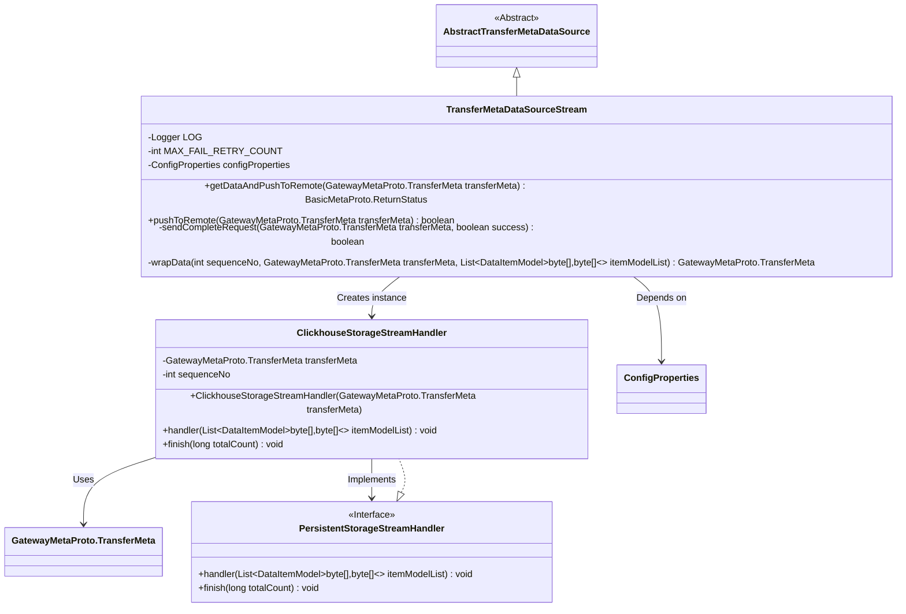
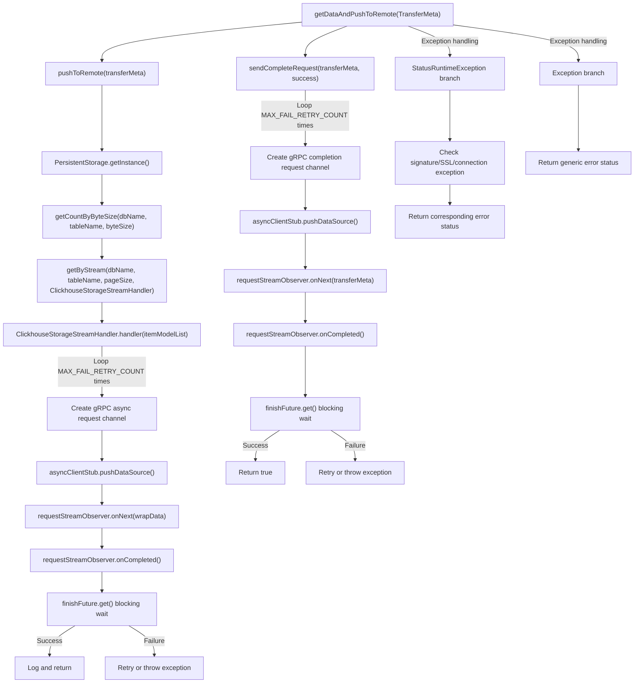

# Basic Information

|      |      |
|------|------|
| Name | TransferMetaDataSourceStream |
| Language | .java |
| Code Path | WeFe/gateway/src/main/java/com/welab/wefe/gateway/service/TransferMetaDataSourceStream.java |
| Package Name | com.welab.wefe.gateway.service |
| Dependencies | ['com.google.common.util.concurrent.SettableFuture', 'com.welab.wefe.common.data.storage.model.DataItemModel', 'com.welab.wefe.common.data.storage.service.persistent.PersistentStorage', 'com.welab.wefe.common.data.storage.service.persistent.PersistentStorageStreamHandler', 'com.welab.wefe.common.util.ThreadUtil', 'com.welab.wefe.gateway.api.meta.basic.BasicMetaProto', 'com.welab.wefe.gateway.api.meta.basic.GatewayMetaProto', 'com.welab.wefe.gateway.api.service.proto.NetworkDataTransferProxyServiceGrpc', 'com.welab.wefe.gateway.api.streammessage.PushDataSourceResponseStreamObserver', 'com.welab.wefe.gateway.cache.GrpcChannelCache', 'com.welab.wefe.gateway.common.EndpointBuilder', 'com.welab.wefe.gateway.common.KeyValueDataBuilder', 'com.welab.wefe.gateway.common.ReturnStatusBuilder', 'com.welab.wefe.gateway.config.ConfigProperties', 'com.welab.wefe.gateway.interceptor.ClientCallCredentials', 'com.welab.wefe.gateway.interceptor.SignVerifyMetadataBuilder', 'com.welab.wefe.gateway.interceptor.SystemTimestampMetadataBuilder', 'com.welab.wefe.gateway.service.base.AbstractTransferMetaDataSource', 'com.welab.wefe.gateway.util.GrpcUtil', 'com.welab.wefe.gateway.util.TlsUtil', 'com.welab.wefe.gateway.util.TransferMetaUtil', 'io.grpc.ManagedChannel', 'io.grpc.StatusRuntimeException', 'io.grpc.stub.StreamObserver', 'org.apache.commons.collections4.CollectionUtils', 'org.slf4j.Logger', 'org.slf4j.LoggerFactory', 'org.springframework.beans.factory.annotation.Autowired', 'org.springframework.stereotype.Service', 'java.util.ArrayList', 'java.util.List'] |
| Brief Description | The `TransferMetaDataSourceStream` class implements data streaming transmission, supports failure retries and SSL verification, and includes functionalities for data pushing, completion request sending, and exception handling. |

# Description

The `TransferMetaDataSourceStream` class is a service class that inherits from `AbstractTransferMetaDataSource` and is used to transfer data to a remote destination. Its primary functions include: sending data in batches to the remote target via the `pushToRemote` method, supporting retries on failure (up to 50 times), logging transmission details and time consumption; processing data streams through the internal `ClickhouseStorageStreamHandler` class, utilizing gRPC asynchronous communication for data transmission with support for TLS encryption and signature verification; the `sendCompleteRequest` method sends a completion request flag; and the `wrapData` method encapsulates data. Exception handling covers issues such as network connectivity, SSL certificates, and signature verification, returning corresponding error statuses. The entire process involves recording and transmitting critical information such as database names, table names, and session IDs.

# Class Summary

| Name   | Type  | Description |
|-------|------|-------------|
| TransferMetaDataSourceStream | class | The TransferMetaDataSourceStream class implements data streaming transmission, incorporating features such as failure retry, logging, exception handling, and SSL verification, while supporting chunked sending and completion flag notification. |

## Class TransferMetaDataSourceStream

|      |      |
|------|------|
| Access Modifier | @Service;public |
| Type | class |
| Name | TransferMetaDataSourceStream |
| Description | The TransferMetaDataSourceStream class implements data streaming transmission, incorporating features such as failure retry, logging, exception handling, and SSL verification, while supporting chunked sending and completion flag notification. |

### UML Class Diagram

This diagram illustrates the core class structure of a data transfer service. TransferMetaDataSourceStream inherits from the abstract class AbstractTransferMetaDataSource and handles the core logic of metadata transfer, including methods for data pushing, completion request sending, and data processing packaging. The inner class ClickhouseStorageStreamHandler implements the PersistentStorageStreamHandler interface to manage sharded data transmission and completion callbacks for ClickHouse data streams. Classes collaborate through dependency and implementation relationships to accomplish distributed data synchronization tasks, featuring robust error handling and retry mechanisms.

### Internal Method Call Graph

Flowchart description: This flowchart illustrates the execution flow of the core method getDataAndPushToRemote in the TransferMetaDataSourceStream class. It primarily consists of two main branches: data pushing (pushToRemote) and completion request sending (sendCompleteRequest), both utilizing gRPC asynchronous communication. The data pushing process includes paginated queries, stream processing, and retry mechanisms, while the completion request handles status synchronization. The exception handling branch distinguishes between different error types (signature verification, SSL connection, network issues, etc.) to return corresponding error codes. The entire process features robust logging and retry mechanisms to ensure data transmission reliability.

### Field List

| Name  | Type  | Description |
|-------|-------|------|
| configProperties | ConfigProperties | Automatically inject configuration property objects. |
| LOG = LoggerFactory.getLogger(TransferMetaDataSourceStream.class) | Logger | Define the static log object LOG for the TransferMetaDataSourceStream class to record log information. |
| MAX_FAIL_RETRY_COUNT = 50 | int | Define the maximum failure retry count constant as 50. |

### Method List

| Name  | Type  | Description |
|-------|-------|------|
| getDataAndPushToRemote | BasicMetaProto.ReturnStatus | The method `getDataAndPushToRemote` handles data pushing to the remote server, records time consumption and status. It returns error messages in case of failure, including network, signature, SSL, and other issues. Upon success, it returns an OK status. In case of exceptions, it logs the error and returns the specific error details. |
| pushToRemote | boolean | The method `pushToRemote` attempts to transfer data to a remote ClickHouse. After calculating the batch size, it retrieves the storage instance and table name, reads the data in pages based on byte size, and streams it. It returns `true` on success, or logs the failure and returns `false`. |
| sendCompleteRequest | boolean | The method sends a transfer completion request via gRPC, supporting retry on failure and TLS encryption. It returns true upon success, or false/throws an exception in case of failure or error. |
| wrapData | GatewayMetaProto.TransferMeta | The method encapsulates the list of data items into transmission metadata, sets the sequence number and status as "processing," and adds a key-value data list. |

