# Basic Information

|      |      |
|------|------|
| Name | service |
| Language | .java |
| Code Path | WeFe/gateway/src/main/java/com/welab/wefe/gateway/service |
| Package Name | docs.gateway.src.main.java.com.welab.wefe.gateway.service |
| Brief Description | Distributed System Health Management Framework, including gateway detection, microservice status checks, supporting local pre-checks and remote validation. Provides data transmission metadata persistence, cache management, and cross-node communication, featuring multiple processors and checkpoint mechanisms, dependent on various infrastructures. |

# Description

## Overview  
This module serves as the core communication and health management framework for distributed systems, fulfilling dual responsibilities: service state monitoring (e.g., gateway connectivity detection, MySQL health checks) and cross-node data transmission (e.g., metadata synchronization, streaming push), akin to a distributed nervous system. It adopts a layered interface specification: the health management side is based on the Processor abstract class (beforeSendToRemote/remoteProcess) and Checkpoint mechanism (doCheck/desc), while the data transmission side revolves around the TransferMeta object to implement CRUD, push operations (getDataAndPushToRemote), and status checks (checkStatusNow). Key data structures include transmission metadata URI, ReturnStatusBuilder response body, AsyncResponseCollector asynchronous collector, and multi-type checkpoints (e.g., MySQL/Storage). Dependencies encompass infrastructure such as gateway networks, function computing, MySQL, ClickHouse, and JNI/POSIX protocols—for instance, FileSystemCheckpoint validates directory permissions, and TransferMetaDataSourceStream enables encrypted transmission via gRPC.

## Core Business Scenarios  
The module supports two primary scenarios: Health management employs a "local pre-check → remote validation" layered strategy, such as GatewayAvailableProcessor first verifying session legitimacy before scanning multiple checkpoints. Data transmission follows a "persistence → push → state synchronization" workflow, exemplified by AbstractSendTransferMetaService validating parameters before sharding and pushing via parallel streams (TransferMetaDataSourceParallelStream). Typical interaction patterns include SM4-encrypted communication (BoardHttpProcessor), CA certificate synchronization (CaCertificateService), and cache updates based on TransferMeta (TransferMetaDataSink). Exception handling permeates the entire process, such as BlacklistService intercepting illegal requests and MessageService deduplicating messages via ExpiringMap. Collectively, it forms a self-healing data pipeline, supporting end-to-end monitoring and data transmission from network topology validation to storage system states.

### Package Internal Structure View

```mermaid
graph TD
    service --> processors
    service --> base
    service --> FlowActionQueueService.java
    service --> RecvTransferMetaCachePersistentService.java
    service --> GlobalConfigService.java
    service --> AbstractService.java
    service --> MessageQueueService.java
    service --> PartnerConfigService.java
    service --> MessageService.java
    service --> ServerCertService.java
    service --> TransferMetaDataSourceStream.java
    service --> BlacklistService.java
    service --> SendTransferMetaService.java
    service --> TransferMetaDataSource.java
    service --> TransferMetaDataSourceParallelStream.java
    service --> MemberService.java
    service --> CaCertificateService.java
    service --> RecvTransferMetaService.java
    service --> TransferMetaDataAsyncSaveService.java
    service --> SendTransferMetaCachePersistentService.java
    service --> TransferMetaDataSink.java
    processors --> available
    processors --> RefreshFcStorageProcessor.java
    processors --> RefreshMemberBlacklistCacheProcessor.java
    processors --> DbFlowTableProcessor.java
    processors --> BoardHttpProcessor.java
    processors --> DbChatTableProcessor.java
    processors --> RefreshMemberCacheProcessor.java
    processors --> RefreshSystemConfigCacheProcessor.java
    processors --> ResidentMemoryProcessor.java
    processors --> RemoteCallbackProcessor.java
    processors --> AbstractProcessor.java
    processors --> RestartExternalGrpcServerProcessor.java
    processors --> RefreshPartnerConfigCacheProcessor.java
    processors --> RefreshPersistentStorageProcessor.java
    processors --> DsourceProcessor.java
    processors --> AvailableCheckBeforeStartJobProcessor.java
    processors --> ProcessorContext.java
    available --> checkpoint
    available --> GatewayAliveProcessor.java
    available --> GatewayAvailableProcessor.java
    checkpoint --> FcCheckpoint.java
    checkpoint --> MysqlCheckpoint.java
    checkpoint --> FileSystemCheckpoint.java
    checkpoint --> StorageCheckpoint.java
    checkpoint --> BoardCheckpoint.java
    checkpoint --> UnionCheckpoint.java
    base --> AbstractRecvTransferMetaCachePersistentService.java
    base --> AbstractTransferMetaDataSource.java
    base --> AbstractTransferMetaDataSink.java
    base --> AbstractSendTransferMetaService.java
    base --> AbstractSendTransferMetaCachePersistentService.java
    base --> AbstractFlowActionQueueService.java
    base --> AbstractRecvTransferMetaService.java
    base --> AbstractMemberService.java
```

This flowchart illustrates the complete file structure of the WeFe gateway service, starting from the top-level service directory and branching into processors, base, and multiple service class files. The processors directory is further subdivided into an available subdirectory and multiple processor classes, with available containing a checkpoint directory and two processor classes. The checkpoint directory includes various checkpoint implementation classes. The base directory comprises multiple abstract base classes. The entire structure is clearly hierarchical, showcasing the modular design of the gateway service.

# File List

| Name   | Type  | Description |
|-------|------|-------------|
| [base](base/_module.md) | package | Abstract class collection, defining core methods for transmission metadata persistence, pushing, receiving, and member management, including operations such as save, delete, get, findAll, etc., requiring subclasses to implement specific logic. |
| [FlowActionQueueService.java](FlowActionQueueService.md) | file | The FlowActionQueueService inherits from AbstractFlowActionQueueService and saves the FlowActionQueueEntity entity through FlowActionQueueRepository. |
| [RecvTransferMetaCachePersistentService.java](RecvTransferMetaCachePersistentService.md) | file | Metadata reception and transmission caching persistence service, based on local file system storage, provides functions for saving, querying, deleting, and retrieving all metadata, handles serialization and deserialization operations, and ensures correct directory permissions and paths. |
| [GlobalConfigService.java](GlobalConfigService.md) | file | The GlobalConfigService provides configuration management functionality, allowing querying of configuration item lists by group and converting configuration items into model objects of a specified type. Core methods include getModel for retrieving configuration models, list for querying configuration items by group, and toModel for converting configuration items into entity objects. |
| [AbstractService.java](AbstractService.md) | file | Abstract service classes provide logging functionality, including a protected log object and exception logging methods. |
| [MessageQueueService.java](MessageQueueService.md) | file | The MessageQueueService class uses @Autowired to inject MessageQueueRepository and provides a save method to persist MessageQueueEntity objects. |
| [PartnerConfigService.java](PartnerConfigService.md) | file | The PartnerConfigService class retrieves all PartnerConfigEntity data through the PartnerConfigRepository. |
| [MessageService.java](MessageService.md) | file | The MessageService class utilizes ExpiringMap to cache message hashes within 60 seconds to avoid duplicate storage. It provides multiple saveError methods to record gateway error information in the database and logs exceptions when they occur. |
| [ServerCertService.java](ServerCertService.md) | file | The ServerCertService class retrieves certificate information in the VALID state, associates it with key and request data, decrypts the information, and returns a ServerCertInfoModel object. |
| [TransferMetaDataSourceStream.java](TransferMetaDataSourceStream.md) | file | The TransferMetaDataSourceStream class implements data streaming transmission, supporting failure retry and SSL verification, and includes functionalities for data pushing, completion request sending, and exception handling. |
| [BlacklistService.java](BlacklistService.md) | file | Blacklist service class, automatically injects the repository, provides methods to query all blacklists. |
| [SendTransferMetaService.java](SendTransferMetaService.md) | file | SendTransferMetaService handles message transmission, including remote sending and cache processing logic, records logs, and invokes related services. |
| [TransferMetaDataSource.java](TransferMetaDataSource.md) | file | The `TransferMetaDataSource` class implements data pagination transfer functionality, manages pagination parameters through thread-local variables, supports a failure retry mechanism, utilizes gRPC asynchronous communication to send data chunks to remote services, handles exceptions such as signature verification and SSL connections, and logs transfer records. |
| [TransferMetaDataSourceParallelStream.java](TransferMetaDataSourceParallelStream.md) | file | Parallel data transmission service class, supporting failure retries and shard processing, asynchronously pushing data to remote endpoints via GRPC, including logging and exception handling. |
| [MemberService.java](MemberService.md) | file | The MemberService class inherits from AbstractMemberService, providing functionality to retrieve member lists and self-information. It handles member entity data including ID, name, secret key, and gateway configuration, with support for TLS settings verification. |
| [CaCertificateService.java](CaCertificateService.md) | file | The CaCertificateService class provides the findAll method, which retrieves CA certificate data from the federated service, parses it into a list, and returns the list containing serial numbers, subject names, and certificate contents. |
| [RecvTransferMetaService.java](RecvTransferMetaService.md) | file | The RecvTransferMetaService handles the receipt of transfer metadata, checks statuses, and executes business logic. It includes functionalities such as cache management, status verification, and blacklist validation. |
| [TransferMetaDataAsyncSaveService.java](TransferMetaDataAsyncSaveService.md) | file | Asynchronous save transmission metadata service, supports deserializing data and checking storage configurations, stores data based on type (OTS/OSS/COS/ClickHouse), retries 3 times upon failure, and processes success or failure status. |
| [SendTransferMetaCachePersistentService.java](SendTransferMetaCachePersistentService.md) | file | The `SendTransferMetaCachePersistentService` class implements local filesystem persistence based on conditional annotations, providing functionalities for saving, deleting, and querying transfer metadata, while handling exceptions and logging them. |
| [TransferMetaDataSink.java](TransferMetaDataSink.md) | file | The TransferMetaDataSink class handles metadata transfer, including cache management, status check threads, serialized data loading, and temporary storage functions, supporting three states: in progress, success, and failure. |
| [processors](processors/_module.md) | package | Distributed Service Availability Check Framework, including gateway connection verification and backend health checks, supports multi-level probes and dual-track mode, covering full-link validation from network to storage, with various processor implementations such as MySQL checks, cache refreshes, etc. |

