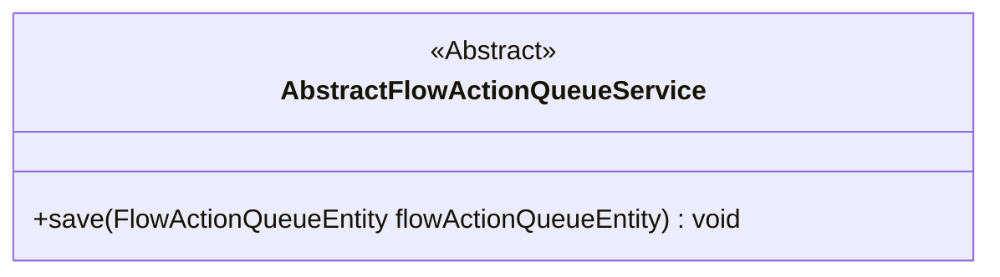
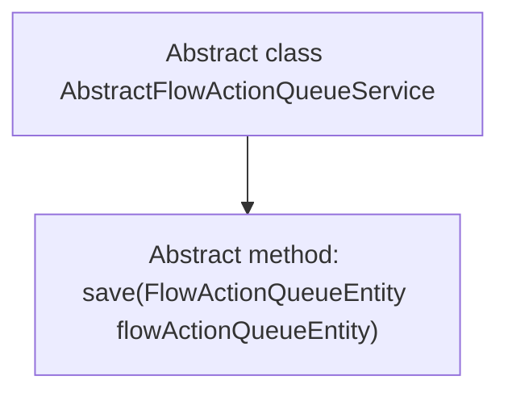

# Basic Information

|      |      |
|------|------|
| Name | AbstractFlowActionQueueService |
| Language | .java |
| Code Path | WeFe/gateway/src/main/java/com/welab/wefe/gateway/service/base/AbstractFlowActionQueueService.java |
| Package Name | com.welab.wefe.gateway.service.base |
| Dependencies | ['com.welab.wefe.gateway.entity.FlowActionQueueEntity'] |
| Brief Description | The abstract class AbstractFlowActionQueueService defines an abstract method save for persisting FlowActionQueueEntity instances. |

# Description

This is an abstract class named AbstractFlowActionQueueService, which defines an abstract method save for storing entity objects of type FlowActionQueueEntity. The abstract class provides a foundational framework, with concrete implementations to be completed by subclasses.

# Class Summary

| Name   | Type  | Description |
|-------|------|-------------|
| AbstractFlowActionQueueService | class | The abstract class AbstractFlowActionQueueService defines an abstract method save for persisting FlowActionQueueEntity instances. |

## Class AbstractFlowActionQueueService

|      |      |
|------|------|
| Access Modifier | public abstract |
| Type | class |
| Name | AbstractFlowActionQueueService |
| Description | The abstract class AbstractFlowActionQueueService defines an abstract method save for persisting FlowActionQueueEntity instances. |

### UML Class Diagram

This class diagram illustrates an abstract class named AbstractFlowActionQueueService, which defines an abstract method `save` for persisting entities of type FlowActionQueueEntity. The abstract nature of the class indicates that core functionality must be implemented by concrete subclasses, providing a foundational template and standardized interface for subsequent concrete queue service implementations. The diagram clearly reflects the service's core responsibilities and extension point design.

### Internal Method Call Graph

This code defines an abstract class named AbstractFlowActionQueueService, which contains an abstract method save that accepts a parameter of type FlowActionQueueEntity. Being an abstract class, it cannot be directly instantiated and requires concrete implementation of the save method logic by subclasses. The flowchart clearly illustrates the inheritance relationship between the class and its abstract method, providing a template specification for subsequent concrete implementation classes.

### Field List

| Name  | Type  | Description |
|-------|-------|------|

### Method List

| Name  | Type  | Description |
|-------|-------|------|
| save | void | Abstract method for saving process action queue entity objects. |

