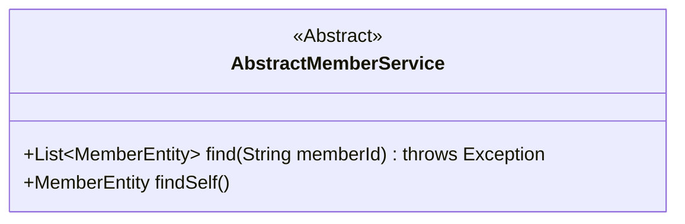
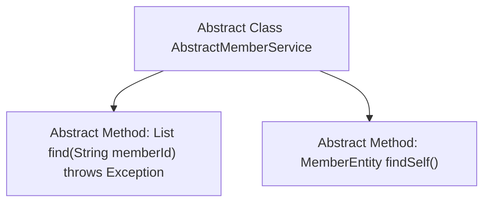

# Basic Information

|      |      |
|------|------|
| Name | AbstractMemberService |
| Language | .java |
| Code Path | WeFe/gateway/src/main/java/com/welab/wefe/gateway/service/base/AbstractMemberService.java |
| Package Name | com.welab.wefe.gateway.service.base |
| Dependencies | ['com.welab.wefe.gateway.entity.MemberEntity', 'java.util.List'] |
| Brief Description | The abstract class AbstractMemberService defines two abstract methods: find queries the member list by memberId and may throw exceptions, while findSelf retrieves the current member entity. |

# Description

This is an abstract class named AbstractMemberService, which defines two abstract methods. The first method, find, takes a memberId string parameter and returns a list of MemberEntity objects, potentially throwing an exception. The second method, findSelf, has no parameters and returns a single MemberEntity object. This class serves as a foundational template, with concrete implementations to be provided by subclasses.

# Class Summary

| Name   | Type  | Description |
|-------|------|-------------|
| AbstractMemberService | class | The abstract class AbstractMemberService defines two abstract methods: find queries the member list by memberId and may throw exceptions, while findSelf retrieves the current member entity. |

## Class AbstractMemberService

|      |      |
|------|------|
| Access Modifier | public abstract |
| Type | class |
| Name | AbstractMemberService |
| Description | The abstract class AbstractMemberService defines two abstract methods: find queries the member list by memberId and may throw exceptions, while findSelf retrieves the current member entity. |

### UML Class Diagram

This class diagram describes an abstract class named AbstractMemberService, which defines two abstract methods: find() and findSelf(). The find() method takes a String parameter memberId, returns a list of MemberEntity type, and may throw an Exception; the findSelf() method directly returns a single MemberEntity object. The class is marked with <<Abstract>> to indicate it is an abstract class that cannot be instantiated directly and requires concrete subclasses to implement these abstract methods. The diagram clearly presents the core interface definition of this abstract service.

### Internal Method Call Graph

This flowchart illustrates the structure of the abstract class AbstractMemberService, which contains two core abstract methods: find() for querying member lists by memberId (may throw exceptions), and findSelf() for retrieving the current member entity. The abstract class is represented with a dashed border, emphasizing that subclasses need to implement concrete logic. The arrows denote the hierarchical relationship between the class and its methods, conforming to object-oriented design norms for defining methods in abstract classes.

### Field List

| Name  | Type  | Description |
|-------|-------|------|

### Method List

| Name  | Type  | Description |
|-------|-------|------|
| findSelf | MemberEntity | Abstract method: Find self member entities. |
| find | List<MemberEntity> | The abstract method `find` queries a list of `MemberEntity` by `memberId` and may throw an exception. |

