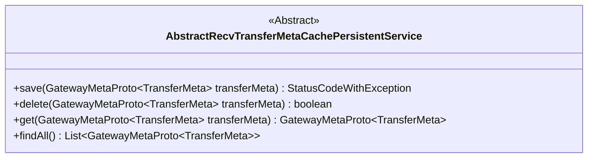
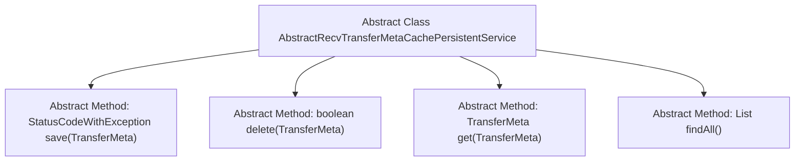

# Basic Information

|      |      |
|------|------|
| Name | AbstractRecvTransferMetaCachePersistentService |
| Language | .java |
| Code Path | WeFe/gateway/src/main/java/com/welab/wefe/gateway/service/base/AbstractRecvTransferMetaCachePersistentService.java |
| Package Name | com.welab.wefe.gateway.service.base |
| Dependencies | ['com.welab.wefe.common.exception.StatusCodeWithException', 'com.welab.wefe.gateway.api.meta.basic.GatewayMetaProto', 'java.util.List'] |
| Brief Description | An abstract class defines the metadata persistence service for transmission, including methods for saving, deleting, retrieving individual metadata, and querying all metadata. |

# Description

This is an abstract class named AbstractRecvTransferMetaCachePersistentService, which defines four core methods for handling persistent operations of transfer metadata. It includes the save method for storing transfer metadata, returning a status code and exception; the delete method for removing specified transfer metadata, returning a boolean value; the get method for retrieving a single transfer metadata; and the findAll method for obtaining a list of all transfer metadata. All methods operate based on parameters of the GatewayMetaProto.TransferMeta type.

# Class Summary

| Name   | Type  | Description |
|-------|------|-------------|
| AbstractRecvTransferMetaCachePersistentService | class | The abstract class AbstractRecvTransferMetaCachePersistentService defines four methods: save, delete, get, and query all transfer metadata, all of which operate based on GatewayMetaProto.TransferMeta. |

## Class AbstractRecvTransferMetaCachePersistentService

|      |      |
|------|------|
| Access Modifier | public abstract |
| Type | class |
| Name | AbstractRecvTransferMetaCachePersistentService |
| Description | The abstract class AbstractRecvTransferMetaCachePersistentService defines four methods: save, delete, get, and query all transfer metadata, all of which operate based on GatewayMetaProto.TransferMeta. |

### UML Class Diagram

This class diagram describes an abstract class named AbstractRecvTransferMetaCachePersistentService, which defines four core methods for handling the persistence operations of gateway metadata. The class provides methods to save (save), delete (delete), retrieve (get), and query all (findAll) TransferMeta objects. The save method returns a composite object containing a status code and exception, delete returns a boolean result, get returns a single metadata object, and findAll returns a list of metadata. All methods accept or return the generic type GatewayMetaProto.TransferMeta, indicating that this class specializes in cache persistence services for gateway transfer metadata.

### Internal Method Call Graph

This flowchart illustrates the structure of an abstract class and its four abstract methods. AbstractRecvTransferMetaCachePersistentService serves as the base class, defining core data persistence operation interfaces: save for storing transfer metadata and returning status codes, delete for removing specified metadata, get for retrieving a single metadata entry, and findAll for obtaining a list of all metadata. All methods are abstract and require concrete implementation logic by specific subclasses.

### Field List

| Name  | Type  | Description |
|-------|-------|------|

### Method List

| Name  | Type  | Description |
|-------|-------|------|
| save | StatusCodeWithException | Abstract method, saves transmission metadata, returns status codes and exceptions. |
| delete | boolean | Abstract method `delete`, which takes a `TransferMeta` object as a parameter and returns a boolean value indicating whether the deletion operation was successful. |
| get | GatewayMetaProto.TransferMeta | Abstract method to retrieve transfer metadata, with the parameter being a TransferMeta object. |
| findAll | List<GatewayMetaProto.TransferMeta> | Abstract method findAll, returns a list of type GatewayMetaProto.TransferMeta. |

