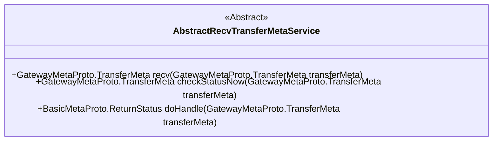
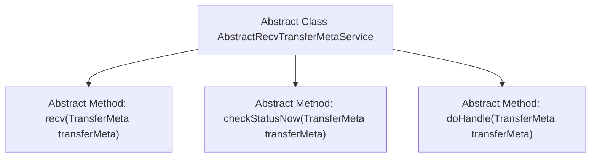

# Basic Information

|      |      |
|------|------|
| Name | AbstractRecvTransferMetaService |
| Language | .java |
| Code Path | WeFe/gateway/src/main/java/com/welab/wefe/gateway/service/base/AbstractRecvTransferMetaService.java |
| Package Name | com.welab.wefe.gateway.service.base |
| Dependencies | ['com.welab.wefe.gateway.api.meta.basic.BasicMetaProto', 'com.welab.wefe.gateway.api.meta.basic.GatewayMetaProto'] |
| Brief Description | The abstract class AbstractRecvTransferMetaService provides three methods: `recv` for blocking retrieval of remote gateway data, `checkStatusNow` for non-blocking query of data status, and `doHandle` for processing remote gateway messages and returning results. |

# Description

AbstractRecvTransferMetaService is an abstract class that defines three core methods. The recv method is used to pull data submitted by a remote gateway from the local data cache, and this method blocks until timeout. The checkStatusNow method is used to query the status of data submitted by the remote gateway, and this method is non-blocking. The doHandle method is used to process messages submitted by the remote gateway and returns the processing result. All methods take a TransferMeta object as a parameter, and some methods return a TransferMeta or ReturnStatus object.

# Class Summary

| Name   | Type  | Description |
|-------|------|-------------|
| AbstractRecvTransferMetaService | class | The abstract class AbstractRecvTransferMetaService defines three methods: recv blocks to receive data from the remote gateway, checkStatusNow performs a non-blocking query of the data status, and doHandle processes messages from the remote gateway and returns the result. |

## Class AbstractRecvTransferMetaService

|      |      |
|------|------|
| Access Modifier | public abstract |
| Type | class |
| Name | AbstractRecvTransferMetaService |
| Description | The abstract class AbstractRecvTransferMetaService defines three methods: recv blocks to receive data from the remote gateway, checkStatusNow performs a non-blocking query of the data status, and doHandle processes messages from the remote gateway and returns the result. |

### UML Class Diagram

This code defines an abstract class named AbstractRecvTransferMetaService, primarily designed to handle transfer metadata submitted by remote gateways. The class contains three core abstract methods: recv() for pulling data submitted by remote gateways from local cache (a blocking operation), checkStatusNow() for non-blocking queries of the status of data submitted by remote gateways, and doHandle() for processing messages submitted by remote gateways and returning the processing results. All these methods accept parameters of type GatewayMetaProto.TransferMeta and return response results of different protocol types, reflecting the core functionality of data transfer and status checking between gateways.

### Internal Method Call Graph

This flowchart illustrates the structure of an abstract class `AbstractRecvTransferMetaService`, which contains three core abstract methods. The `recv()` method is used to pull data submitted by remote gateways from local cache (blocking operation), `checkStatusNow()` performs non-blocking queries on the status of data submitted by remote gateways, while `doHandle()` processes messages submitted by remote gateways and returns the handling results. All methods take `GatewayMetaProto.TransferMeta` as a parameter, reflecting a unified data transfer protocol design.

### Field List

| Name  | Type  | Description |
|-------|-------|------|

### Method List

| Name  | Type  | Description |
|-------|-------|------|
| doHandle | BasicMetaProto.ReturnStatus | The abstract method `doHandle` processes transmission metadata and returns the base metadata state. |
| checkStatusNow | GatewayMetaProto.TransferMeta | Abstract method `checkStatusNow`, which takes a `TransferMeta` parameter and returns the status check result of `TransferMeta`. |
| recv | GatewayMetaProto.TransferMeta | The abstract method `recv` takes a `TransferMeta` parameter and returns a `TransferMeta` object. |

