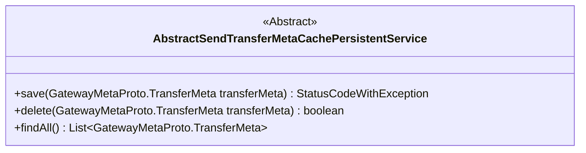
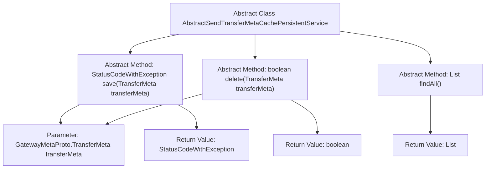

# Basic Information

|      |      |
|------|------|
| Name | AbstractSendTransferMetaCachePersistentService |
| Language | .java |
| Code Path | WeFe/gateway/src/main/java/com/welab/wefe/gateway/service/base/AbstractSendTransferMetaCachePersistentService.java |
| Package Name | com.welab.wefe.gateway.service.base |
| Dependencies | ['com.welab.wefe.common.exception.StatusCodeWithException', 'com.welab.wefe.gateway.api.meta.basic.GatewayMetaProto', 'java.util.List'] |
| Brief Description | The abstract class AbstractSendTransferMetaCachePersistentService defines persistent message operations: save saves a message and returns a status code, delete removes a message and returns a boolean value, findAll loads all messages and returns a list. |

# Description

This is an abstract class named AbstractSendTransferMetaCachePersistentService, which defines the core methods for persisting transfer metadata. It includes three abstract methods: the save method is used to persist transfer metadata and returns a composite result containing a status code and exceptions; the delete method is used to remove persisted metadata and returns a boolean indicating the operation result; the findAll method is used to load all persisted metadata into memory and returns a list of metadata. This class provides the foundational interfaces for message persistence, deletion, and querying, with specific implementations to be completed by subclasses.

# Class Summary

| Name   | Type  | Description |
|-------|------|-------------|
| AbstractSendTransferMetaCachePersistentService | class | The abstract class AbstractSendTransferMetaCachePersistentService defines abstract methods for persisting messages: save (returns a status code), delete (returns a boolean), and query all messages (returns a list). |

## Class AbstractSendTransferMetaCachePersistentService

|      |      |
|------|------|
| Access Modifier | public abstract |
| Type | class |
| Name | AbstractSendTransferMetaCachePersistentService |
| Description | The abstract class AbstractSendTransferMetaCachePersistentService defines abstract methods for persisting messages: save (returns a status code), delete (returns a boolean), and query all messages (returns a list). |

### UML Class Diagram

This class diagram describes an abstract class `AbstractSendTransferMetaCachePersistentService`, which defines three core methods for gateway metadata persistence operations. The `save` method persists transfer metadata and returns a result object containing status code and exception, the `delete` method removes specified metadata and returns a boolean result, while the `findAll` method loads all persisted metadata into memory. As an abstract base class, it requires subclasses to implement concrete storage logic (such as database or file system), making it suitable for gateway system scenarios requiring reliable persistence of message transfer metadata.

### Internal Method Call Graph

This flowchart illustrates the structure of the abstract class `AbstractSendTransferMetaCachePersistentService`, which contains three core abstract methods: `save()` for persisting messages and returning status codes and exceptions, `delete()` for removing persisted messages and returning a boolean result, and `findAll()` for loading all persisted messages. Each method explicitly specifies parameter types and return value types, with arrows clearly expressing the hierarchical relationship between the class and its methods, as well as the association between methods and their inputs/outputs.

### Field List

| Name  | Type  | Description |
|-------|-------|------|

### Method List

| Name  | Type  | Description |
|-------|-------|------|
| delete | boolean | Abstract method `delete`, which takes a `TransferMeta` object as a parameter and returns a boolean value indicating whether the deletion operation was successful. |
| save | StatusCodeWithException | Abstract method declaration for saving transmission metadata, returning status codes and exception messages. |
| findAll | List<GatewayMetaProto.TransferMeta> | Abstract method, returns a list of type GatewayMetaProto.TransferMeta. |

