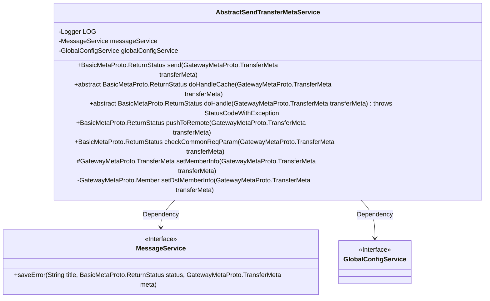
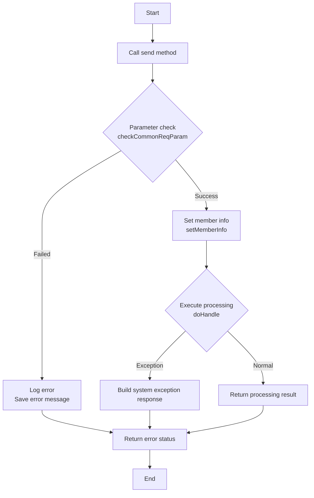
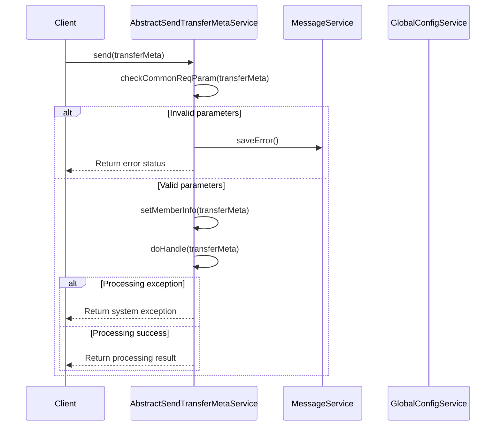
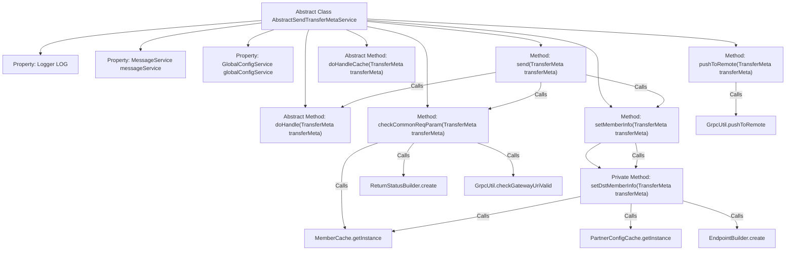

# Basic Information

|      |      |
|------|------|
| Name | AbstractSendTransferMetaService |
| Language | .java |
| Code Path | WeFe/gateway/src/main/java/com/welab/wefe/gateway/service/base/AbstractSendTransferMetaService.java |
| Package Name | com.welab.wefe.gateway.service.base |
| Dependencies | ['com.welab.wefe.common.exception.StatusCodeWithException', 'com.welab.wefe.common.util.StringUtil', 'com.welab.wefe.common.wefe.dto.global_config.GatewayConfigModel', 'com.welab.wefe.gateway.api.meta.basic.BasicMetaProto', 'com.welab.wefe.gateway.api.meta.basic.GatewayMetaProto', 'com.welab.wefe.gateway.cache.MemberCache', 'com.welab.wefe.gateway.cache.PartnerConfigCache', 'com.welab.wefe.gateway.common.EndpointBuilder', 'com.welab.wefe.gateway.common.ReturnStatusBuilder', 'com.welab.wefe.gateway.common.ReturnStatusEnum', 'com.welab.wefe.gateway.entity.MemberEntity', 'com.welab.wefe.gateway.entity.PartnerConfigEntity', 'com.welab.wefe.gateway.service.GlobalConfigService', 'com.welab.wefe.gateway.service.MessageService', 'com.welab.wefe.gateway.util.GrpcUtil', 'com.welab.wefe.gateway.util.ReturnStatusUtil', 'com.welab.wefe.gateway.util.TransferMetaUtil', 'org.slf4j.Logger', 'org.slf4j.LoggerFactory', 'org.springframework.beans.factory.annotation.Autowired'] |
| Brief Description | The abstract class AbstractSendTransferMetaService provides message forwarding functionality, including parameter validation, member information setting, remote pushing, and other methods, supporting cache processing and exception handling. |

# Description

AbstractSendTransferMetaService is an abstract class designed for forwarding metadata messages. It includes a logger and auto-injected MessageService and GlobalConfigService. The primary method, `send`, is responsible for validating parameters, configuring sender and recipient information, and invoking the abstract method `doHandle` to process messages. The `pushToRemote` method pushes messages to remote nodes. The `checkCommonReqParam` method validates request parameters, including session ID, processor field, target member ID, and gateway address. The `setMemberInfo` method configures sender and recipient details such as member ID, name, and endpoint address. Abstract methods `doHandle` and `doHandleCache` must be implemented by subclasses to handle standard messages and cached messages, respectively.

# Class Summary

| Name   | Type  | Description |
|-------|------|-------------|
| AbstractSendTransferMetaService | class | The abstract class AbstractSendTransferMetaService provides message forwarding functionality, including parameter validation, member information setting, and remote push methods, with support for cache handling and exception catching. |

## Class AbstractSendTransferMetaService

|      |      |
|------|------|
| Access Modifier | public abstract |
| Type | class |
| Name | AbstractSendTransferMetaService |
| Description | The abstract class AbstractSendTransferMetaService provides message forwarding functionality, including parameter validation, member information setting, and remote push methods, with support for cache handling and exception catching. |

### UML Class Diagram

This code demonstrates the design of an abstract message transfer service class responsible for handling gateway metadata transfer logic. The class diagram includes the core abstract class AbstractSendTransferMetaService and its two dependent service interfaces MessageService and GlobalConfigService, showcasing core functionalities such as parameter validation, message processing, and remote pushing. The flowchart clearly outlines the message sending process, while the sequence diagram illustrates the interaction during client invocation. The design employs the Template Method pattern, delegating specific processing logic to subclasses while providing comprehensive parameter validation and error handling mechanisms.

### Internal Method Call Graph

This code illustrates an abstract class AbstractSendTransferMetaService, primarily designed for handling metadata operations related to message forwarding. The class incorporates core functionalities such as parameter validation, member information configuration, and remote pushing, with extensible business logic implemented through abstract methods doHandle and doHandleCache. The flowchart clearly demonstrates the class properties and invocation relationships between methods, particularly highlighting the complex logical flows of parameter validation and member information setup, reflecting stringent requirements for security and reliability during message forwarding processes.

### Field List

| Name  | Type  | Description |
|-------|-------|------|
| messageService | MessageService | Automatically inject the MessageService instance. |
| globalConfigService | GlobalConfigService | Use @Autowired to automatically inject an instance of GlobalConfigService. |
| LOG = LoggerFactory.getLogger(this.getClass()) | Logger | Define a private static log object LOG in the class for recording log information of the current class. |

### Method List

| Name  | Type  | Description |
|-------|-------|------|
| pushToRemote | BasicMetaProto.ReturnStatus | The method `pushToRemote` sends messages to a remote destination via gRPC. Upon success, it logs the operation; if it fails, it records the error and saves the failure information, then finally returns the status. |
| doHandle | BasicMetaProto.ReturnStatus | The abstract method doHandle processes transmission metadata, returning a status or throwing an exception. |
| setMemberInfo | GatewayMetaProto.TransferMeta | The method `setMemberInfo` is used to set member information for transmitting metadata, including the source member ID and name, and returns the new metadata after updating the target member information. |
| doHandleCache | BasicMetaProto.ReturnStatus | Abstract methods handle caching, with TransferMeta as the parameter, and return a ReturnStatus state. |
| checkCommonReqParam | BasicMetaProto.ReturnStatus | Check the validity of transmission metadata parameters, including session ID, processor, target member ID, and gateway address, ensuring they are non-empty and correctly formatted; otherwise, return an error status. |
| send | BasicMetaProto.ReturnStatus | The method `send` handles message transmission: first, it checks the validity of the parameters and logs an error if the check fails; then, it sets the sender and receiver information; finally, it attempts to process the message, returning a system error status in case of an exception. |
| setDstMemberInfo | GatewayMetaProto.Member | Method for setting target member information: Retrieve the target member based on transmitted metadata. If the IP is unspecified, determine whether it is a self-access (using an intranet address) or obtain a dedicated line address via configuration; otherwise, use an external address. Finally, return the updated target member information. |

