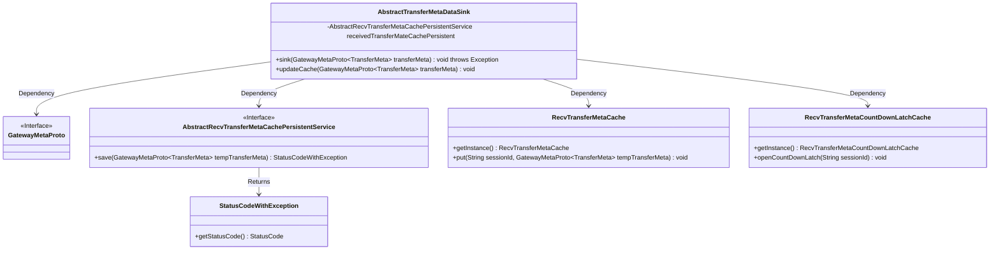
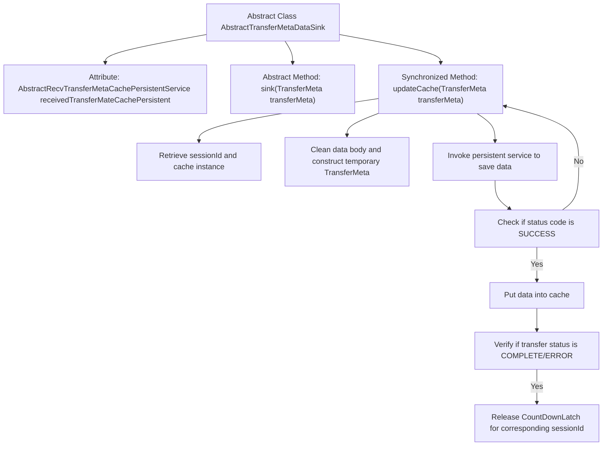

# Basic Information

|      |      |
|------|------|
| Name | AbstractTransferMetaDataSink |
| Language | .java |
| Code Path | WeFe/gateway/src/main/java/com/welab/wefe/gateway/service/base/AbstractTransferMetaDataSink.java |
| Package Name | com.welab.wefe.gateway.service.base |
| Dependencies | ['com.welab.wefe.common.StatusCode', 'com.welab.wefe.common.exception.StatusCodeWithException', 'com.welab.wefe.gateway.api.meta.basic.GatewayMetaProto', 'com.welab.wefe.gateway.cache.RecvTransferMetaCache', 'com.welab.wefe.gateway.cache.RecvTransferMetaCountDownLatchCache', 'org.springframework.beans.factory.annotation.Autowired'] |
| Brief Description | The abstract class AbstractTransferMetaDataSink provides metadata storage functionality, including abstract sink methods and the updateCache synchronization method, with the latter handling cache updates, persistence, and state notifications. |

# Description

This is an abstract class `AbstractTransferMetaDataSink`, designed for handling the persistence of transfer metadata and cache updates. It includes an auto-wired persistence service `receivedTransferMateCachePersistent`. The class defines an abstract method `sink` for saving data and a synchronized method `updateCache` for updating the cache. The `updateCache` method clears the content body in the metadata to reduce memory usage and then saves the processed data via the persistence service. If the status is `COMPLETE` or `ERROR`, it notifies the client of data reception completion through `RecvTransferMetaCountDownLatchCache`.

# Class Summary

| Name   | Type  | Description |
|-------|------|-------------|
| AbstractTransferMetaDataSink | class | The abstract class AbstractTransferMetaDataSink defines the logic for receiving metadata transfers, including the abstract method `sink` for saving data and the synchronous cache update method `updateCache`, which handles data persistence and notifies clients of the reception status. |

## Class AbstractTransferMetaDataSink

|      |      |
|------|------|
| Access Modifier | public abstract |
| Type | class |
| Name | AbstractTransferMetaDataSink |
| Description | The abstract class AbstractTransferMetaDataSink defines the logic for receiving metadata transfers, including the abstract method `sink` for saving data and the synchronous cache update method `updateCache`, which handles data persistence and notifies clients of the reception status. |

### UML Class Diagram

This class diagram illustrates the AbstractTransferMetaDataSink abstract class and its associated components. The core functionality involves processing transfer metadata through the updateCache method: first clearing the data body to reduce memory usage, persisting the data to storage, then updating the cache. When the transfer status is COMPLETE/ERROR, it notifies the client via CountDownLatch. The system involves five key collaborating classes, including the metadata prototype, caching service, persistence interface, and status notification mechanism, forming a complete data reception processing chain.

### Internal Method Call Graph

This code describes an abstract class AbstractTransferMetaDataSink, primarily used for handling cache updates and persistence operations of transfer metadata. The flowchart illustrates the processing flow starting from the updateCache method: first retrieving the session ID and cache instance, then cleaning the data body to construct a temporary object, followed by persistent saving and deciding whether to update the cache based on the returned status code. When the transfer status is complete or in error, it triggers the CountDownLatch notification mechanism. The entire process employs synchronized methods to ensure thread safety, demonstrating precise control over memory usage and state notifications.

### Field List

| Name  | Type  | Description |
|-------|-------|------|
| receivedTransferMateCachePersistent | AbstractRecvTransferMetaCachePersistentService | Using @Autowired to automatically inject an instance of AbstractRecvTransferMetaCachePersistentService named receivedTransferMateCachePersistent. |

### Method List

| Name  | Type  | Description |
|-------|-------|------|
| sink | void | Abstract method `sink`, which accepts a `TransferMeta` parameter and may throw exceptions. |
| updateCache | void | The synchronous method `updateCache` updates the cache: it clears the transport metadata content body and persists the storage. If successful, it caches the data and checks the status, releasing the corresponding countdown lock upon completion or error. |

