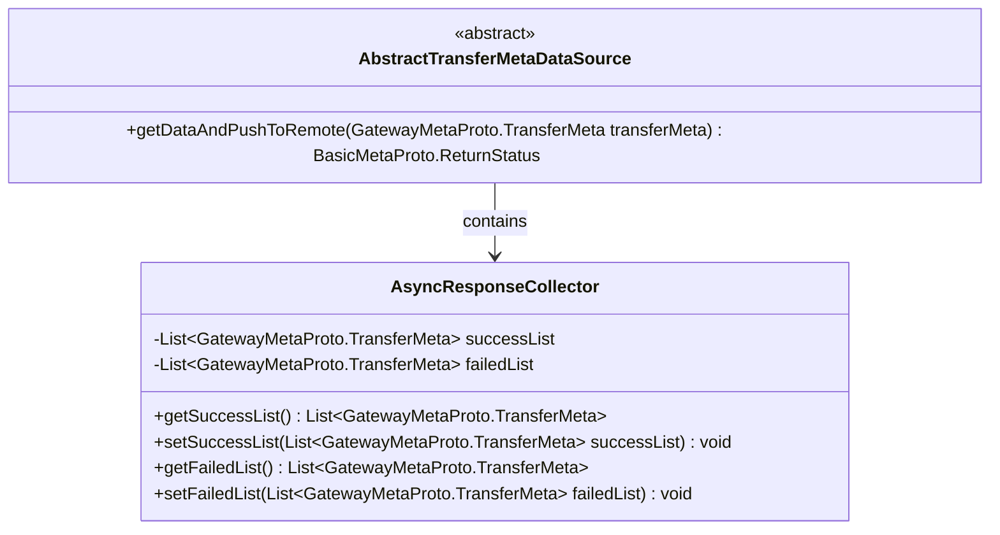
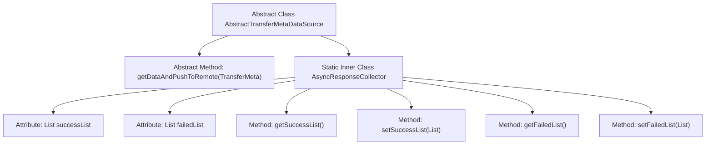

# Basic Information

|      |      |
|------|------|
| Name | AbstractTransferMetaDataSource |
| Language | .java |
| Code Path | WeFe/gateway/src/main/java/com/welab/wefe/gateway/service/base/AbstractTransferMetaDataSource.java |
| Package Name | com.welab.wefe.gateway.service.base |
| Dependencies | ['com.welab.wefe.gateway.api.meta.basic.BasicMetaProto', 'com.welab.wefe.gateway.api.meta.basic.GatewayMetaProto', 'java.util.ArrayList', 'java.util.List'] |
| Brief Description | The abstract class AbstractTransferMetaDataSource defines interfaces for obtaining data to push to remote destinations, including an asynchronous response collector class that records lists of successful and failed data segments. |

# Description

The abstract class `AbstractTransferMetaDataSource` defines an abstract method `getDataAndPushToRemote`, which is used to fetch data and push it to a remote location. It accepts a `TransferMeta` parameter and returns a `ReturnStatus` result. The internal static class `AsyncResponseCollector` contains two lists: `successList` stores metadata fragments that were successfully pushed, while `failedList` stores those that failed. Corresponding getter and setter methods are provided.

# Class Summary

| Name   | Type  | Description |
|-------|------|-------------|
| AbstractTransferMetaDataSource | class | The abstract class AbstractTransferMetaDataSource defines abstract methods for retrieving data and pushing it to a remote location, including an inner class AsyncResponseCollector for collecting lists of successfully and unsuccessfully transferred segments. |

## Class AbstractTransferMetaDataSource

|      |      |
|------|------|
| Access Modifier | public abstract |
| Type | class |
| Name | AbstractTransferMetaDataSource |
| Description | The abstract class AbstractTransferMetaDataSource defines abstract methods for retrieving data and pushing it to a remote location, including an inner class AsyncResponseCollector for collecting lists of successfully and unsuccessfully transferred segments. |

### UML Class Diagram

Class Diagram Description: The diagram illustrates the structure of an abstract class AbstractTransferMetaDataSource and its inner static class AsyncResponseCollector. The abstract class defines the core abstract method getDataAndPushToRemote for data transfer, while the inner class serves as a response collector, maintaining lists of successful and failed transfer metadata. The two form a composition relationship, embodying the design pattern of responsibility separation for state collection during data transfer.

### Internal Method Call Graph

This flowchart illustrates the structure of the abstract class AbstractTransferMetaDataSource, which includes an abstract method and a static inner class. The abstract method getDataAndPushToRemote is used to fetch data and push it to a remote location, while the inner class AsyncResponseCollector is responsible for collecting response results. It contains two lists for success and failure cases, along with their corresponding getter/setter methods. The overall design achieves separation between data transfer and state management, adhering to the Single Responsibility Principle.

### Field List

| Name  | Type  | Description |
|-------|-------|------|

### Method List

| Name  | Type  | Description |
|-------|-------|------|
| getDataAndPushToRemote | BasicMetaProto.ReturnStatus | Abstract method: Retrieves data by transmitting metadata and pushes it to a remote location, returning basic status information. |

