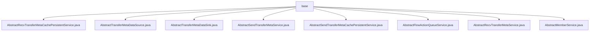

# Basic Information

|      |      |
|------|------|
| Name | base |
| Language | .java |
| Code Path | WeFe/gateway/src/main/java/com/welab/wefe/gateway/service/base |
| Package Name | docs.gateway.src.main.java.com.welab.wefe.gateway.service.base |
| Brief Description | Abstract class collection, defining core methods for transmission metadata persistence, pushing, receiving, and member management, including operations such as save, delete, get, findAll, etc., requiring subclasses to implement specific logic. |

# Description

## Overview  
The core responsibility of this module is to provide a foundational framework for the persistence of data transmission metadata, cache management, and cross-node communication, akin to a message relay station model. The interface specifications include CRUD operations (e.g., save/delete/findAll), data pushing (getDataAndPushToRemote), and status checks (checkStatusNow), all revolving around the GatewayMetaProto.TransferMeta type. Key data structures include TransferMeta (transmission metadata), AsyncResponseCollector (asynchronous response collector), and FlowActionQueueEntity (flow action queue entity). External dependencies involve MessageService (message service), GlobalConfigService (global configuration), and underlying protocols such as JNI/POSIX. For example, AbstractSendTransferMetaService supports different message processing strategies through the abstract method doHandle.  

## Primary Business Scenarios  
The module supports the end-to-end process of cross-gateway data synchronization, including metadata persistence (e.g., AbstractRecvTransferMetaCachePersistentService), remote pushing (e.g., AbstractTransferMetaDataSource), and cache updates (e.g., updateCache in AbstractTransferMetaDataSink). A typical interaction pattern is as follows: the sender validates parameters and forwards messages via AbstractSendTransferMetaService, while the receiver pulls data and updates statuses via AbstractRecvTransferMetaService. For instance, AbstractMemberService provides member information queries to support routing decisions. All scenarios are based on the flow of TransferMeta objects, with failed fragments collected via failedList in case of exceptions.

### Package Internal Structure View

This flowchart illustrates 8 abstract service class files under the service/base directory in the WeFe Gateway project. All files are directly subordinate to the base directory without deeper subdirectory structures. These service classes cover foundational abstract implementations of core gateway functionality modules including transfer metadata cache persistence, data sources, data reception, and queue processing.

# File List

| Name   | Type  | Description |
|-------|------|-------------|
| [AbstractRecvTransferMetaCachePersistentService.java](AbstractRecvTransferMetaCachePersistentService.md) | file | Abstract classes define the metadata persistence service for transmission, including methods for saving, deleting, retrieving individual metadata, and querying all metadata. |
| [AbstractTransferMetaDataSource.java](AbstractTransferMetaDataSource.md) | file | The abstract class AbstractTransferMetaDataSource defines interfaces for obtaining data to push to remote destinations, including an asynchronous response collector class that records lists of successful and failed data segments. |
| [AbstractTransferMetaDataSink.java](AbstractTransferMetaDataSink.md) | file | The abstract class AbstractTransferMetaDataSink provides metadata storage functionality, including the sink abstract method and the updateCache synchronization method, with the latter handling cache updates, persistence, and state notifications. |
| [AbstractSendTransferMetaService.java](AbstractSendTransferMetaService.md) | file | The abstract class AbstractSendTransferMetaService provides message forwarding functionality, including parameter validation, member information setting, remote pushing, and other methods, supporting cache processing and exception handling. |
| [AbstractSendTransferMetaCachePersistentService.java](AbstractSendTransferMetaCachePersistentService.md) | file | The abstract class AbstractSendTransferMetaCachePersistentService defines persistent message operations: save stores a message and returns a status code, delete removes a message and returns a boolean, findAll loads all messages and returns a list. |
| [AbstractFlowActionQueueService.java](AbstractFlowActionQueueService.md) | file | The abstract class AbstractFlowActionQueueService defines an abstract method save for persisting FlowActionQueueEntity instances. |
| [AbstractRecvTransferMetaService.java](AbstractRecvTransferMetaService.md) | file | The abstract class AbstractRecvTransferMetaService provides three methods: `recv` for blocking retrieval of remote gateway data, `checkStatusNow` for non-blocking query of data status, and `doHandle` for processing remote gateway messages and returning results. |
| [AbstractMemberService.java](AbstractMemberService.md) | file | The abstract class AbstractMemberService defines two abstract methods: find queries the member list by memberId and may throw exceptions, while findSelf retrieves the current member entity. |

