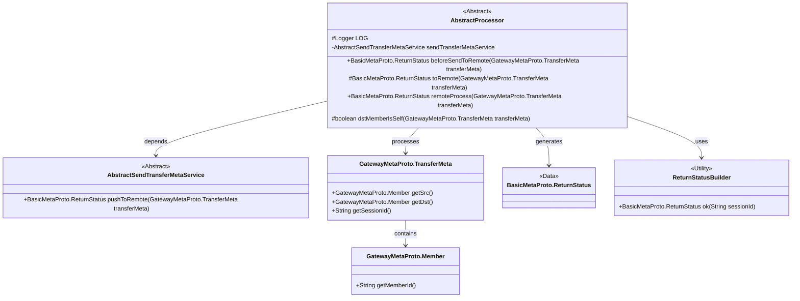
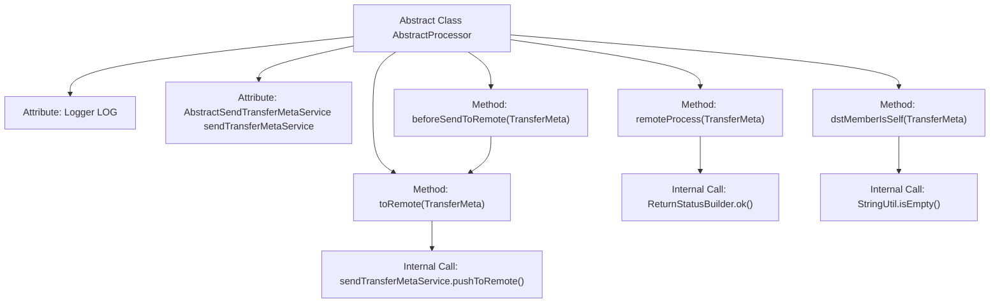

# Basic Information

|      |      |
|------|------|
| Name | AbstractProcessor |
| Language | .java |
| Code Path | WeFe/gateway/src/main/java/com/welab/wefe/gateway/service/processors/AbstractProcessor.java |
| Package Name | com.welab.wefe.gateway.service.processors |
| Dependencies | ['com.welab.wefe.common.util.StringUtil', 'com.welab.wefe.gateway.api.meta.basic.BasicMetaProto', 'com.welab.wefe.gateway.api.meta.basic.GatewayMetaProto', 'com.welab.wefe.gateway.common.ReturnStatusBuilder', 'com.welab.wefe.gateway.service.base.AbstractSendTransferMetaService', 'org.slf4j.Logger', 'org.slf4j.LoggerFactory', 'org.springframework.beans.factory.annotation.Autowired'] |
| Brief Description | The abstract class AbstractProcessor provides a messaging processing framework, including methods such as pre-send processing, remote pushing, and receiving processing, supporting subclass extensions. Key methods include beforeSendToRemote, toRemote, and remoteProcess, and it incorporates the target member checking functionality dstMemberIsSelf. |

# Description

This is an abstract processor class that provides the core processing logic for message transmission. The class includes auto-injected logger and message sending services. Key methods include: `beforeSendToRemote` for pre-processing before message sending, which by default directly calls the `toRemote` method; `toRemote` actually executes remote message pushing and typically doesn't require subclass overrides; `remoteProcess` handles messages received remotely, returning a success status by default; `dstMemberIsSelf` determines whether the target member is the local machine. This class provides a foundational message processing framework for subclasses, with critical operations extendable through method overrides.

# Class Summary

| Name   | Type  | Description |
|-------|------|-------------|
| AbstractProcessor | class | The abstract class AbstractProcessor provides a message processing framework, including methods such as pre-send processing beforeSendToRemote, remote pushing toRemote, remote processing remoteProcess, etc. It supports subclass extension and checks whether the target member is the current node via dstMemberIsSelf. |

## Class AbstractProcessor

|      |      |
|------|------|
| Access Modifier | public abstract |
| Type | class |
| Name | AbstractProcessor |
| Description | The abstract class AbstractProcessor provides a message processing framework, including methods such as pre-send processing beforeSendToRemote, remote pushing toRemote, remote processing remoteProcess, etc. It supports subclass extension and checks whether the target member is the current node via dstMemberIsSelf. |

### UML Class Diagram

This class diagram depicts the core structure of a message processing framework. The AbstractProcessor serves as an abstract base class, defining key workflows such as pre-send validation (beforeSendToRemote) and remote processing (remoteProcess), while utilizing AbstractSendTransferMetaService via composition for message delivery. The system transports message metadata through GatewayMetaProto.TransferMeta, which contains source/destination member information (Member class), ultimately returning status responses of type BasicMetaProto.ReturnStatus. Notably, the processor provides utility methods like destination member validation (dstMemberIsSelf), with the overall design embodying the Template Method pattern philosophy.

### Internal Method Call Graph

This code illustrates an abstract message processor class that handles pre- and post-transmission logic. The core workflow includes: beforeSendToRemote as a pre-hook invoking toRemote method for message delivery, remoteProcess handling remotely received messages, and dstMemberIsSelf validating whether the target member is the current node. The class utilizes sendTransferMetaService for actual remote delivery, ReturnStatusBuilder for constructing response statuses, and relies on StringUtil for empty string checks. The methods form a clear invocation chain, reflecting lifecycle management of message processing.

### Field List

| Name  | Type  | Description |
|-------|-------|------|
| sendTransferMetaService | AbstractSendTransferMetaService | Automatically inject transfer metadata service instance. |
| LOG = LoggerFactory.getLogger(getClass()) | Logger | Declare a protected logger variable LOG, initializing the logging factory with the current class. |

### Method List

| Name  | Type  | Description |
|-------|-------|------|
| beforeSendToRemote | BasicMetaProto.ReturnStatus | The Java method `beforeSendToRemote` invokes `toRemote` to process transmission metadata and returns the status. |
| remoteProcess | BasicMetaProto.ReturnStatus | The method `remoteProcess` accepts a `TransferMeta` parameter and returns a success status containing its `sessionId`. |
| toRemote | BasicMetaProto.ReturnStatus | Push the GatewayMetaProto.TransferMeta object to the remote end via sendTransferMetaService and return the BasicMetaProto.ReturnStatus status. |
| dstMemberIsSelf | boolean | Check whether the target member is the same as the source member or the target member ID is empty. |

