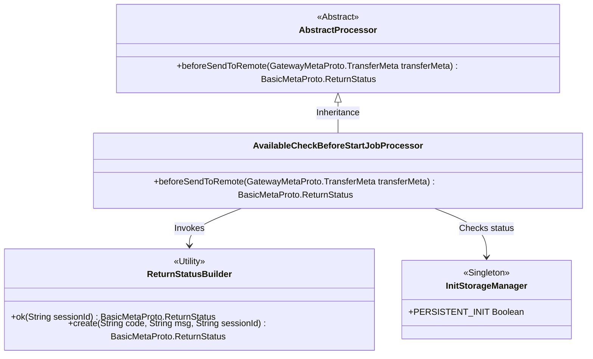
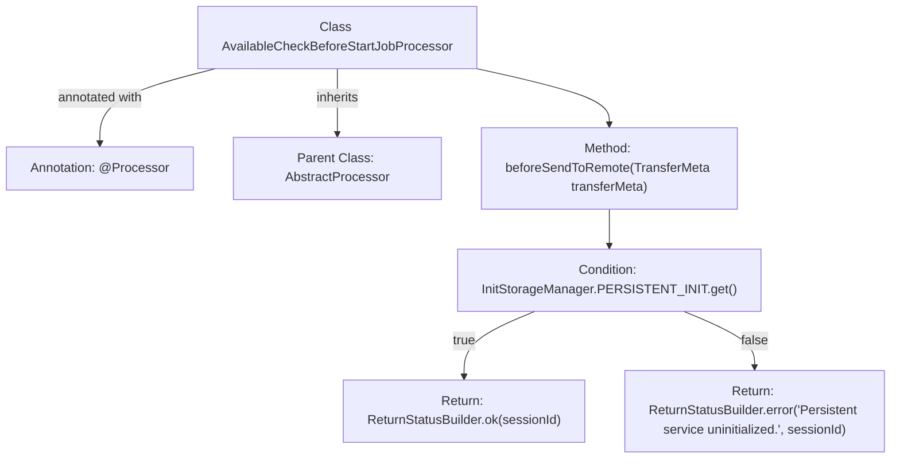

# Basic Information

|      |      |
|------|------|
| Name | AvailableCheckBeforeStartJobProcessor |
| Language | .java |
| Code Path | WeFe/gateway/src/main/java/com/welab/wefe/gateway/service/processors/AvailableCheckBeforeStartJobProcessor.java |
| Package Name | com.welab.wefe.gateway.service.processors |
| Dependencies | ['com.welab.wefe.common.wefe.enums.GatewayProcessorType', 'com.welab.wefe.gateway.api.meta.basic.BasicMetaProto', 'com.welab.wefe.gateway.api.meta.basic.GatewayMetaProto', 'com.welab.wefe.gateway.base.Processor', 'com.welab.wefe.gateway.common.ReturnStatusBuilder', 'com.welab.wefe.gateway.common.ReturnStatusEnum', 'com.welab.wefe.gateway.init.InitStorageManager'] |
| Brief Description | Availability Check Processor verifies whether the persistence service is initialized before task startup and returns an exception status if uninitialized. |

# Description

This is a processor class named AvailableCheckBeforeStartJobProcessor, designed to perform availability checks before job startup. It inherits from AbstractProcessor and is annotated as GatewayProcessorType.availableCheckBeforeStartJobProcessor. The core method beforeSendToRemote executes checks before sending to remote: if the persistent storage service is initialized (PERSISTENT_INIT is true), it returns a success status; otherwise, it returns a system exception status indicating the persistent service is not initialized. This method accepts a TransferMeta parameter and returns a status object containing the session ID.

# Class Summary

| Name   | Type  | Description |
|-------|------|-------------|
| AvailableCheckBeforeStartJobProcessor | class | Availability Check Processor verifies whether the persistence service is initialized before task startup. If uninitialized, it returns a system exception status. |

## Class AvailableCheckBeforeStartJobProcessor

|      |      |
|------|------|
| Access Modifier | @Processor(type = GatewayProcessorType.availableCheckBeforeStartJobProcessor, desc = "Available check before start job processor");public |
| Type | class |
| Name | AvailableCheckBeforeStartJobProcessor |
| Description | Availability Check Processor verifies whether the persistence service is initialized before task startup. If uninitialized, it returns a system exception status. |

### UML Class Diagram

This class diagram illustrates the core relationships of the gateway processor architecture. The AvailableCheckBeforeStartJobProcessor inherits from the abstract class AbstractProcessor, implementing pre-check logic. It relies on ReturnStatusBuilder to construct return statuses and checks the persistent service initialization state via the InitStorageManager singleton. Processors are marked with annotations indicating their types and descriptions, demonstrating a typical implementation of the Chain of Responsibility pattern.

### Internal Method Call Graph

This flowchart illustrates the structure and core logic of the AvailableCheckBeforeStartJobProcessor class. Marked with the @Processor annotation and inheriting from AbstractProcessor, its key method is beforeSendToRemote. The method checks whether the persistent service is initialized: returning a success status if initialized, otherwise returning a system error code with an error message. The diagram clearly shows the conditional branching and two return paths, fully mapping the business decision logic of the code.

### Field List

| Name  | Type  | Description |
|-------|-------|------|

### Method List

| Name  | Type  | Description |
|-------|-------|------|
| beforeSendToRemote | BasicMetaProto.ReturnStatus | The method checks whether the persistence service is initialized. If not, it returns an exception status; otherwise, it returns a success status along with the session ID. |

