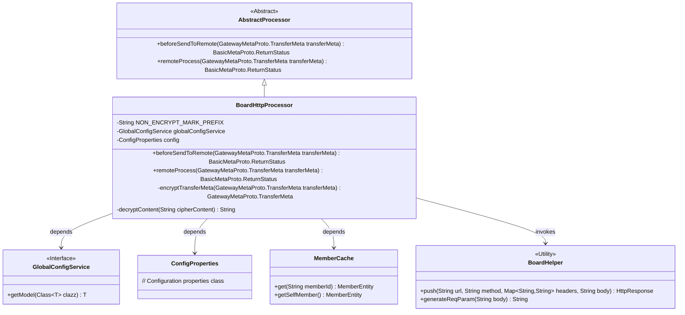
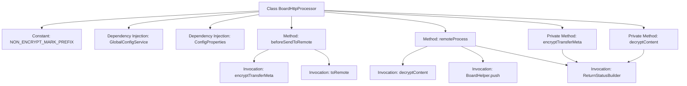
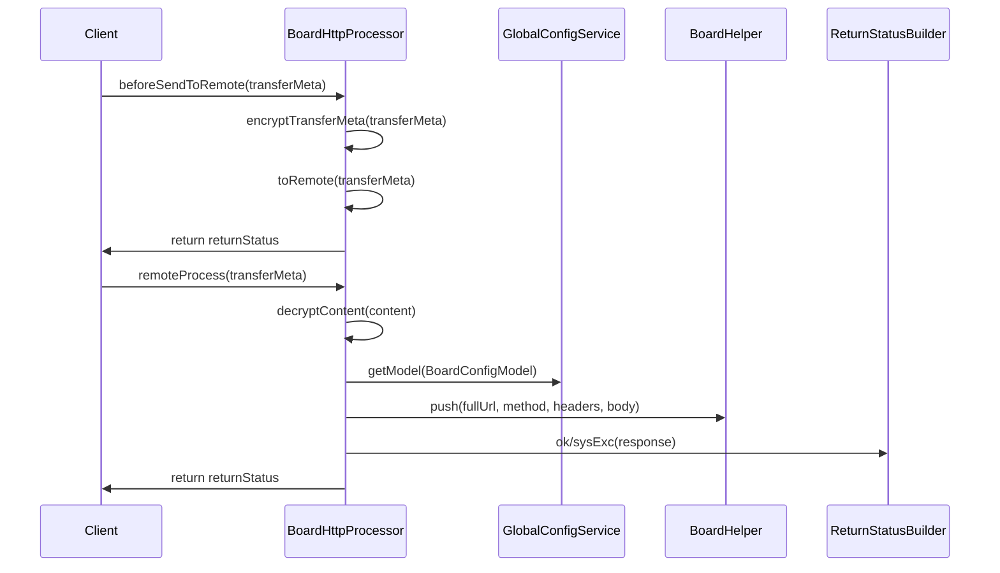

# Basic Information

|      |      |
|------|------|
| Name | BoardHttpProcessor |
| Language | .java |
| Code Path | WeFe/gateway/src/main/java/com/welab/wefe/gateway/service/processors/BoardHttpProcessor.java |
| Package Name | com.welab.wefe.gateway.service.processors |
| Dependencies | ['java.util.HashMap', 'java.util.Map', 'org.springframework.beans.factory.annotation.Autowired', 'com.welab.wefe.common.http.HttpResponse', 'com.welab.wefe.common.util.AsymmetricCryptoUtil', 'com.welab.wefe.common.util.JObject', 'com.welab.wefe.common.util.SM4Util', 'com.welab.wefe.common.util.StringUtil', 'com.welab.wefe.common.wefe.dto.global_config.BoardConfigModel', 'com.welab.wefe.common.wefe.enums.GatewayProcessorType', 'com.welab.wefe.gateway.api.meta.basic.BasicMetaProto', 'com.welab.wefe.gateway.api.meta.basic.GatewayMetaProto', 'com.welab.wefe.gateway.base.Processor', 'com.welab.wefe.gateway.cache.MemberCache', 'com.welab.wefe.gateway.common.ReturnStatusBuilder', 'com.welab.wefe.gateway.config.ConfigProperties', 'com.welab.wefe.gateway.entity.MemberEntity', 'com.welab.wefe.gateway.sdk.BoardHelper', 'com.welab.wefe.gateway.service.GlobalConfigService'] |
| Brief Description | BoardHttpProcessor is an HTTP-mode message handler responsible for encrypting transmitted data and pushing it to the board module, while recording processing time and handling exceptions. It includes encryption/decryption logic and remote request processing. |

# Description

BoardHttpProcessor is an HTTP-mode message handler designed to push messages to the board module. It inherits from AbstractProcessor and incorporates functionalities for encrypted data transmission, remote processing, and content encryption/decryption. In the beforeSendToRemote method, the processor encrypts the transmission data and logs the time consumption. The remoteProcess method is responsible for decrypting the content, constructing the request URL and headers, invoking BoardHelper to push the request, and handling the response. The encryption and decryption methods, encryptTransferMeta and decryptContent, handle data encryption and decryption respectively, supporting non-encryption flags and the SM4 encryption algorithm. The processor relies on GlobalConfigService and ConfigProperties to retrieve configuration information and logs critical operations and time consumption.

# Class Summary

| Name   | Type  | Description |
|-------|------|-------------|
| BoardHttpProcessor | class | BoardHttpProcessor is the message handler in HTTP mode, responsible for encrypting transmitted data and pushing it to the board module, processing requests and responses, and recording time consumption and error logs. |

## Class BoardHttpProcessor

|      |      |
|------|------|
| Access Modifier | @Processor(type = GatewayProcessorType.boardHttpProcessor, desc = "push to the board module message processor in HTTP mode");public |
| Type | class |
| Name | BoardHttpProcessor |
| Description | BoardHttpProcessor is the message handler in HTTP mode, responsible for encrypting transmitted data and pushing it to the board module, processing requests and responses, and recording time consumption and error logs. |

### UML Class Diagram

This class diagram illustrates BoardHttpProcessor as a subclass of AbstractProcessor, implementing message processing logic in HTTP mode. It relies on GlobalConfigService for configuration, accesses member information via MemberCache, and invokes the BoardHelper utility class for HTTP requests. Core functionalities include transfer metadata encryption/decryption (beforeSendToRemote) and remote processing (remoteProcess), involving asymmetric encryption (SM4Util/AsymmetricCryptoUtil) and network communication. The system logs time consumption at each stage and handles edge cases including encryption exceptions and address configuration errors.

### Internal Method Call Graph

This code implements an HTTP-mode message processor with two core functionalities: 1) Pre-send data encryption processing (beforeSendToRemote), incorporating hybrid SM4 and RSA encryption; 2) Remote processing flow (remoteProcess), including request parameter decryption, Board service address concatenation, and HTTP request forwarding. The flowchart illustrates the class structure and method invocation relationships, while the sequence diagram details the execution flow and component interactions of the two main methods. The processor features robust error handling and logging mechanisms, capable of tracking time consumption at each stage.

### Field List

| Name  | Type  | Description |
|-------|-------|------|
| globalConfigService | GlobalConfigService | Using @Autowired to automatically inject an instance of GlobalConfigService. |
| NON_ENCRYPT_MARK_PREFIX = "NON_ENCRYPT:" | String | Define a static constant string NON_ENCRYPT_MARK_PREFIX with the value "NON_ENCRYPT:" to mark non-encrypted content. |
| config | ConfigProperties | Automatically inject the configuration property object `config`. |

### Method List

| Name  | Type  | Description |
|-------|-------|------|
| remoteProcess | BasicMetaProto.ReturnStatus | Processing gateway requests remotely, decrypting the data to extract the URL, method, and request body, setting the request headers, and invoking the Board service interface, then returning the processing result or error message. |
| beforeSendToRemote | BasicMetaProto.ReturnStatus | The method encrypts the data before sending and records the time consumption, including encryption, remote invocation, and total time. It returns an encryption exception status in case of errors. |
| encryptTransferMeta | GatewayMetaProto.TransferMeta | This method is used to encrypt transmission metadata. If the content is empty or the target member has not enabled TLS, the original data is returned directly; otherwise, SM4 and public key encryption are used to generate an encryption key and ciphertext, which are then concatenated to update the metadata content before returning. |
| decryptContent | String | Decryption method: Return the content directly if it is empty or unencrypted; for encrypted content, decrypt the key with the private key first, then use SM4 to decrypt the content. |

