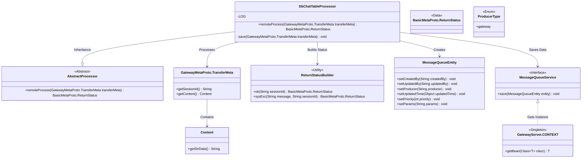
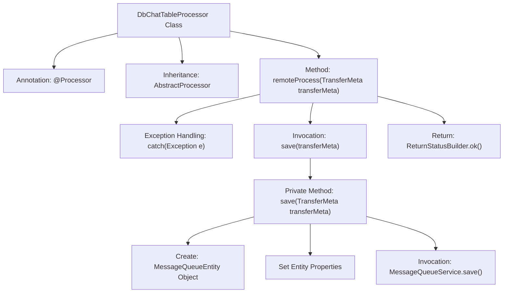

# Basic Information

|      |      |
|------|------|
| Name | DbChatTableProcessor |
| Language | .java |
| Code Path | WeFe/gateway/src/main/java/com/welab/wefe/gateway/service/processors/DbChatTableProcessor.java |
| Package Name | com.welab.wefe.gateway.service.processors |
| Dependencies | ['com.welab.wefe.common.wefe.enums.GatewayProcessorType', 'com.welab.wefe.common.wefe.enums.ProducerType', 'com.welab.wefe.gateway.GatewayServer', 'com.welab.wefe.gateway.api.meta.basic.BasicMetaProto', 'com.welab.wefe.gateway.api.meta.basic.GatewayMetaProto', 'com.welab.wefe.gateway.base.Processor', 'com.welab.wefe.gateway.common.ReturnStatusBuilder', 'com.welab.wefe.gateway.entity.MessageQueueEntity', 'com.welab.wefe.gateway.service.MessageQueueService'] |
| Brief Description | DbChatTableProcessor stores messages into the MySQL exchange center queue, handles exceptions, and returns status. |

# Description

DbChatTableProcessor is a MySQL exchange center queue list processor designed for storing messages. It inherits from AbstractProcessor and processes transmission metadata through the remoteProcess method, invoking the save method to store data in the message queue. If processing fails, it returns a system exception status; upon success, it returns a normal status. The save method creates a MessageQueueEntity object, configures producer and parameter information, and persists it to the database via MessageQueueService.

# Class Summary

| Name   | Type  | Description |
|-------|------|-------------|
| DbChatTableProcessor | class | The DbChatTableProcessor class stores messages into the MySQL exchange center queue, handles exceptions, and returns status. It constructs message entities through the save method and invokes services for persistence. |

## Class DbChatTableProcessor

|      |      |
|------|------|
| Access Modifier | @Processor(type = GatewayProcessorType.dbChatTableProcessor, desc = "The message is saved to the exchange center queue list processor of MySQL");public |
| Type | class |
| Name | DbChatTableProcessor |
| Description | The DbChatTableProcessor class stores messages into the MySQL exchange center queue, handles exceptions, and returns status. It constructs message entities through the save method and invokes services for persistence. |

### UML Class Diagram

This code implements a database chat table processor that inherits from an abstract processor class. Its primary function is to save transfer metadata into a message queue. The message queue entity class encapsulates the data, and the message queue service is called for persistence operations. During processing, exceptions are caught and corresponding status information is returned, while successful execution returns a success status. The class diagram illustrates the interaction relationships between the processor and components such as the message queue service, entity class, status builder, etc.

### Internal Method Call Graph

The flowchart describes the processing logic of the DbChatTableProcessor class: This is a database chat table processor that receives transfer metadata through the remoteProcess method and invokes the save method to store data in the message queue. The save method creates a message queue entity, sets relevant properties, and ultimately saves the data via MessageQueueService. If an exception occurs, it returns a system error status; upon normal processing, it returns a success status.

### Field List

| Name  | Type  | Description |
|-------|-------|------|

### Method List

| Name  | Type  | Description |
|-------|-------|------|
| remoteProcess | BasicMetaProto.ReturnStatus | Remote processing method, saves transmission metadata, returns OK status upon success, logs errors and returns exception status upon failure. |
| save | void | The private method `save` accepts a `TransferMeta` object, creates a `MessageQueueEntity`, sets its properties, and finally saves it via the `MessageQueueService`. The producer type is `gateway`, and the parameters are derived from the `transferMeta` content. |

