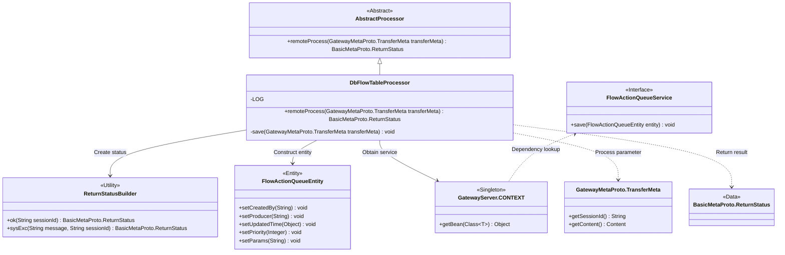
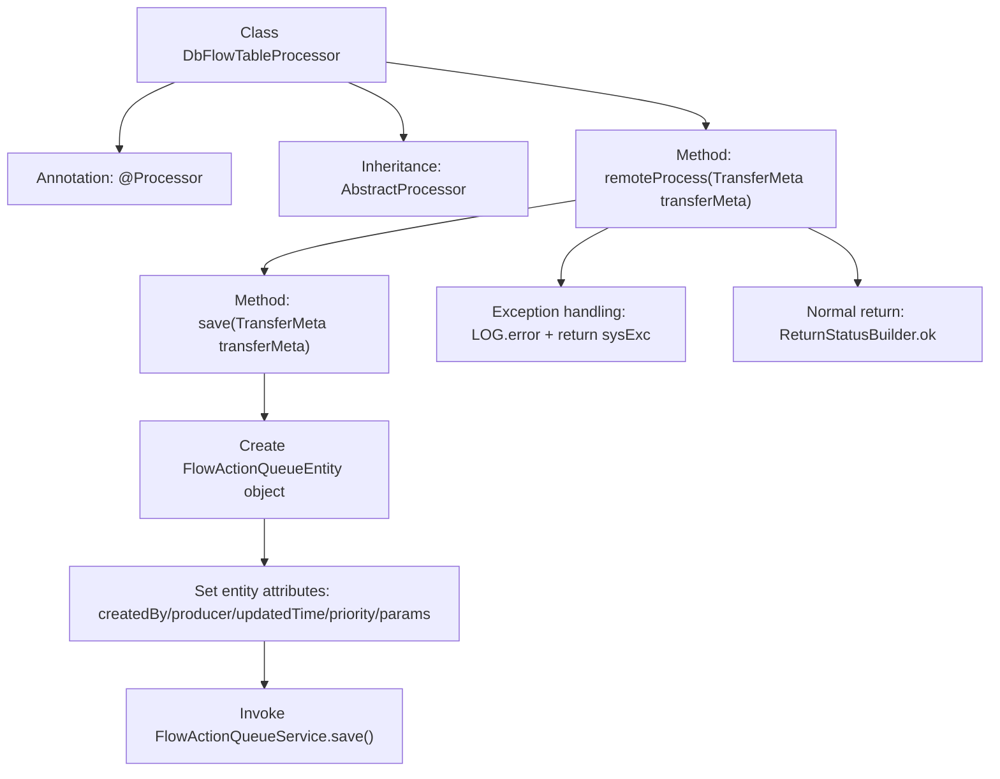

# Basic Information

|      |      |
|------|------|
| Name | DbFlowTableProcessor |
| Language | .java |
| Code Path | WeFe/gateway/src/main/java/com/welab/wefe/gateway/service/processors/DbFlowTableProcessor.java |
| Package Name | com.welab.wefe.gateway.service.processors |
| Dependencies | ['com.welab.wefe.common.wefe.enums.GatewayProcessorType', 'com.welab.wefe.common.wefe.enums.ProducerType', 'com.welab.wefe.gateway.GatewayServer', 'com.welab.wefe.gateway.api.meta.basic.BasicMetaProto', 'com.welab.wefe.gateway.api.meta.basic.GatewayMetaProto', 'com.welab.wefe.gateway.base.Processor', 'com.welab.wefe.gateway.common.ReturnStatusBuilder', 'com.welab.wefe.gateway.entity.FlowActionQueueEntity', 'com.welab.wefe.gateway.service.FlowActionQueueService'] |
| Brief Description | DbFlowTableProcessor stores messages into the MySQL process action queue, handles exceptions, and returns status. |

# Description

The content describes a processor class named DbFlowTableProcessor, which belongs to the GatewayProcessorType.dbFlowTableProcessor type. Its function is to save messages to the flow action queue list in MySQL. The processor inherits from AbstractProcessor and processes incoming TransferMeta data through the remoteProcess method, calling the save method to store the data in the FlowActionQueueEntity entity. If an exception occurs during processing, an error log is recorded and the system returns an abnormal status; if successful, it returns a normal status. The save method sets entity attributes and saves the data via the FlowActionQueueService.

# Class Summary

| Name   | Type  | Description |
|-------|------|-------------|
| DbFlowTableProcessor | class | The DbFlowTableProcessor class extends AbstractProcessor, storing messages into the MySQL flow action queue table. Upon successful processing, it returns an OK status; in case of exceptions, it logs the error and returns a system exception status. |

## Class DbFlowTableProcessor

|      |      |
|------|------|
| Access Modifier | @Processor(type = GatewayProcessorType.dbFlowTableProcessor, desc = "The message is saved to the flow action queue list processor of MySQL");public |
| Type | class |
| Name | DbFlowTableProcessor |
| Description | The DbFlowTableProcessor class extends AbstractProcessor, storing messages into the MySQL flow action queue table. Upon successful processing, it returns an OK status; in case of exceptions, it logs the error and returns a system exception status. |

### UML Class Diagram

This flowchart illustrates the core structure of the database flow table processor. DbFlowTableProcessor inherits from the abstract processor, receives transfer metadata via the remote processing method, constructs a flow action queue using entity classes, and relies on the context to obtain services for storage operations. During processing, exceptions are caught and corresponding statuses are returned, while successful execution returns an OK status. The class diagram clearly presents the interaction relationships between the processor and entities, services, and utility classes, demonstrating the complete processing chain for storing messages into a MySQL queue.

### Internal Method Call Graph

This code demonstrates a database flow table processor, whose primary function is to save transfer metadata into a MySQL flow action queue. The flowchart clearly illustrates the complete process from receiving transfer data to final persistence or exception handling, including entity object creation, attribute setting, service layer invocation, and exception catching mechanism. The annotation indicates this is a gateway processor specifically designed for handling database flow table operations.

### Field List

| Name  | Type  | Description |
|-------|-------|------|

### Method List

| Name  | Type  | Description |
|-------|-------|------|
| save | void | The method `save` accepts a `TransferMeta` object, creates a `FlowActionQueueEntity`, sets its properties, and finally saves the entity via `FlowActionQueueService`. |
| remoteProcess | BasicMetaProto.ReturnStatus | Remote processing method, saves transmission metadata, returns OK status upon success, or logs the error and returns system exception status in case of failure. |

