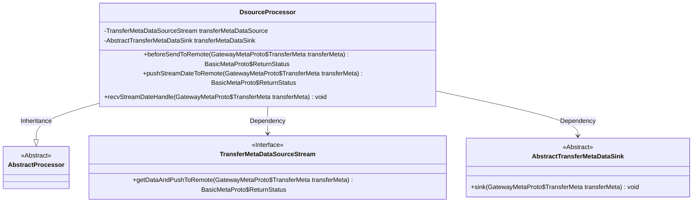
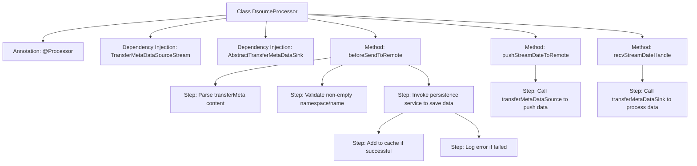

# Basic Information

|      |      |
|------|------|
| Name | DsourceProcessor |
| Language | .java |
| Code Path | WeFe/gateway/src/main/java/com/welab/wefe/gateway/service/processors/DsourceProcessor.java |
| Package Name | com.welab.wefe.gateway.service.processors |
| Dependencies | ['com.welab.wefe.common.StatusCode', 'com.welab.wefe.common.exception.StatusCodeWithException', 'com.welab.wefe.common.util.JObject', 'com.welab.wefe.common.util.StringUtil', 'com.welab.wefe.common.wefe.enums.GatewayProcessorType', 'com.welab.wefe.gateway.GatewayServer', 'com.welab.wefe.gateway.api.meta.basic.BasicMetaProto', 'com.welab.wefe.gateway.api.meta.basic.GatewayMetaProto', 'com.welab.wefe.gateway.base.Processor', 'com.welab.wefe.gateway.cache.SendTransferMetaCache', 'com.welab.wefe.gateway.common.ReturnStatusBuilder', 'com.welab.wefe.gateway.common.ReturnStatusEnum', 'com.welab.wefe.gateway.common.StorageConstant', 'com.welab.wefe.gateway.service.MessageService', 'com.welab.wefe.gateway.service.TransferMetaDataSourceParallelStream', 'com.welab.wefe.gateway.service.TransferMetaDataSourceStream', 'com.welab.wefe.gateway.service.base.AbstractSendTransferMetaCachePersistentService', 'com.welab.wefe.gateway.service.base.AbstractTransferMetaDataSink', 'com.welab.wefe.gateway.service.base.AbstractTransferMetaDataSource', 'com.welab.wefe.gateway.util.TransferMetaUtil', 'org.springframework.beans.factory.annotation.Autowired'] |
| Brief Description | The DsourceProcessor class is responsible for big data transmission processing, such as CK database data. It includes methods for pre-send validation, data persistence and caching, pushing streaming data to remote endpoints, and receiving and processing remote data. It validates data structures and mandatory fields, caches data upon successful persistence, and logs errors upon failure. For pushing and receiving data, it invokes transferMetaDataSource and transferMetaDataSink respectively for processing. |

# Description

This is a processor class named DsourceProcessor, designed for big data transmission and forwarding. It inherits from AbstractProcessor and is annotated as a data source processor type. The class injects two dependencies, TransferMetaDataSourceStream and AbstractTransferMetaDataSink, for data pushing and receiving respectively. Key functionalities include: validating data structure before transmission, checking if namespace and name are empty; persisting messages to cache and asynchronously handling forwarding; providing methods to push stream data to remote endpoints; and processing received data at the remote end. The process logs operations and returns corresponding status information.

# Class Summary

| Name   | Type  | Description |
|-------|------|-------------|
| DsourceProcessor | class | The DsourceProcessor class handles large-scale data transmission, validates data, and forwards messages after persistence. It includes methods for remote pushing and receiving. |

## Class DsourceProcessor

|      |      |
|------|------|
| Access Modifier | @Processor(type = GatewayProcessorType.dSourceProcessor, desc = "Forwarding big data transmission processor (such as CK database data)");public |
| Type | class |
| Name | DsourceProcessor |
| Description | The DsourceProcessor class handles large-scale data transmission, validates data, and forwards messages after persistence. It includes methods for remote pushing and receiving. |

### UML Class Diagram

This code demonstrates a big data transfer processor `DsourceProcessor`, which inherits from `AbstractProcessor` and relies on two core interfaces: `TransferMetaDataSourceStream` (data source stream processing) and `AbstractTransferMetaDataSink` (data sink processing). Its main functionalities include: 1) Preprocessing transfer metadata (validating data structure, persisting messages); 2) Pushing stream data to remote; 3) Handling received stream data from remote. The class diagram clearly reflects its inheritance relationships and key dependencies, illustrating the processor's core coordinating role in the data transfer workflow.

### Internal Method Call Graph

This code implements a gateway processor for big data transmission, containing three core methods: beforeSendToRemote for message preprocessing and persistence, pushStreamDateToRemote for pushing data to remote, and recvStreamDateHandle for processing received remote data. The flowchart clearly illustrates the class structure, dependency relationships, and method invocation chain, particularly highlighting the parameter validation, persistence processing, and exception handling branch logic within the beforeSendToRemote method.

### Field List

| Name  | Type  | Description |
|-------|-------|------|
| transferMetaDataSink | AbstractTransferMetaDataSink | Using @Autowired to automatically inject an instance of AbstractTransferMetaDataSink. |
| transferMetaDataSource | TransferMetaDataSourceStream | The code snippet shows the use of @Autowired to inject a TransferMetaDataSourceStream instance, with the ParallelStream version commented out. |

### Method List

| Name  | Type  | Description |
|-------|-------|------|
| pushStreamDateToRemote | BasicMetaProto.ReturnStatus | The method pushes the transmission metadata to the remote server and returns the operation status. |
| recvStreamDateHandle | void | Java method `recvStreamDateHandle` receives a `TransferMeta` object and calls the `sink` method to process the data. |
| beforeSendToRemote | BasicMetaProto.ReturnStatus | The method checks the transmission metadata content, verifies that the namespace and name are not empty, and then persists the storage. If successful, it caches and returns a success status; if failed, it logs the error and returns a failure status. |

