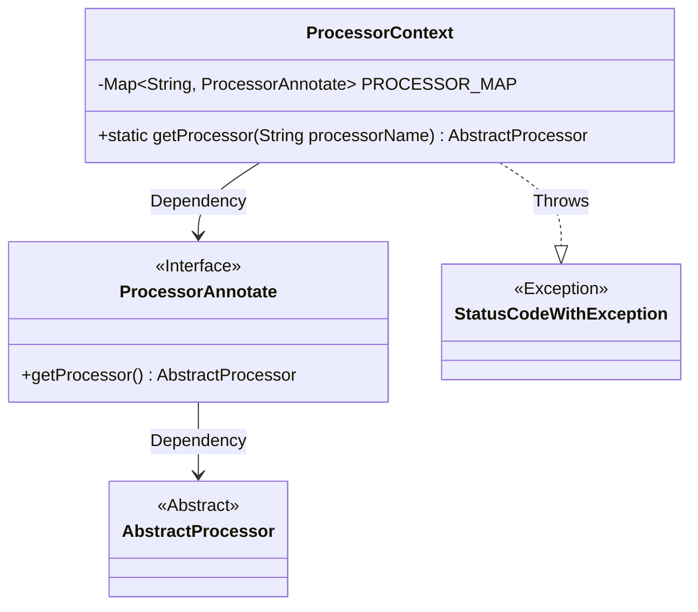
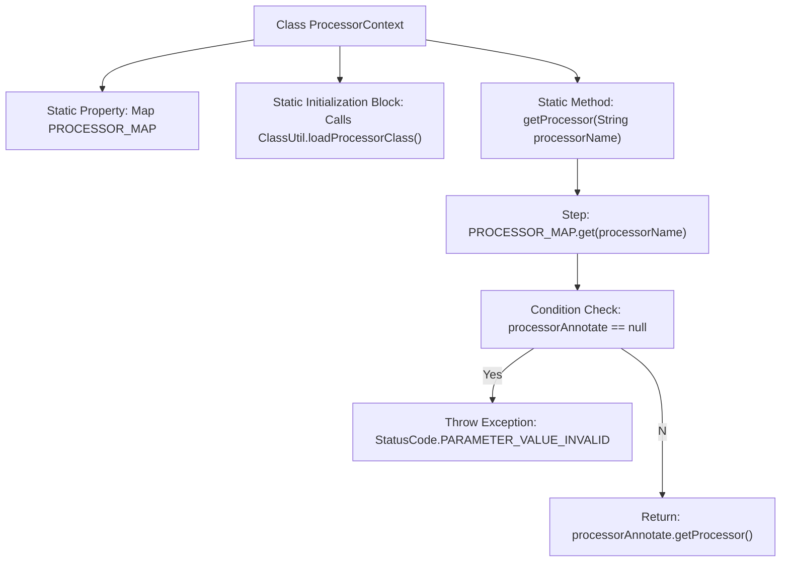

# Basic Information

|      |      |
|------|------|
| Name | ProcessorContext |
| Language | .java |
| Code Path | WeFe/gateway/src/main/java/com/welab/wefe/gateway/service/processors/ProcessorContext.java |
| Package Name | com.welab.wefe.gateway.service.processors |
| Dependencies | ['com.welab.wefe.common.StatusCode', 'com.welab.wefe.common.exception.StatusCodeWithException', 'com.welab.wefe.gateway.base.ProcessorAnnotate', 'com.welab.wefe.gateway.util.ClassUtil', 'java.util.Map'] |
| Brief Description | The `ProcessorContext` class loads all processor classes into the `PROCESSOR_MAP` via a static block, providing the `getProcessor` method to retrieve a processor instance by name, throwing an exception if it does not exist. |

# Description

The `ProcessorContext` class is a static utility class designed to manage and retrieve processor instances. It contains a static `Map` variable named `PROCESSOR_MAP`, which is initialized during class loading via the `ClassUtil.loadProcessorClass` method to store information about all processor classes. It provides a `getProcessor` method that retrieves the corresponding `ProcessorAnnotate` annotation object from the `Map` based on the input processor name. If the object does not exist, it throws an invalid parameter exception; otherwise, it returns the wrapped `AbstractProcessor` instance.

# Class Summary

| Name   | Type  | Description |
|-------|------|-------------|
| ProcessorContext | class | The `ProcessorContext` class loads processor classes into the `PROCESSOR_MAP` via a static block, providing the `getProcessor` method to retrieve a processor instance by name, and throws an exception if it does not exist. |

## Class ProcessorContext

|      |      |
|------|------|
| Access Modifier | public |
| Type | class |
| Name | ProcessorContext |
| Description | The `ProcessorContext` class loads processor classes into the `PROCESSOR_MAP` via a static block, providing the `getProcessor` method to retrieve a processor instance by name, and throws an exception if it does not exist. |

### UML Class Diagram

Class Diagram Description: This diagram illustrates the static structure of the ProcessorContext class and its relationships. ProcessorContext maintains a mapping between processor names and the ProcessorAnnotate interface via a static Map, providing a getProcessor method to retrieve AbstractProcessor instances. The ProcessorAnnotate interface defines the method to obtain processors, while AbstractProcessor serves as the abstract base class for processors. When a processor does not exist, a StatusCodeWithException is thrown.

### Internal Method Call Graph

This flowchart illustrates the core structure and workflow of the ProcessorContext class. The class loads all processor classes into PROCESSOR_MAP via a static initialization block and provides a static method getProcessor to retrieve processor instances. The method first looks up the processor annotation by name in the map, throws a parameter invalid exception if not found, otherwise returns the corresponding processor instance. The entire process clearly demonstrates the logical path of class initialization, exception handling, and instance retrieval.

### Field List

| Name  | Type  | Description |
|-------|-------|------|
| PROCESSOR_MAP = null | Map<String, ProcessorAnnotate> | Static mapping variable PROCESSOR_MAP, with keys as strings and values of ProcessorAnnotate type, initialized to null. |

### Method List

| Name  | Type  | Description |
|-------|-------|------|
| getProcessor | AbstractProcessor | This method retrieves the corresponding processor instance based on the processor name. It throws an exception if the name is invalid; otherwise, it returns the processor instance. |

