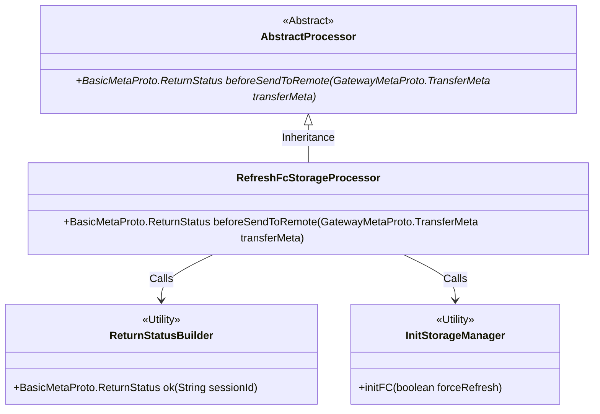
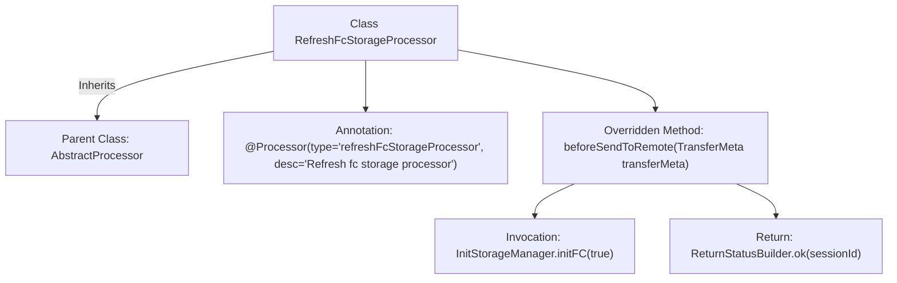

# Basic Information

|      |      |
|------|------|
| Name | RefreshFcStorageProcessor |
| Language | .java |
| Code Path | WeFe/gateway/src/main/java/com/welab/wefe/gateway/service/processors/RefreshFcStorageProcessor.java |
| Package Name | com.welab.wefe.gateway.service.processors |
| Dependencies | ['com.welab.wefe.common.wefe.enums.GatewayProcessorType', 'com.welab.wefe.gateway.api.meta.basic.BasicMetaProto', 'com.welab.wefe.gateway.api.meta.basic.GatewayMetaProto', 'com.welab.wefe.gateway.base.Processor', 'com.welab.wefe.gateway.common.ReturnStatusBuilder', 'com.welab.wefe.gateway.init.InitStorageManager'] |
| Brief Description | Refresh the FC storage processor, initialize the storage manager, and return the success status. |

# Description

The content describes a processor class named RefreshFcStorageProcessor, which is used to refresh FC storage. This class inherits from AbstractProcessor and is annotated to identify its type as GatewayProcessorType.refreshFcStorageProcessor. Its primary function is to initialize FC storage by calling the InitStorageManager.initFC method before sending data remotely, returning a success status containing a session ID. The entire processing logic is concise and clear, focusing specifically on the refresh operation of FC storage.

# Class Summary

| Name   | Type  | Description |
|-------|------|-------------|
| RefreshFcStorageProcessor | class | Refresh the FC storage processor class, which inherits from AbstractProcessor, initializes the storage manager through the beforeSendToRemote method and returns a success status. |

## Class RefreshFcStorageProcessor

|      |      |
|------|------|
| Access Modifier | @Processor(type = GatewayProcessorType.refreshFcStorageProcessor, desc = "Refresh fc storage processor");public |
| Type | class |
| Name | RefreshFcStorageProcessor |
| Description | Refresh the FC storage processor class, which inherits from AbstractProcessor, initializes the storage manager through the beforeSendToRemote method and returns a success status. |

### UML Class Diagram

Class Diagram Description: This code illustrates a refresh FC storage processor class RefreshFcStorageProcessor, which inherits from the abstract class AbstractProcessor and implements the beforeSendToRemote method. The method initializes storage by calling InitStorageManager.initFC and constructs return statuses using ReturnStatusBuilder. The diagram clearly depicts key design structures including inheritance relationships (abstract processor and concrete implementation) and utility class invocations (status builder and storage manager).

### Internal Method Call Graph

This flowchart illustrates the structure of the RefreshFcStorageProcessor class, which is a processor class inheriting from AbstractProcessor with a specific type and description annotation. The core logic resides in the overridden beforeSendToRemote method, where it first invokes InitStorageManager to initialize FC storage, then constructs and returns a success status containing a session ID. The entire flow clearly reflects the class inheritance relationship and method invocation sequence.

### Field List

| Name  | Type  | Description |
|-------|-------|------|

### Method List

| Name  | Type  | Description |
|-------|-------|------|
| beforeSendToRemote | BasicMetaProto.ReturnStatus | The method `beforeSendToRemote` initializes the storage manager before sending data and returns a success status containing the session ID. |

